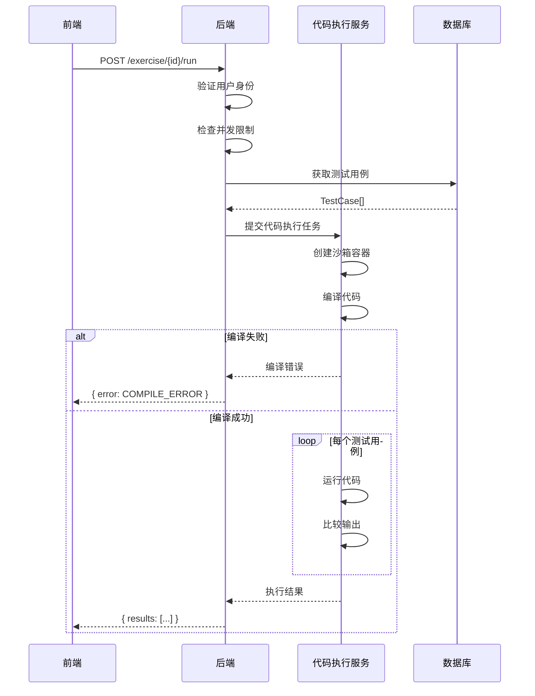

# 代码执行服务设计

## 概述

代码执行服务负责编译和运行用户提交的代码，验证输出是否符合预期。这是练习题库的核心依赖。

## 技术选型

### 方案对比

| 方案 | 优点 | 缺点 | 适用场景 |
|------|------|------|----------|
| Docker 沙箱 | 安全隔离好，可控性强 | 需要服务器资源，部署复杂 | 生产环境 |
| 云函数 | 按需付费，无需运维 | 冷启动慢，有调用限制 | 中小规模 |
| 第三方服务 (Judge0) | 开箱即用，功能完善 | 依赖外部服务，有成本 | 快速上线 |
| WebAssembly | 浏览器端运行，无服务器压力 | 语言支持有限，调试困难 | 简单场景 |

### 推荐方案

**阶段一（MVP）：** 使用第三方服务 Judge0
- 快速上线，验证产品
- 支持 40+ 编程语言
- 有免费额度

**阶段二（规模化）：** 自建 Docker 沙箱
- 成本可控
- 完全自主

## 系统架构

```
┌─────────────┐     ┌─────────────┐     ┌─────────────────┐
│   前端      │────→│   后端API   │────→│  代码执行服务    │
│ CodeEditor  │     │ /exercise   │     │  (Judge0/Docker) │
└─────────────┘     └─────────────┘     └─────────────────┘
                           │
                           ▼
                    ┌─────────────┐
                    │   数据库    │
                    │ TestCase    │
                    └─────────────┘
```

## API 设计

### 运行代码

```
POST /exercise/{id}/run
```

**请求：**
```json
{
  "code": "#include <iostream>\nusing namespace std;\nint main() { cout << 5; return 0; }",
  "language": "cpp"
}
```

**响应（成功）：**
```json
{
  "success": true,
  "results": [
    {
      "testCase": 1,
      "passed": true,
      "input": "5",
      "expected": "120",
      "actual": "120",
      "time": 12,
      "memory": 3200
    },
    {
      "testCase": 2,
      "passed": false,
      "input": "0",
      "expected": "1",
      "actual": "0",
      "time": 8,
      "memory": 3100
    }
  ],
  "allPassed": false,
  "summary": {
    "total": 2,
    "passed": 1,
    "failed": 1,
    "totalTime": 20,
    "maxMemory": 3200
  }
}
```

**响应（编译错误）：**
```json
{
  "success": false,
  "error": {
    "type": "COMPILE_ERROR",
    "message": "main.cpp:5:1: error: expected ';' before '}' token",
    "line": 5,
    "column": 1
  }
}
```

**响应（运行时错误）：**
```json
{
  "success": false,
  "error": {
    "type": "RUNTIME_ERROR",
    "message": "Segmentation fault (core dumped)",
    "testCase": 1
  }
}
```

**响应（超时）：**
```json
{
  "success": false,
  "error": {
    "type": "TIME_LIMIT_EXCEEDED",
    "message": "程序运行超时（限制：2秒）",
    "testCase": 1,
    "timeUsed": 2000
  }
}
```

## 执行限制

| 限制项 | 值 | 说明 |
|--------|-----|------|
| 时间限制 | 2秒 | 单个测试用例 |
| 内存限制 | 256MB | 单个测试用例 |
| 输出限制 | 64KB | 防止输出过大 |
| 代码长度 | 64KB | 防止代码过长 |
| 并发限制 | 10/用户 | 防止滥用 |

## 支持语言

| 语言 | 编译器/解释器 | 版本 |
|------|--------------|------|
| C++ | g++ | 11.4 |
| C | gcc | 11.4 |
| Python | python3 | 3.10 |
| Java | openjdk | 17 |

**MVP 阶段只支持 C++**，后续根据需求扩展。

## 安全措施

### 代码沙箱

```yaml
# Docker 容器限制
resources:
  limits:
    cpus: '0.5'
    memory: 256M
  reservations:
    cpus: '0.1'
    memory: 64M

security_opt:
  - no-new-privileges:true
  - seccomp:unconfined

read_only: true
network_mode: none
```

### 禁止的系统调用

- `fork`, `exec`, `system` - 禁止创建进程
- `socket`, `connect` - 禁止网络访问
- `open` (部分) - 限制文件访问

### 输入过滤

```typescript
function sanitizeCode(code: string): string {
  // 检查危险关键字
  const dangerous = ['system', 'exec', 'fork', 'popen', '__asm__'];
  for (const keyword of dangerous) {
    if (code.includes(keyword)) {
      throw new Error(`禁止使用 ${keyword}`);
    }
  }
  return code;
}
```

## 测试用例设计

### 数据模型

```prisma
model TestCase {
  id          String   @id @default(uuid())
  exerciseId  String
  input       String   // 输入数据
  output      String   // 期望输出
  isHidden    Boolean  @default(false)  // 是否隐藏（防作弊）
  orderIndex  Int      @default(0)
  timeLimit   Int?     // 单独的时间限制（毫秒）
  memoryLimit Int?     // 单独的内存限制（KB）

  exercise    Exercise @relation(fields: [exerciseId], references: [id], onDelete: Cascade)

  @@index([exerciseId])
}
```

### 隐藏测试用例

- 前端只显示公开测试用例的输入输出
- 隐藏测试用例只显示"通过/失败"，不显示具体内容
- 防止用户针对测试用例硬编码答案

```json
{
  "results": [
    { "testCase": 1, "passed": true, "input": "5", "expected": "120", "actual": "120" },
    { "testCase": 2, "passed": true, "input": "0", "expected": "1", "actual": "1" },
    { "testCase": 3, "passed": false, "hidden": true },  // 隐藏用例
    { "testCase": 4, "passed": true, "hidden": true }
  ]
}
```

## 执行流程



## 错误处理

| 错误类型 | 错误码 | 用户提示 |
|----------|--------|----------|
| COMPILE_ERROR | 1001 | 编译错误：{详细信息} |
| RUNTIME_ERROR | 1002 | 运行时错误：{详细信息} |
| TIME_LIMIT_EXCEEDED | 1003 | 程序运行超时（限制：2秒） |
| MEMORY_LIMIT_EXCEEDED | 1004 | 内存超出限制（限制：256MB） |
| OUTPUT_LIMIT_EXCEEDED | 1005 | 输出过长（限制：64KB） |
| WRONG_ANSWER | 1006 | 答案错误 |
| INTERNAL_ERROR | 5000 | 系统错误，请稍后重试 |

## 性能优化

### 编译缓存

对于相同代码，缓存编译结果：

```typescript
const compileCacheKey = crypto.createHash('md5').update(code).digest('hex');
const cached = await redis.get(`compile:${compileCacheKey}`);
if (cached) {
  return JSON.parse(cached);
}
```

### 预热容器

保持一定数量的空闲容器，减少冷启动时间：

```typescript
const WARM_POOL_SIZE = 5;
const warmContainers: Container[] = [];

async function getContainer(): Promise<Container> {
  if (warmContainers.length > 0) {
    return warmContainers.pop()!;
  }
  return createNewContainer();
}
```

### 队列处理

使用消息队列处理高并发：

```
用户请求 → Redis Queue → Worker Pool → 执行结果
```

## 监控指标

| 指标 | 说明 | 告警阈值 |
|------|------|----------|
| 执行成功率 | 成功执行/总请求 | < 95% |
| 平均执行时间 | 从提交到返回结果 | > 5秒 |
| 队列长度 | 等待执行的任务数 | > 100 |
| 容器使用率 | 活跃容器/总容器 | > 80% |

## 第三方服务集成 (Judge0)

### 配置

```typescript
// .env
JUDGE0_API_URL=https://judge0-ce.p.rapidapi.com
JUDGE0_API_KEY=your-api-key

// 语言ID映射
const LANGUAGE_IDS = {
  cpp: 54,    // C++ (GCC 9.2.0)
  c: 50,      // C (GCC 9.2.0)
  python: 71, // Python (3.8.1)
  java: 62,   // Java (OpenJDK 13.0.1)
};
```

### 调用示例

```typescript
async function runCodeWithJudge0(code: string, language: string, testCases: TestCase[]) {
  const submissions = testCases.map(tc => ({
    source_code: Buffer.from(code).toString('base64'),
    language_id: LANGUAGE_IDS[language],
    stdin: Buffer.from(tc.input).toString('base64'),
    expected_output: Buffer.from(tc.output).toString('base64'),
    cpu_time_limit: 2,
    memory_limit: 262144, // 256MB in KB
  }));

  // 批量提交
  const response = await fetch(`${JUDGE0_API_URL}/submissions/batch`, {
    method: 'POST',
    headers: {
      'Content-Type': 'application/json',
      'X-RapidAPI-Key': JUDGE0_API_KEY,
    },
    body: JSON.stringify({ submissions }),
  });

  const tokens = await response.json();

  // 轮询获取结果
  return pollResults(tokens);
}
```

## 相关文件

| 文件 | 说明 |
|------|------|
| `backend/src/services/codeRunner.ts` | 代码执行服务封装 |
| `backend/src/services/judge0.ts` | Judge0 API 集成 |
| `backend/src/routes/exercise.ts` | 练习题 API（调用代码执行） |
| `docker/code-runner/Dockerfile` | 自建沙箱镜像 |
| `docker/code-runner/docker-compose.yml` | 沙箱编排配置 |
