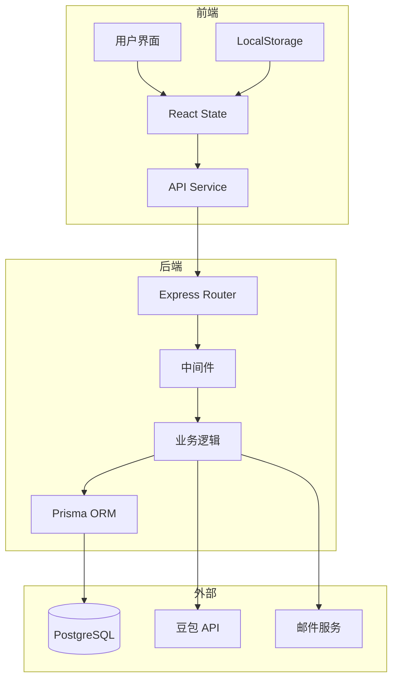
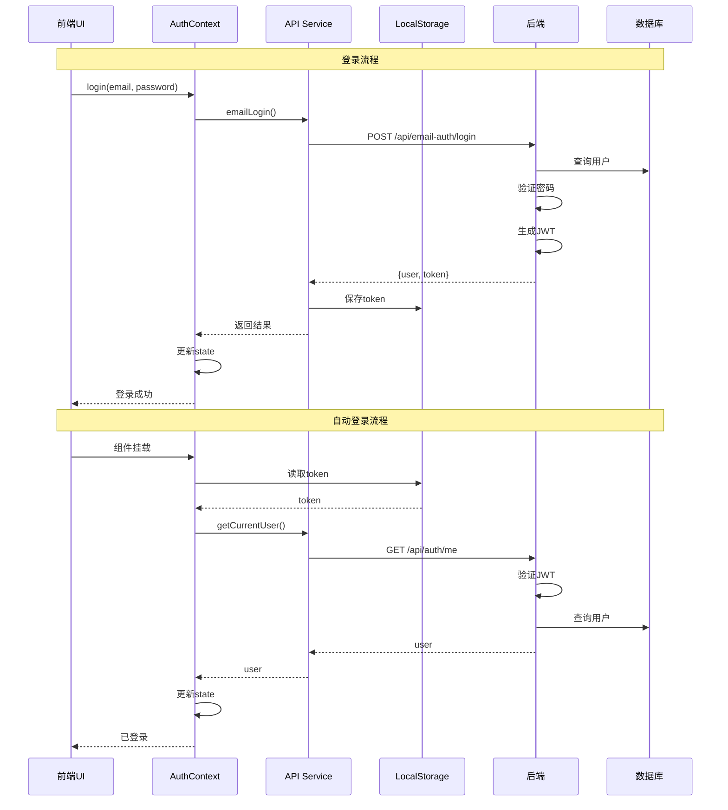
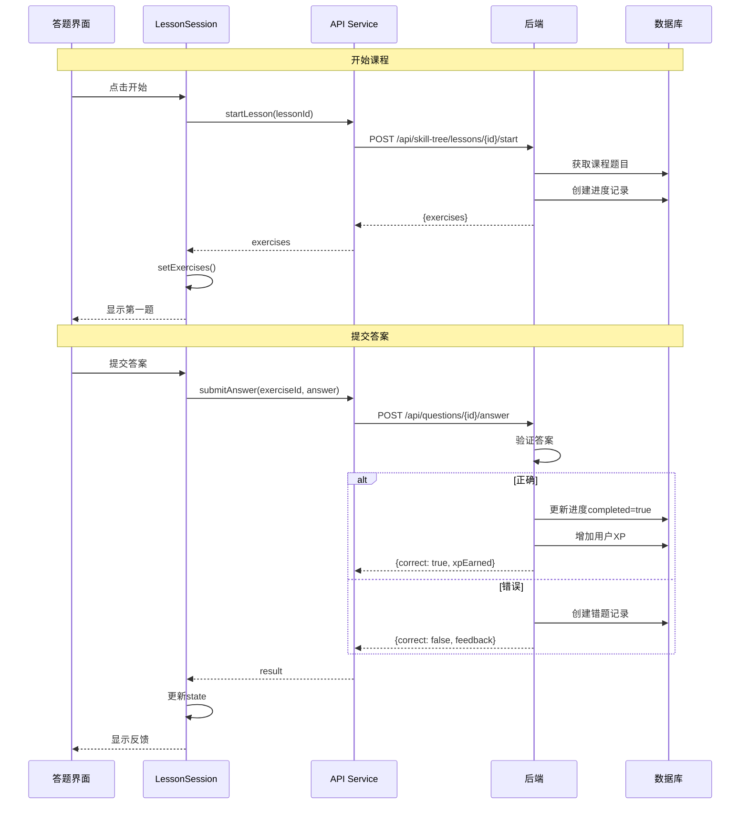
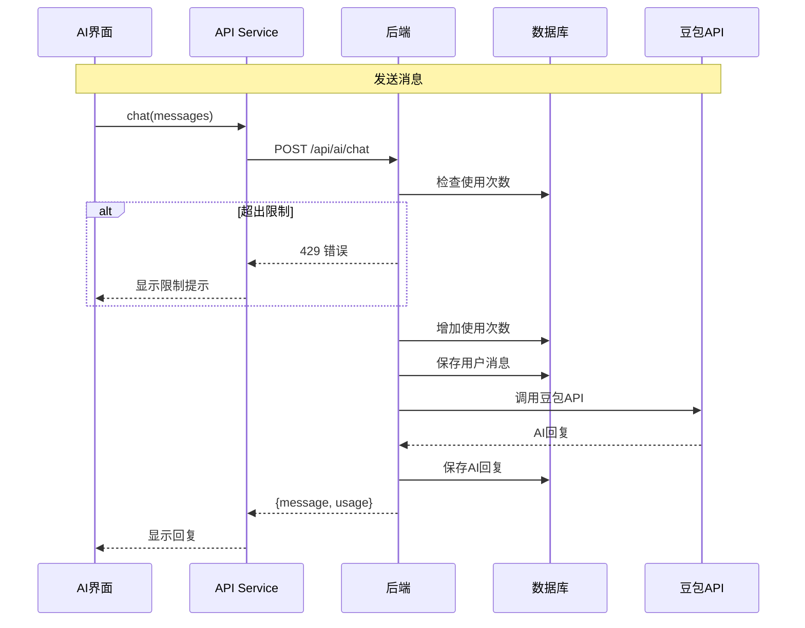
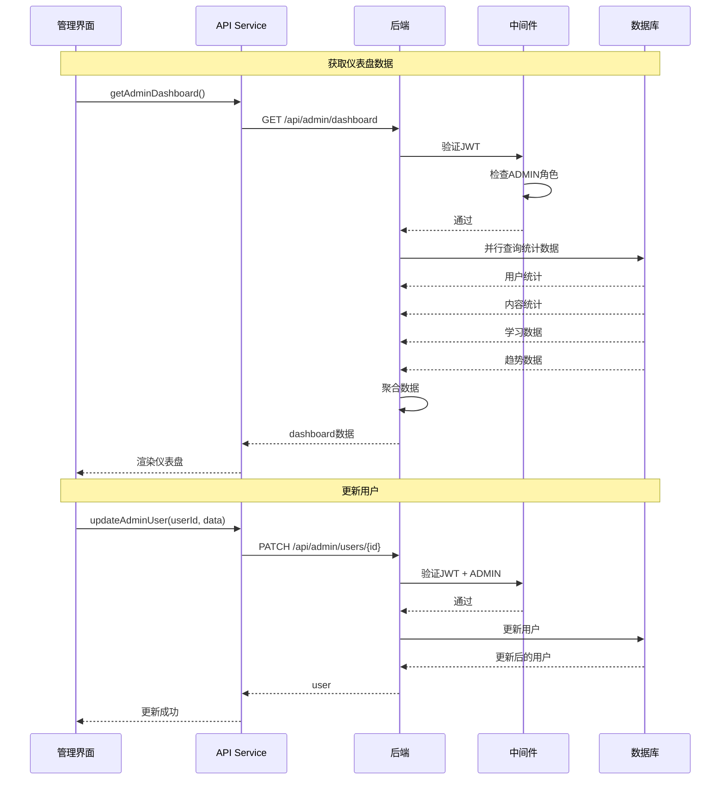
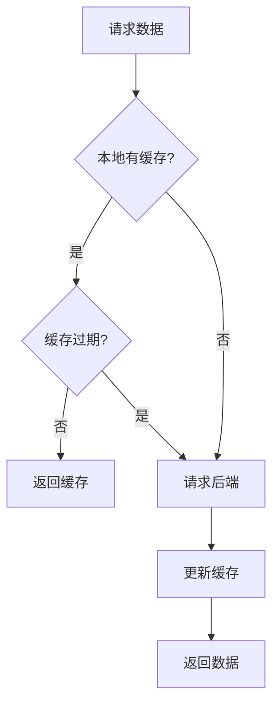

# 数据流

## 整体数据流



## 认证数据流



## 答题数据流



## AI 数据流



## 管理员数据流



## 状态管理

### 前端状态

```typescript
// AuthContext 状态
interface AuthState {
  user: User | null;
  token: string | null;
  isAuthenticated: boolean;
  isLoading: boolean;
}

// LessonSession 状态
interface LessonState {
  exercises: Exercise[];
  currentIndex: number;
  hearts: number;
  mistakes: number;
  xpEarned: number;
  showFeedback: boolean;
  feedbackData: FeedbackData | null;
  currentQuestionMistakes: number;
  showAIHint: boolean;
}

// AdminDashboard 状态
interface DashboardState {
  data: DashboardData | null;
  loading: boolean;
}
```

### 数据持久化

| 数据 | 存储位置 | 说明 |
|------|----------|------|
| JWT Token | LocalStorage | 认证令牌 |
| 用户设置 | LocalStorage | 主题、语言等 |
| 用户数据 | PostgreSQL | 用户信息、进度 |
| 题目数据 | PostgreSQL | 题目、答案 |
| AI对话 | PostgreSQL | 聊天历史 |

## 缓存策略



### 缓存配置

| 数据类型 | 缓存时间 | 说明 |
|----------|----------|------|
| 技能树 | 5分钟 | 结构变化少 |
| 用户信息 | 1分钟 | 需要较新数据 |
| 题目内容 | 10分钟 | 基本不变 |
| 统计数据 | 30秒 | 实时性要求高 |
