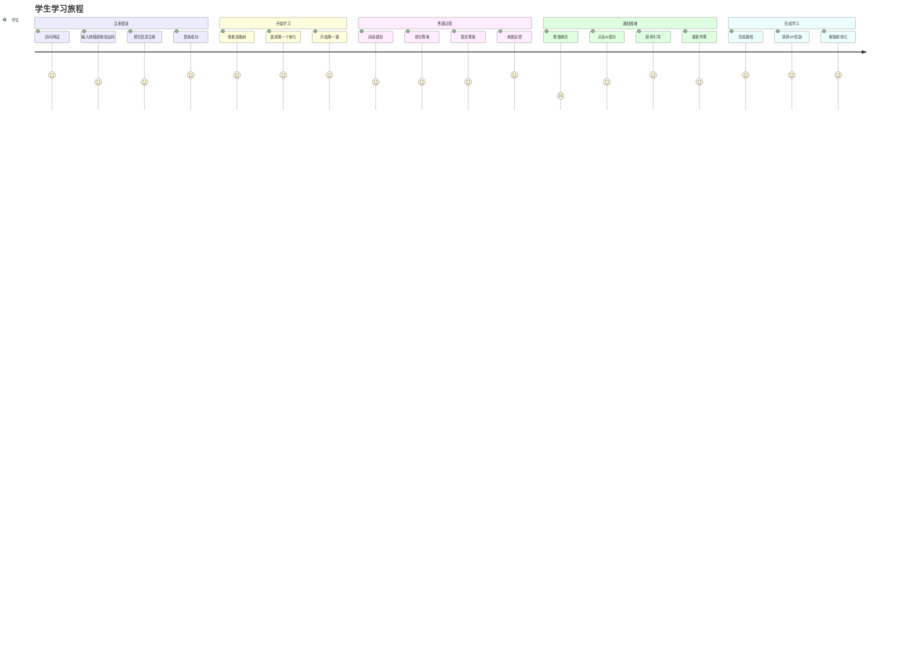
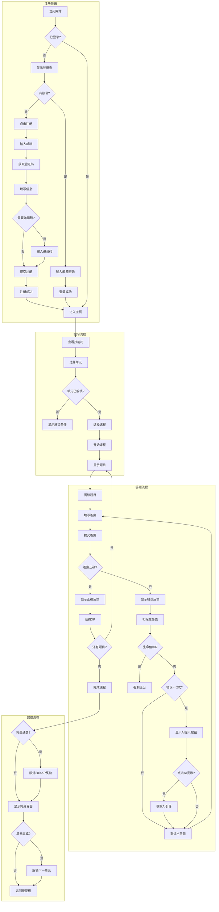
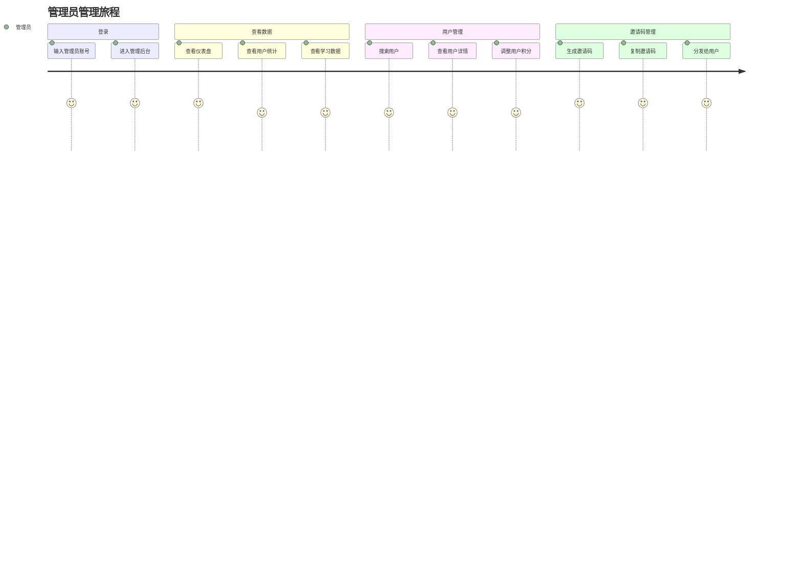
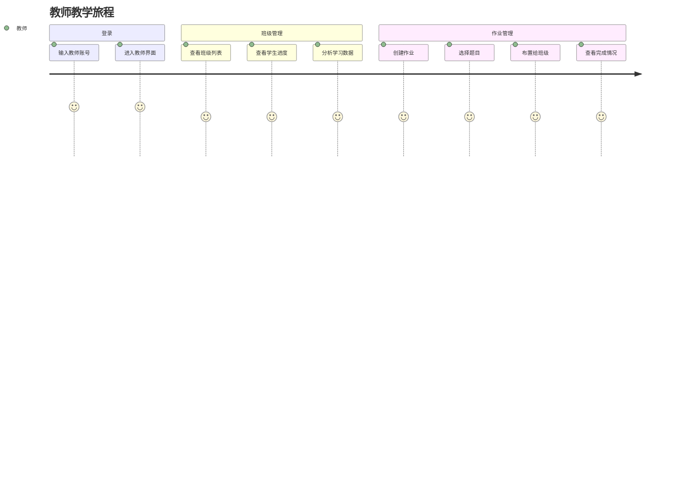
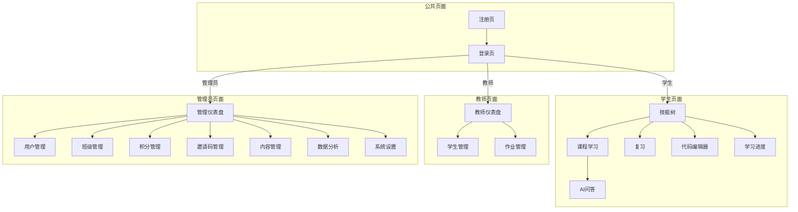

# 用户旅程

## 学生用户旅程

```mermaid
journey
    title 学生学习旅程
    section 注册登录
      访问网站: 5: 学生
      输入邮箱获取验证码: 4: 学生
      填写信息注册: 4: 学生
      登录成功: 5: 学生
    section 开始学习
      查看技能树: 5: 学生
      选择第一个单元: 5: 学生
      开始第一课: 5: 学生
    section 答题过程
      阅读题目: 4: 学生
      填写答案: 4: 学生
      提交答案: 4: 学生
      查看反馈: 5: 学生
    section 遇到困难
      答错两次: 2: 学生
      点击AI提示: 4: 学生
      获得引导: 5: 学生
      重新作答: 4: 学生
    section 完成学习
      完成课程: 5: 学生
      获得XP奖励: 5: 学生
      解锁新单元: 5: 学生
```

## 学生完整流程图

```mermaid
flowchart TD
    subgraph 注册登录
        A[访问网站] --> B{已登录?}
        B -->|否| C[显示登录页]
        C --> D{有账号?}
        D -->|否| E[点击注册]
        E --> F[输入邮箱]
        F --> G[获取验证码]
        G --> H[填写信息]
        H --> I{需要邀请码?}
        I -->|是| J[输入邀请码]
        I -->|否| K[提交注册]
        J --> K
        K --> L[注册成功]
        D -->|是| M[输入邮箱密码]
        M --> N[登录成功]
        L --> O[进入主页]
        N --> O
        B -->|是| O
    end

    subgraph 学习流程
        O --> P[查看技能树]
        P --> Q[选择单元]
        Q --> R{单元已解锁?}
        R -->|否| S[显示解锁条件]
        R -->|是| T[选择课程]
        T --> U[开始课程]
        U --> V[显示题目]
    end

    subgraph 答题流程
        V --> W[阅读题目]
        W --> X[填写答案]
        X --> Y[提交答案]
        Y --> Z{答案正确?}
        Z -->|是| AA[显示正确反馈]
        AA --> AB[获得XP]
        AB --> AC{还有题目?}
        AC -->|是| V
        AC -->|否| AD[完成课程]
        Z -->|否| AE[显示错误反馈]
        AE --> AF[扣除生命值]
        AF --> AG{生命值=0?}
        AG -->|是| AH[强制退出]
        AG -->|否| AI{错误>=2次?}
        AI -->|是| AJ[显示AI提示按钮]
        AI -->|否| AK[重试当前题]
        AJ --> AL{点击AI提示?}
        AL -->|是| AM[获取AI引导]
        AM --> AK
        AL -->|否| AK
        AK --> X
    end

    subgraph 完成流程
        AD --> AN{完美通关?}
        AN -->|是| AO[额外20%XP奖励]
        AN -->|否| AP[显示完成界面]
        AO --> AP
        AP --> AQ{单元完成?}
        AQ -->|是| AR[解锁下一单元]
        AQ -->|否| AS[返回技能树]
        AR --> AS
    end
```

## 管理员用户旅程

```mermaid
journey
    title 管理员管理旅程
    section 登录
      输入管理员账号: 5: 管理员
      进入管理后台: 5: 管理员
    section 查看数据
      查看仪表盘: 5: 管理员
      查看用户统计: 4: 管理员
      查看学习数据: 4: 管理员
    section 用户管理
      搜索用户: 4: 管理员
      查看用户详情: 4: 管理员
      调整用户积分: 4: 管理员
    section 邀请码管理
      生成邀请码: 5: 管理员
      复制邀请码: 5: 管理员
      分发给用户: 5: 管理员
```

## 教师用户旅程

```mermaid
journey
    title 教师教学旅程
    section 登录
      输入教师账号: 5: 教师
      进入教师界面: 5: 教师
    section 班级管理
      查看班级列表: 4: 教师
      查看学生进度: 4: 教师
      分析学习数据: 4: 教师
    section 作业管理
      创建作业: 4: 教师
      选择题目: 4: 教师
      布置给班级: 4: 教师
      查看完成情况: 4: 教师
```

## 页面导航图

```mermaid
graph TB
    subgraph 公共页面
        Login[登录页]
        Register[注册页]
    end

    subgraph 学生页面
        SkillTree[技能树]
        Lesson[课程学习]
        Review[复习]
        Editor[代码编辑器]
        Progress[学习进度]
        AIChat[AI问答]
    end

    subgraph 教师页面
        TDashboard[教师仪表盘]
        Students[学生管理]
        Assignments[作业管理]
    end

    subgraph 管理员页面
        ADashboard[管理仪表盘]
        Users[用户管理]
        Classes[班级管理]
        Points[积分管理]
        Invites[邀请码管理]
        Content[内容管理]
        Analytics[数据分析]
        Settings[系统设置]
    end

    Login --> |学生| SkillTree
    Login --> |教师| TDashboard
    Login --> |管理员| ADashboard
    Register --> Login

    SkillTree --> Lesson
    SkillTree --> Review
    SkillTree --> Editor
    SkillTree --> Progress
    Lesson --> AIChat

    TDashboard --> Students
    TDashboard --> Assignments

    ADashboard --> Users
    ADashboard --> Classes
    ADashboard --> Points
    ADashboard --> Invites
    ADashboard --> Content
    ADashboard --> Analytics
    ADashboard --> Settings
```
