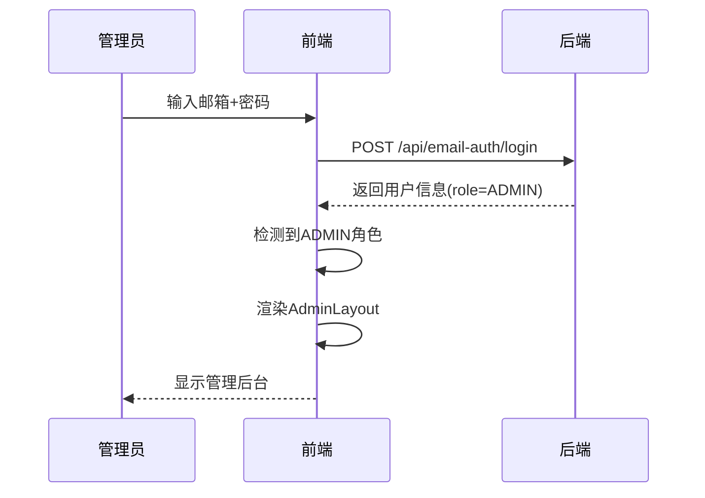

# 管理员模块

## 概述

管理员模块提供系统管理功能，包括用户管理、班级管理、积分管理、邀请码管理、内容管理、数据分析和系统设置。

## 功能架构

```mermaid
graph TB
    subgraph 管理员后台
        Dashboard[仪表盘]
        Users[用户管理]
        Classes[班级管理]
        Points[积分管理]
        Invites[邀请码管理]
        Content[内容管理]
        Analytics[数据分析]
        Settings[系统设置]
    end

    Dashboard --> UserStats[用户统计]
    Dashboard --> ContentStats[内容统计]
    Dashboard --> Trends[趋势图表]

    Users --> UserList[用户列表]
    Users --> UserEdit[编辑用户]
    Users --> UserDelete[删除用户]

    Classes --> ClassList[班级列表]
    Classes --> ClassCreate[创建班级]
    Classes --> ClassStudents[班级学生]

    Points --> PointsView[查看积分]
    Points --> PointsAdjust[调整积分]

    Invites --> InviteGenerate[生成邀请码]
    Invites --> InviteList[邀请码列表]
    Invites --> InviteDelete[删除邀请码]

    Content --> ExerciseList[题目列表]
    Content --> UnitList[单元列表]

    Analytics --> XpTrend[XP趋势]
    Analytics --> TypeDist[题型分布]
    Analytics --> LevelDist[等级分布]

    Settings --> BasicConfig[基础配置]
    Settings --> InviteConfig[邀请码配置]
    Settings --> AIConfig[AI配置]
```



## 页面流程

### 管理员登录流程



## API 接口

### 仪表盘

```
GET /api/admin/dashboard
Authorization: Bearer <token>
```

**响应:**
```json
{
  "users": {
    "total": 1000,
    "students": 950,
    "teachers": 45,
    "admins": 5,
    "newToday": 10,
    "newThisWeek": 50,
    "activeToday": 200
  },
  "content": {
    "exercises": 100,
    "units": 6,
    "lessons": 24
  },
  "learning": {
    "totalProgress": 5000,
    "completedProgress": 3000,
    "completionRate": 60,
    "totalSubmissions": 10000
  },
  "trends": {
    "dailyActiveUsers": [
      { "day": "2024-01-20", "count": 180 },
      { "day": "2024-01-21", "count": 200 }
    ],
    "dailyNewUsers": [
      { "day": "2024-01-20", "count": 8 },
      { "day": "2024-01-21", "count": 12 }
    ]
  }
}
```

### 用户管理

#### 获取用户列表

```
GET /api/admin/users?role=STUDENT&search=张&page=1&limit=20
Authorization: Bearer <token>
```

**响应:**
```json
{
  "users": [
    {
      "id": "uuid",
      "username": "zhangsan",
      "email": "zhang@example.com",
      "name": "张三",
      "role": "STUDENT",
      "level": 5,
      "xp": 150,
      "totalXp": 500,
      "streak": 7,
      "hearts": 5,
      "gems": 100,
      "createdAt": "2024-01-01T00:00:00Z",
      "progressCount": 50,
      "submissionCount": 100
    }
  ],
  "pagination": {
    "page": 1,
    "limit": 20,
    "total": 100,
    "totalPages": 5
  }
}
```

#### 更新用户

```
PATCH /api/admin/users/{userId}
Authorization: Bearer <token>
```

**请求体:**
```json
{
  "name": "新名字",
  "role": "TEACHER",
  "level": 10,
  "xp": 500,
  "hearts": 5,
  "gems": 200
}
```

#### 删除用户

```
DELETE /api/admin/users/{userId}
Authorization: Bearer <token>
```

### 班级管理

#### 获取班级列表

```
GET /api/admin/classes
Authorization: Bearer <token>
```

**响应:**
```json
{
  "classes": [
    {
      "id": "uuid",
      "name": "2024级1班",
      "description": "初一年级",
      "teacherId": "teacher-uuid",
      "createdAt": "2024-01-01T00:00:00Z",
      "_count": { "students": 30 }
    }
  ]
}
```

#### 创建班级

```
POST /api/admin/classes
Authorization: Bearer <token>
```

**请求体:**
```json
{
  "name": "2024级2班",
  "description": "初一年级"
}
```

#### 获取班级学生

```
GET /api/admin/classes/{classId}/students
Authorization: Bearer <token>
```

#### 更新班级

```
PATCH /api/admin/classes/{classId}
Authorization: Bearer <token>
```

#### 删除班级

```
DELETE /api/admin/classes/{classId}
Authorization: Bearer <token>
```

### 邀请码管理

#### 生成邀请码

```
POST /api/invite/generate
Authorization: Bearer <token>
```

**请求体:**
```json
{
  "count": 10,
  "type": "STUDENT",
  "maxUses": 1,
  "expiresInDays": 30,
  "note": "2024年春季招生"
}
```

**响应:**
```json
{
  "message": "成功生成 10 个邀请码",
  "codes": ["ABC12345", "DEF67890", ...],
  "type": "STUDENT",
  "maxUses": 1,
  "expiresAt": "2024-02-20T00:00:00Z"
}
```

#### 获取邀请码列表

```
GET /api/invite?used=false&page=1&limit=20
Authorization: Bearer <token>
```

#### 删除邀请码

```
DELETE /api/invite/{id}
Authorization: Bearer <token>
```

#### 批量删除过期邀请码

```
DELETE /api/invite/expired/batch
Authorization: Bearer <token>
```

### 系统设置

#### 获取设置

```
GET /api/admin/settings
Authorization: Bearer <token>
```

**响应:**
```json
{
  "siteName": "NOI Quest",
  "siteDescription": "信息学奥赛 C++ 训练营",
  "inviteRequired": "true",
  "aiDailyLimit": "100",
  "defaultHearts": "5",
  "defaultGems": "0",
  "maintenanceMode": "false",
  "announcement": ""
}
```

#### 更新设置

```
PUT /api/admin/settings
Authorization: Bearer <token>
```

**请求体:**
```json
{
  "inviteRequired": "true",
  "aiDailyLimit": "200"
}
```

### 数据分析

```
GET /api/admin/analytics?days=30
Authorization: Bearer <token>
```

**响应:**
```json
{
  "dailyXpTrend": [
    { "day": "2024-01-20", "totalXp": 5000, "activeUsers": 100 }
  ],
  "categoryStats": [
    { "category": "基础入门", "count": 20 }
  ],
  "typeStats": [
    { "type": "FILL_BLANK", "count": 30 }
  ],
  "difficultyStats": [
    { "difficulty": "EASY", "count": 40 }
  ],
  "levelDistribution": [
    { "level": 1, "count": 500 }
  ],
  "streakDistribution": [
    { "range": "0天", "count": 200 }
  ]
}
```

## 权限控制

所有管理员 API 都需要:
1. 有效的 JWT Token
2. 用户角色为 ADMIN

```typescript
// 中间件链
router.use(authenticate, requireRole('ADMIN'));
```

## 相关文件

| 文件 | 说明 |
|------|------|
| `backend/src/routes/admin.ts` | 管理员 API |
| `backend/src/routes/invite.ts` | 邀请码 API |
| `frontend/src/components/Admin/AdminLayout.tsx` | 管理后台布局 |
| `frontend/src/components/Admin/AdminDashboard.tsx` | 仪表盘 |
| `frontend/src/components/Admin/UserManagement.tsx` | 用户管理 |
| `frontend/src/components/Admin/ClassManagement.tsx` | 班级管理 |
| `frontend/src/components/Admin/PointsManagement.tsx` | 积分管理 |
| `frontend/src/components/Admin/InviteCodeManagement.tsx` | 邀请码管理 |
| `frontend/src/components/Admin/ContentManagement.tsx` | 内容管理 |
| `frontend/src/components/Admin/DataAnalytics.tsx` | 数据分析 |
| `frontend/src/components/Admin/SystemSettings.tsx` | 系统设置 |
