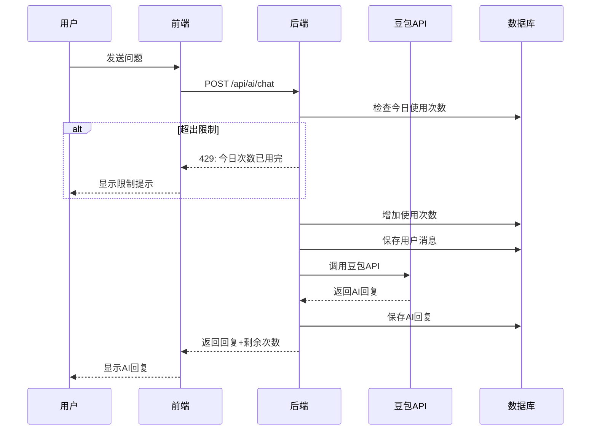
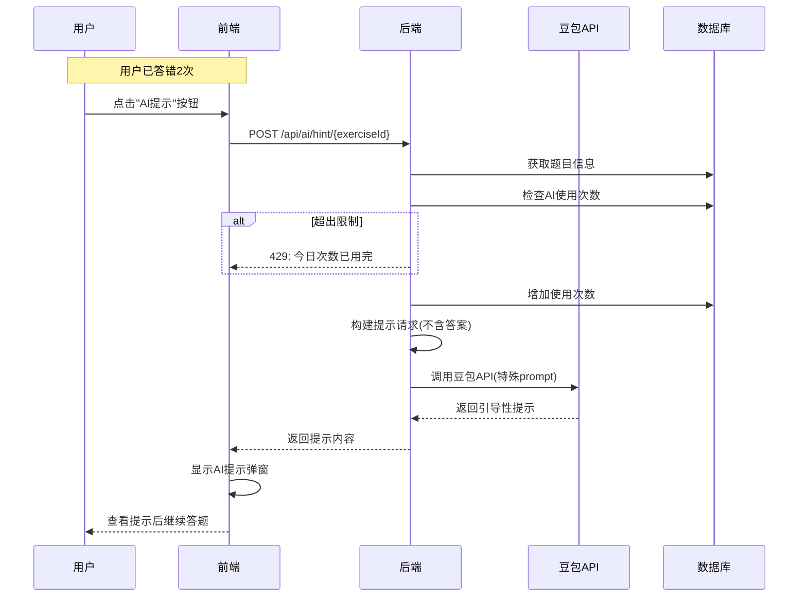
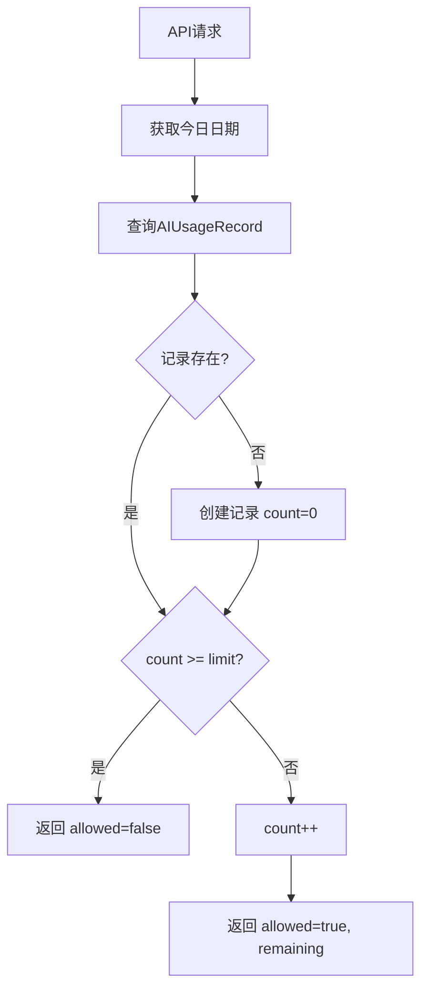

# AI 助手模块

## 概述

AI 助手基于豆包 API，为学生提供编程问答、代码解释、错误分析等功能。每个用户每天有调用次数限制。

## 功能列表

1. **智能问答** - 回答 C++ 编程问题
2. **代码解释** - 解释代码含义
3. **错误分析** - 分析编译/运行错误
4. **答题提示** - 答错两次后提供引导性提示

## 流程图

### AI 问答流程



### AI 提示流程 (答错两次后)



### 使用次数检查流程



## API 接口

### 获取使用状态

```
GET /api/ai/usage
Authorization: Bearer <token>
```

**响应:**
```json
{
  "used": 15,
  "remaining": 85,
  "limit": 100
}
```

### 发送消息

```
POST /api/ai/chat
Authorization: Bearer <token>
```

**请求体:**
```json
{
  "messages": [
    { "role": "user", "content": "什么是指针？" }
  ],
  "sessionId": "optional-session-id"
}
```

**响应:**
```json
{
  "message": "指针是一种特殊的变量，它存储的是另一个变量的内存地址...",
  "sessionId": "session-uuid",
  "usage": {
    "remaining": 84,
    "limit": 100
  }
}
```

### 流式聊天

```
POST /api/ai/chat/stream
Authorization: Bearer <token>
```

**请求体:** 同上

**响应:** Server-Sent Events (SSE)
```
data: {"content": "指针", "sessionId": "xxx"}
data: {"content": "是一种", "sessionId": "xxx"}
...
data: {"usage": {"remaining": 84, "limit": 100}}
data: [DONE]
```

### 代码解释

```
POST /api/ai/explain
Authorization: Bearer <token>
```

**请求体:**
```json
{
  "code": "#include <iostream>\nint main() { ... }"
}
```

**响应:**
```json
{
  "explanation": "这段代码的功能是...",
  "usage": { "remaining": 83, "limit": 100 }
}
```

### 错误分析

```
POST /api/ai/analyze-error
Authorization: Bearer <token>
```

**请求体:**
```json
{
  "code": "int x = 10\ncout << x;",
  "error": "error: expected ';' before 'cout'"
}
```

**响应:**
```json
{
  "analysis": "这个错误是因为第1行末尾缺少分号...",
  "usage": { "remaining": 82, "limit": 100 }
}
```

### 获取答题提示

```
POST /api/ai/hint/{exerciseId}
Authorization: Bearer <token>
```

**响应:**
```json
{
  "hint": "这道题考查的是变量声明。想一想，在C++中声明一个整数变量需要什么关键字？变量名后面应该跟什么符号？",
  "usage": { "remaining": 81, "limit": 100 }
}
```

## System Prompt

### 通用问答 Prompt

```
你是 NOI Quest 的 AI 编程助教，专门帮助初中生学习 C++ 编程，备战 CSP-J、CSP-S 和 NOI 竞赛。

你的职责：
1. 用简单易懂的语言解释 C++ 概念和算法
2. 帮助学生理解代码的含义和逻辑
3. 分析代码错误并给出修复建议
4. 回答学生关于 C++ 编程和算法的问题
5. 引导学生思考，而不是直接给出完整答案

注意事项：
- 使用中文回答
- 解释要通俗易懂，适合初中生理解
- 如果学生问的是竞赛题，引导他们思考解题思路
- 代码示例要简洁明了，符合竞赛代码风格
- 对学生要有耐心，鼓励他们多尝试
- 适当介绍时间复杂度和空间复杂度的概念
```

### 答题提示 Prompt

```
你是 NOI Quest 的 AI 编程助教，专门帮助初中生学习 C++ 编程。

现在学生在做一道题目时遇到了困难，已经答错了两次。你的任务是给出提示，引导学生思考，但绝对不能直接给出答案。

提示原则：
1. 分析题目考查的知识点
2. 提醒学生注意容易出错的地方
3. 用问题引导学生思考
4. 给出思考方向，但不要给出具体答案
5. 语气要鼓励和耐心

注意：
- 使用中文回答
- 不要直接说出正确答案是什么
- 不要给出完整的代码
- 提示要简洁，控制在 100-200 字以内
```

## 配置

| 配置项 | 环境变量 | 默认值 | 说明 |
|--------|----------|--------|------|
| API Key | DOUBAO_API_KEY | - | 豆包 API 密钥 |
| API URL | DOUBAO_API_URL | - | 豆包 API 地址 |
| Model | DOUBAO_MODEL | - | 模型端点 ID |
| 每日限制 | AI_DAILY_LIMIT | 100 | 每用户每日调用次数 |

## 相关文件

| 文件 | 说明 |
|------|------|
| `backend/src/routes/ai.ts` | AI API 路由 |
| `backend/src/config/index.ts` | AI 配置 |
| `frontend/src/components/AI/AIChat.tsx` | AI 聊天组件 |
| `frontend/src/components/AI/AIService.ts` | AI 服务(已废弃，改用后端) |
| `frontend/src/components/Feedback/AIHintModal.tsx` | AI 提示弹窗 |
