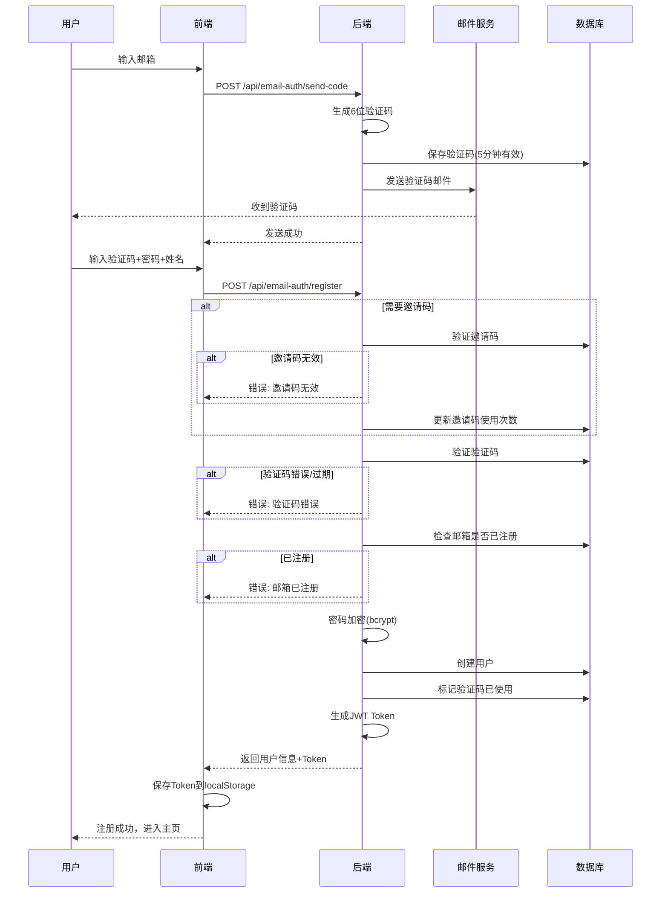
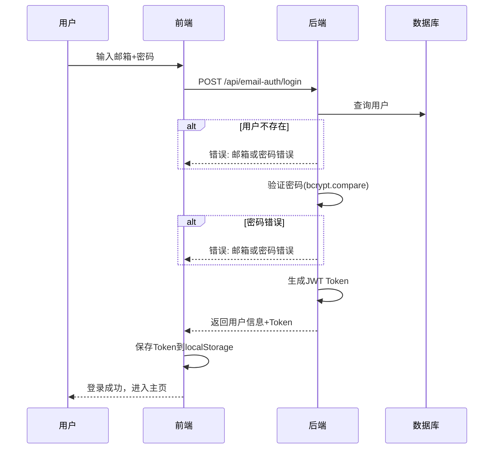
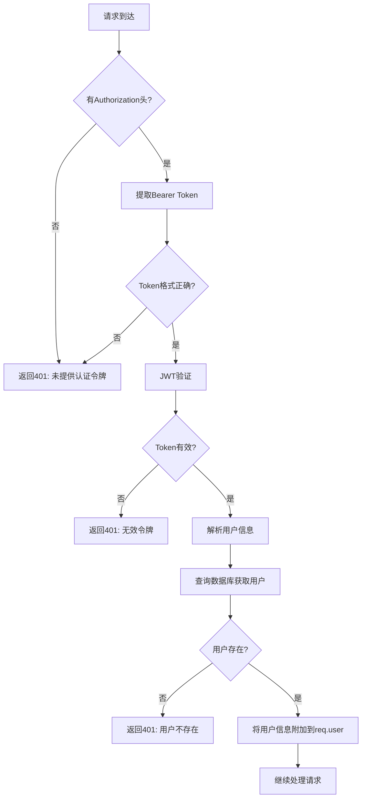

# 认证模块

## 概述

认证模块负责用户注册、登录、权限验证等功能。支持邮箱+验证码注册和邮箱+密码登录。

## 流程图

### 注册流程



### 登录流程



### 认证中间件流程



## API 接口

### 发送验证码

```
POST /api/email-auth/send-code
```

**请求体:**
```json
{
  "email": "user@example.com"
}
```

**响应:**
```json
{
  "message": "验证码已发送到你的邮箱"
}
```

**错误:**
- 400: 邮箱格式错误
- 400: 验证码已发送，请稍后再试

### 注册

```
POST /api/email-auth/register
```

**请求体:**
```json
{
  "email": "user@example.com",
  "code": "123456",
  "password": "password123",
  "name": "张三",
  "role": "STUDENT",
  "inviteCode": "ABC12345"
}
```

**响应:**
```json
{
  "user": {
    "id": "uuid",
    "username": "user",
    "email": "user@example.com",
    "name": "张三",
    "role": "STUDENT",
    "level": 1,
    "xp": 0,
    "totalXp": 0,
    "streak": 0,
    "hearts": 5,
    "gems": 0
  },
  "token": "jwt-token"
}
```

### 登录

```
POST /api/email-auth/login
```

**请求体:**
```json
{
  "email": "user@example.com",
  "password": "password123"
}
```

**响应:** 同注册

### 获取当前用户

```
GET /api/auth/me
Authorization: Bearer <token>
```

**响应:**
```json
{
  "id": "uuid",
  "username": "user",
  "email": "user@example.com",
  "name": "张三",
  "role": "STUDENT",
  ...
}
```

### 获取注册配置

```
GET /api/email-auth/config
```

**响应:**
```json
{
  "inviteRequired": false
}
```

## 相关文件

| 文件 | 说明 |
|------|------|
| `backend/src/routes/email-auth.ts` | 邮箱认证路由 |
| `backend/src/routes/auth.ts` | 基础认证路由 |
| `backend/src/middleware/auth.ts` | 认证中间件 |
| `frontend/src/components/Auth/EmailLogin.tsx` | 登录组件 |
| `frontend/src/components/Auth/EmailRegister.tsx` | 注册组件 |
| `frontend/src/contexts/AuthContext.tsx` | 认证上下文 |

## JWT Token 结构

```json
{
  "id": "user-uuid",
  "username": "user",
  "role": "STUDENT",
  "iat": 1234567890,
  "exp": 1234567890
}
```

- 有效期: 7天 (可配置)
- 签名算法: HS256
