# 题目系统

## 概述

题目系统支持6种题型，每种题型有不同的数据结构和判断逻辑。

## 题目类型

### 1. 填空题 (FILL_BLANK)

**数据结构:**
```json
{
  "type": "FILL_BLANK",
  "questionData": {
    "code": "int x = ___BLANK_1___;\ncout << x ___BLANK_2___ 5;",
    "blanks": [
      {
        "id": "BLANK_1",
        "answer": "10",
        "hint": "整数值",
        "alternatives": ["10"]
      },
      {
        "id": "BLANK_2",
        "answer": "+",
        "hint": "运算符",
        "alternatives": ["+"]
      }
    ]
  }
}
```

**用户答案格式:**
```json
{
  "BLANK_1": "10",
  "BLANK_2": "+"
}
```

**判断逻辑:**
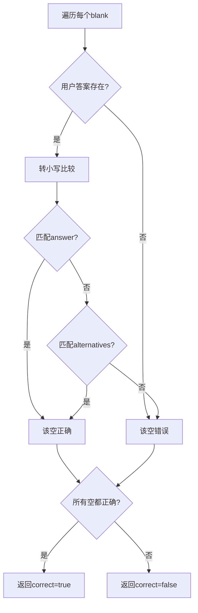

### 2. 代码排序题 (CODE_ORDER)

**数据结构:**
```json
{
  "type": "CODE_ORDER",
  "questionData": {
    "description": "排列代码实现输出 1-5",
    "lines": [
      { "id": "1", "code": "for (int i = 1; i <= 5; i++) {", "order": 1 },
      { "id": "2", "code": "    cout << i << endl;", "order": 2 },
      { "id": "3", "code": "}", "order": 3 }
    ]
  }
}
```

**用户答案格式:**
```json
["1", "2", "3"]  // 用户排列的行ID顺序
```

**判断逻辑:**
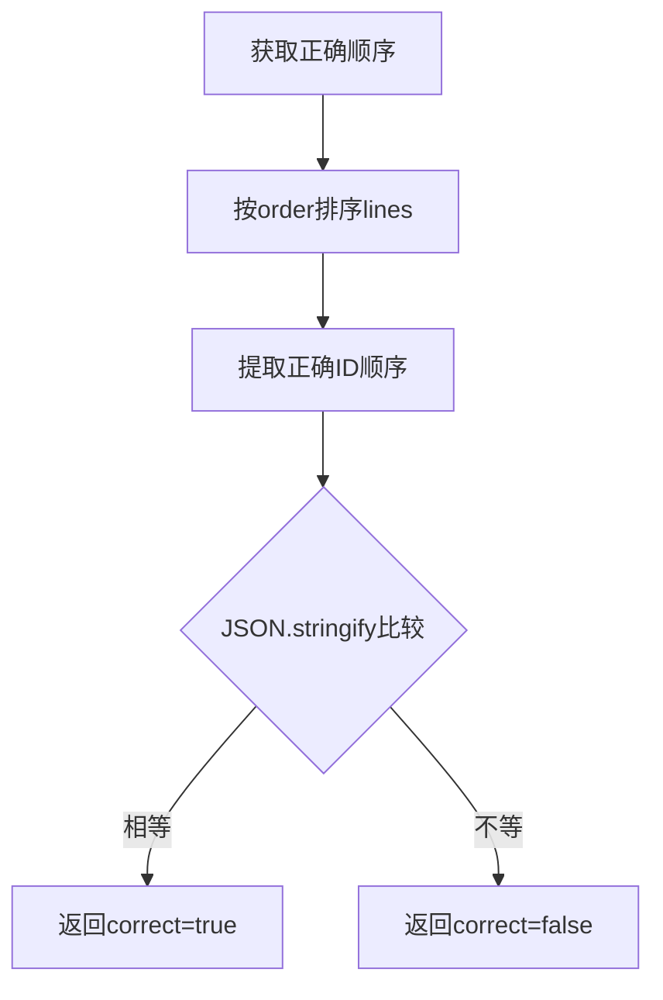

### 3. 选择题 (MULTIPLE_CHOICE)

**数据结构:**
```json
{
  "type": "MULTIPLE_CHOICE",
  "questionData": {
    "question": "int x = 5; cout << x++;  输出什么？",
    "options": [
      { "id": "A", "text": "5", "correct": true },
      { "id": "B", "text": "6", "correct": false },
      { "id": "C", "text": "4", "correct": false },
      { "id": "D", "text": "编译错误", "correct": false }
    ],
    "explanation": "后置递增 x++ 先返回当前值 5，然后 x 变成 6"
  }
}
```

**用户答案格式:**
```json
"A"  // 选项ID
```

**判断逻辑:**
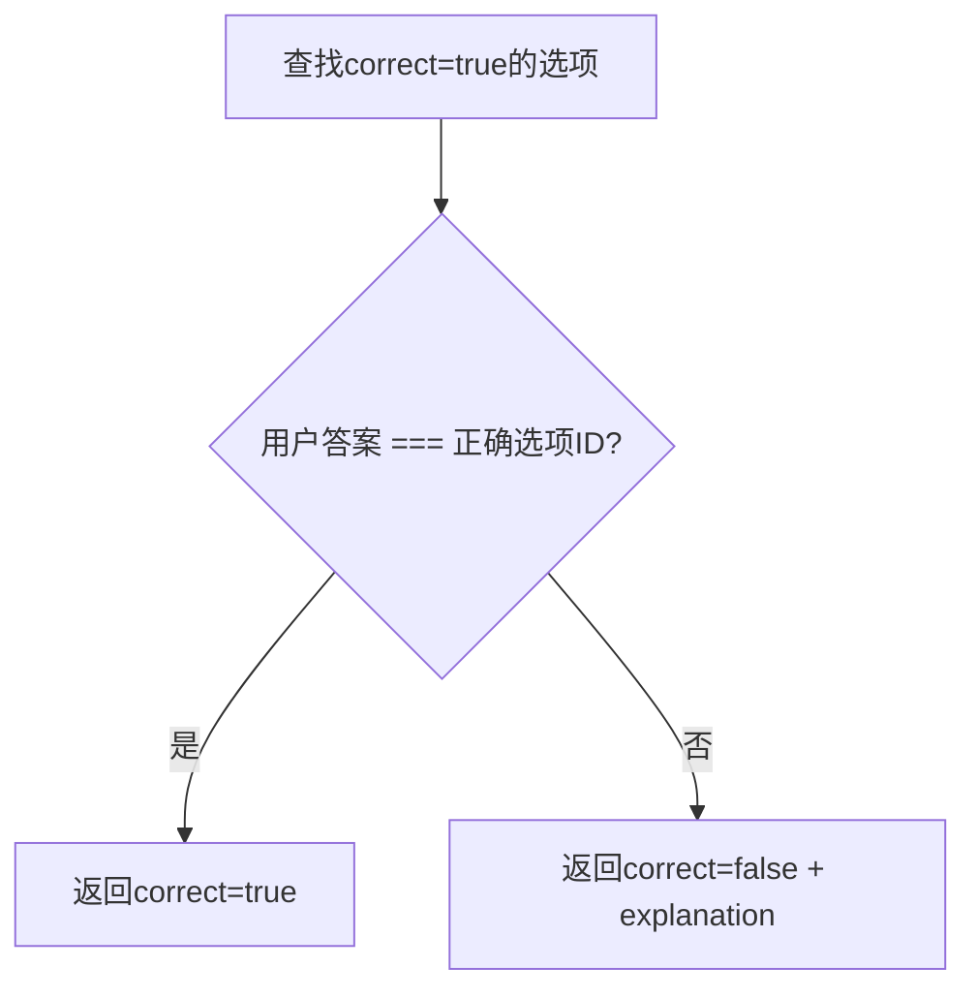

### 4. 配对题 (MATCHING)

**数据结构:**
```json
{
  "type": "MATCHING",
  "questionData": {
    "left": [
      { "id": "L1", "text": "声明变量" },
      { "id": "L2", "text": "输出" },
      { "id": "L3", "text": "输入" }
    ],
    "right": [
      { "id": "R1", "text": "int x = 10;" },
      { "id": "R2", "text": "cout << x;" },
      { "id": "R3", "text": "cin >> x;" }
    ],
    "pairs": [["L1", "R1"], ["L2", "R2"], ["L3", "R3"]]
  }
}
```

**用户答案格式:**
```json
[
  ["L1", "R1"],
  ["L2", "R2"],
  ["L3", "R3"]
]
```

**判断逻辑:**
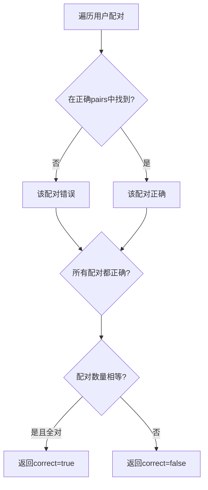

### 5. 改错题 (BUG_FIX)

**数据结构:**
```json
{
  "type": "BUG_FIX",
  "questionData": {
    "buggyCode": "int sum = 0\nfor (i = 0; i < 5; i++)\n    sum += i;",
    "bugs": [
      { "line": 1, "fix": "int sum = 0;", "hint": "缺少分号" },
      { "line": 2, "fix": "for (int i = 0; i < 5; i++) {", "hint": "缺少类型声明和大括号" }
    ],
    "correctCode": "int sum = 0;\nfor (int i = 0; i < 5; i++) {\n    sum += i;\n}"
  }
}
```

**用户答案格式:**
```json
{
  "1": "int sum = 0;",
  "2": "for (int i = 0; i < 5; i++) {"
}
```

**判断逻辑:**
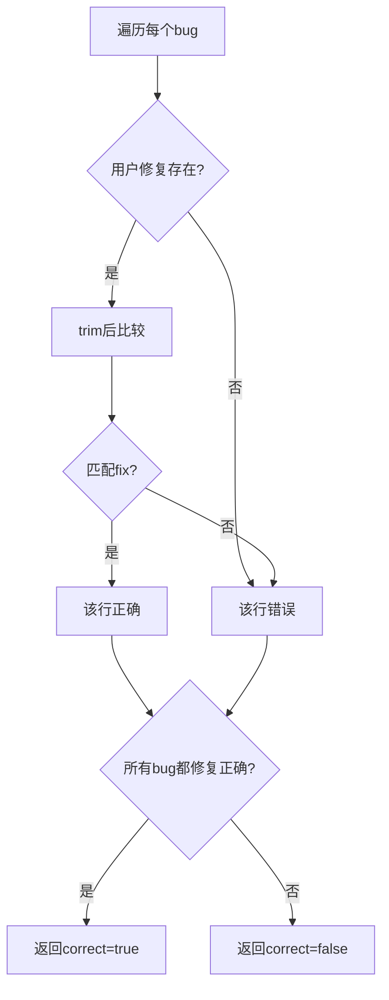

### 6. 编程题 (CODING)

**数据结构:**
```json
{
  "type": "CODING",
  "questionData": {
    "testCases": [
      { "input": "5", "output": "120" },
      { "input": "0", "output": "1" }
    ]
  },
  "starterCode": "#include <iostream>\nusing namespace std;\n\nint main() {\n    // 你的代码\n    return 0;\n}"
}
```

**用户答案格式:**
```json
{
  "code": "#include <iostream>\n..."
}
```

**判断逻辑:** (当前为占位符，需要代码执行环境)
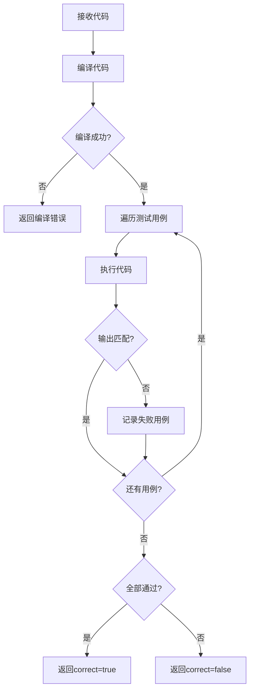

## 前端渲染组件

### QuestionRenderer

根据题目类型渲染不同的答题组件:

```typescript
switch (exercise.type) {
  case 'FILL_BLANK':
    return <FillBlankQuestion ... />;
  case 'CODE_ORDER':
    return <CodeOrderQuestion ... />;
  case 'MULTIPLE_CHOICE':
    return <MultipleChoiceQuestion ... />;
  case 'MATCHING':
    return <MatchingQuestion ... />;
  case 'BUG_FIX':
    return <BugFixQuestion ... />;
  case 'CODING':
    return <CodingQuestion ... />;
}
```

## 练习题库页面

### 页面组件

| 文件 | 说明 |
|------|------|
| `frontend/src/components/Learning/ExerciseList.tsx` | 练习题库列表页面 |
| `frontend/src/components/Learning/ExerciseDetail.tsx` | 练习题详情页面 |
| `frontend/src/data/exercises.ts` | 本地练习题数据（15道题） |

### 功能说明

**ExerciseList (练习题库列表)**
- 显示所有练习题目列表
- 按分类筛选（全部、基础入门、条件语句、循环语句、数组、函数、字符串、算法）
- 按难度筛选（全部、简单、中等、困难）
- 显示完成进度统计（已完成/总数 + 进度条）
- 题目卡片展示完成状态、难度、分类

**ExerciseDetail (练习题详情)**
- 显示题目标题、描述、难度、分类
- 提示（Hint）的展开/隐藏
- 参考答案（Solution）的展开/隐藏
- "加载初始代码"按钮（跳转到编辑器）
- "标记为完成"按钮

### 已知问题与修复方案

---

#### 问题1：前后端数据不同步 [严重]

**位置:** `ExerciseList.tsx:2`

**现状:** 前端使用硬编码的本地数据 `exercises`，而后端有完整的数据库和API。

```typescript
// 当前代码 - 使用本地数据
import { exercises, categories } from '../../data/exercises';
```

**影响:**
- 后端数据库中的题目更新不会反映到前端
- 管理员在后台添加/修改的题目不会显示
- 前后端数据可能不一致

**修复方案:**

1. **在 `api.ts` 中添加练习题库API方法:**

```typescript
// 获取练习题列表
async getExercises(params?: { category?: string; difficulty?: string }): Promise<Exercise[]> {
  const query = new URLSearchParams();
  if (params?.category) query.set('category', params.category);
  if (params?.difficulty) query.set('difficulty', params.difficulty);
  return this.request<Exercise[]>(`/exercise?${query.toString()}`);
}

// 获取分类列表
async getExerciseCategories(): Promise<string[]> {
  return this.request<string[]>('/exercise/meta/categories');
}
```

2. **修改 `ExerciseList.tsx` 组件:**

```typescript
// 删除本地数据导入
// import { exercises, categories } from '../../data/exercises';

// 添加状态和数据获取
const [exercises, setExercises] = useState<Exercise[]>([]);
const [categories, setCategories] = useState<string[]>(['全部']);
const [loading, setLoading] = useState(true);
const [error, setError] = useState<string | null>(null);

useEffect(() => {
  const fetchData = async () => {
    try {
      setLoading(true);
      const [exerciseData, categoryData] = await Promise.all([
        api.getExercises(),
        api.getExerciseCategories()
      ]);
      setExercises(exerciseData);
      setCategories(['全部', ...categoryData]);
    } catch (err) {
      setError(err instanceof Error ? err.message : '加载失败');
    } finally {
      setLoading(false);
    }
  };
  fetchData();
}, []);
```

**数据流:**

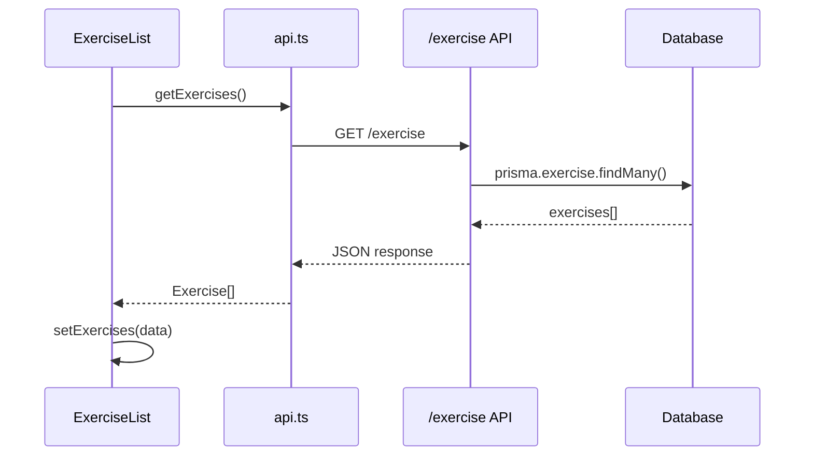

---

#### 问题2：完成状态未持久化 [严重]

**位置:** `App.tsx` 中的 `handleCompleteExercise`

**现状:** 完成状态只保存在前端本地状态，没有调用后端API同步。

**影响:**
- 刷新页面后完成状态丢失
- 不同设备间完成状态不同步
- 用户进度无法真正保存

**修复方案:**

1. **在 `api.ts` 中添加进度API方法:**

```typescript
// 获取用户所有进度
async getExerciseProgress(): Promise<ExerciseProgress[]> {
  return this.request<ExerciseProgress[]>('/progress');
}

// 完成练习题
async completeExercise(exerciseId: string, code?: string): Promise<{
  progress: ExerciseProgress;
  rewards: {
    xpGained: number;
    gemsGained: number;
    levelUp: boolean;
    newLevel: number;
    isFirstCompletion: boolean;
  };
}> {
  return this.request(`/progress/${exerciseId}/complete`, {
    method: 'POST',
    body: JSON.stringify({ code }),
  });
}
```

2. **修改 `App.tsx` 中的完成逻辑:**

```typescript
// 页面加载时获取已完成的题目ID
useEffect(() => {
  const fetchProgress = async () => {
    try {
      const progress = await api.getExerciseProgress();
      const completedIds = progress
        .filter(p => p.completed)
        .map(p => p.exerciseId);
      setCompletedIds(completedIds);
    } catch (err) {
      console.error('获取进度失败:', err);
    }
  };
  if (isLoggedIn) {
    fetchProgress();
  }
}, [isLoggedIn]);

// 完成题目时调用API
const handleCompleteExercise = async (exerciseId: string) => {
  try {
    const result = await api.completeExercise(exerciseId);

    // 更新本地状态
    setCompletedIds(prev => [...prev, exerciseId]);

    // 显示奖励提示
    if (result.rewards.isFirstCompletion) {
      showToast(`获得 ${result.rewards.xpGained} XP!`);
      if (result.rewards.levelUp) {
        showToast(`升级到 ${result.rewards.newLevel} 级!`);
      }
    }
  } catch (err) {
    showToast('保存进度失败');
  }
};
```

**数据流:**

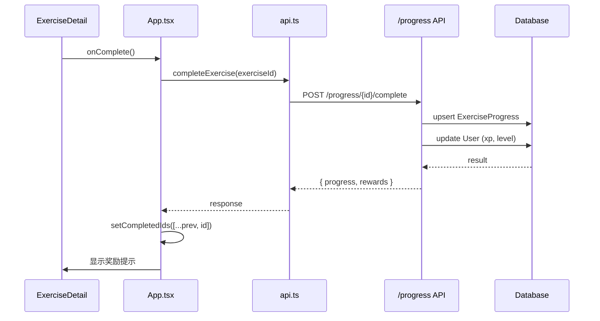

---

#### 问题3：难度值大小写冗余 [轻微]

**位置:** `ExerciseList.tsx:11-27`, `ExerciseDetail.tsx:23-39`

**现状:** 需要同时支持小写和大写的难度值，导致代码冗余。

**修复方案:**

1. **创建统一的难度工具函数 `utils/difficulty.ts`:**

```typescript
export const difficultyConfig = {
  easy: { color: 'bg-green-500', label: '简单' },
  medium: { color: 'bg-yellow-500', label: '中等' },
  hard: { color: 'bg-red-500', label: '困难' },
} as const;

export function getDifficultyColor(difficulty: string): string {
  const key = difficulty.toLowerCase() as keyof typeof difficultyConfig;
  return difficultyConfig[key]?.color || 'bg-gray-500';
}

export function getDifficultyLabel(difficulty: string): string {
  const key = difficulty.toLowerCase() as keyof typeof difficultyConfig;
  return difficultyConfig[key]?.label || difficulty;
}
```

2. **在组件中使用:**

```typescript
import { getDifficultyColor, getDifficultyLabel } from '../../utils/difficulty';

// 使用
<span className={`px-2 py-0.5 text-xs rounded ${getDifficultyColor(exercise.difficulty)} text-white`}>
  {getDifficultyLabel(exercise.difficulty)}
</span>
```

---

#### 问题4：缺少加载和错误状态 [中等]

**位置:** `ExerciseList.tsx`, `ExerciseDetail.tsx`

**现状:** 页面没有处理加载中、错误、空数据状态。

**修复方案:**

**在 `ExerciseList.tsx` 中添加状态处理:**

```typescript
// 状态定义
const [loading, setLoading] = useState(true);
const [error, setError] = useState<string | null>(null);

// 渲染逻辑
if (loading) {
  return (
    <div className="h-full flex items-center justify-center bg-gray-900">
      <div className="text-center">
        <div className="animate-spin rounded-full h-12 w-12 border-b-2 border-blue-500 mx-auto"></div>
        <p className="mt-4 text-gray-400">加载题目中...</p>
      </div>
    </div>
  );
}

if (error) {
  return (
    <div className="h-full flex items-center justify-center bg-gray-900">
      <div className="text-center">
        <p className="text-red-400 mb-4">{error}</p>
        <button
          onClick={() => window.location.reload()}
          className="px-4 py-2 bg-blue-600 text-white rounded hover:bg-blue-700"
        >
          重试
        </button>
      </div>
    </div>
  );
}

if (filteredExercises.length === 0) {
  return (
    <div className="h-full flex items-center justify-center bg-gray-900">
      <div className="text-center text-gray-400">
        <BookOpen size={48} className="mx-auto mb-4 opacity-50" />
        <p>没有找到符合条件的题目</p>
      </div>
    </div>
  );
}
```

---

#### 问题5：练习题库与题目系统未整合 [中等]

**位置:** `ExerciseDetail.tsx`

**现状:** 练习题库页面只支持简单的"加载初始代码"和"标记为完成"，没有使用题目系统的多种题型。

**修复方案:**

**修改 `ExerciseDetail.tsx` 集成 QuestionRenderer:**

```typescript
import QuestionRenderer from '../Questions/QuestionRenderer';

export default function ExerciseDetail({ exercise, onBack, onComplete, isCompleted }: Props) {
  const [userAnswer, setUserAnswer] = useState<any>(null);
  const [result, setResult] = useState<AnswerResult | null>(null);
  const [submitting, setSubmitting] = useState(false);

  const handleSubmit = async () => {
    if (!userAnswer) return;

    setSubmitting(true);
    try {
      const result = await api.submitAnswer(exercise.id, userAnswer);
      setResult(result);

      if (result.correct) {
        onComplete();
      }
    } catch (err) {
      console.error('提交失败:', err);
    } finally {
      setSubmitting(false);
    }
  };

  return (
    <div className="h-full flex flex-col bg-gray-900 text-white">
      {/* 头部保持不变 */}

      {/* 内容区域 */}
      <div className="flex-1 overflow-y-auto p-4">
        {/* 题目描述 */}
        <div className="bg-gray-800 rounded-lg p-4 mb-4">
          <h3 className="font-semibold mb-2 text-blue-400">题目描述</h3>
          <p className="text-gray-300">{exercise.description}</p>
        </div>

        {/* 根据题型渲染不同组件 */}
        {exercise.type && exercise.type !== 'CODING' ? (
          <QuestionRenderer
            exercise={exercise}
            onAnswerChange={setUserAnswer}
            result={result}
          />
        ) : (
          /* 编程题保持原有的提示和答案展示 */
          <>
            {exercise.hint && <HintSection hint={exercise.hint} />}
            {exercise.solution && <SolutionSection solution={exercise.solution} />}
          </>
        )}
      </div>

      {/* 底部操作 */}
      <div className="p-4 border-t border-gray-700 flex gap-3">
        {exercise.type && exercise.type !== 'CODING' ? (
          <button
            onClick={handleSubmit}
            disabled={!userAnswer || submitting || isCompleted}
            className="flex-1 py-2 bg-green-600 hover:bg-green-700 disabled:bg-gray-600 text-white rounded-lg font-medium"
          >
            {submitting ? '提交中...' : isCompleted ? '已完成' : '提交答案'}
          </button>
        ) : (
          <>
            <button onClick={() => onLoadCode(exercise.starterCode)} className="...">
              加载初始代码
            </button>
            {!isCompleted && (
              <button onClick={onComplete} className="...">
                标记为完成
              </button>
            )}
          </>
        )}
      </div>
    </div>
  );
}
```

**逻辑流程:**

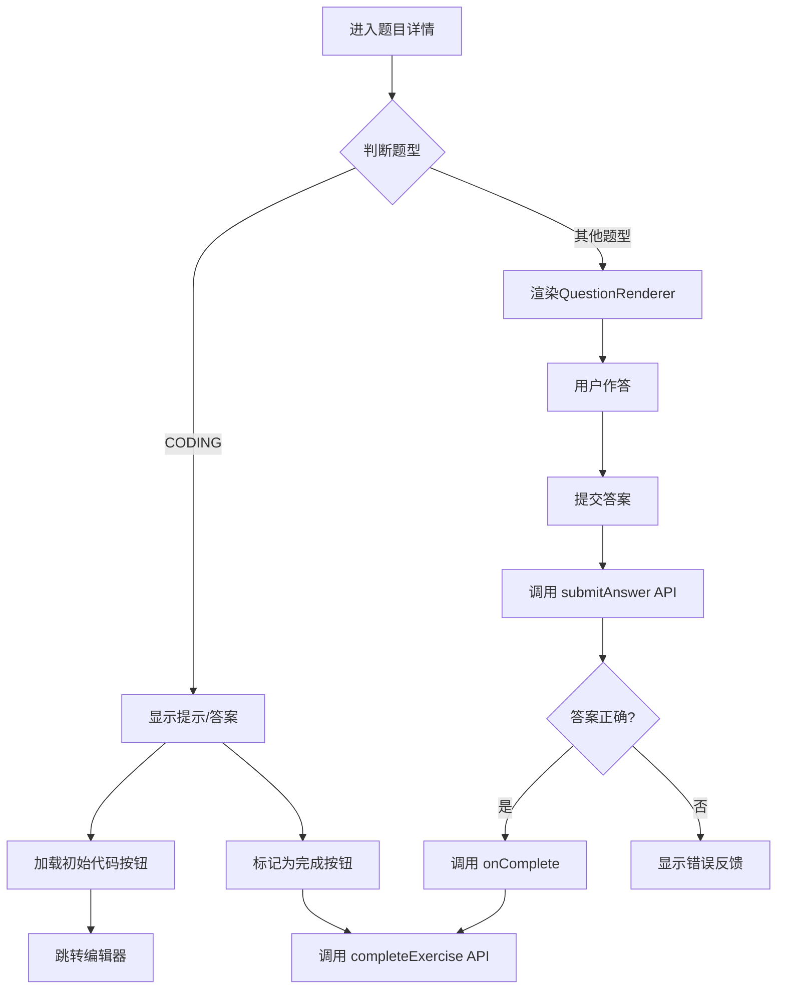

---

#### 问题6：XP奖励未实现 [轻微]

**位置:** `ExerciseDetail.tsx`

**现状:** 题目数据中有 `xp` 字段，但完成题目时没有实际发放XP奖励。

**修复方案:**

此问题在修复问题2时已一并解决。后端 `/progress/{exerciseId}/complete` API 会：

1. 检查是否首次完成
2. 首次完成时发放XP和宝石奖励
3. 更新用户等级
4. 返回奖励信息给前端展示

**奖励计算逻辑 (backend/src/routes/progress.ts):**

```typescript
if (isFirstCompletion) {
  xpGained = exercise.xp;                    // 题目XP
  gemsGained = Math.floor(exercise.xp / 10); // 宝石 = XP/10

  const newTotalXp = user.totalXp + xpGained;
  const newLevel = calculateLevel(newTotalXp);
  levelUp = newLevel > user.level;

  // 更新用户数据
  await prisma.user.update({
    where: { id: userId },
    data: {
      xp: user.xp + xpGained,
      totalXp: newTotalXp,
      gems: user.gems + gemsGained,
      level: newLevel,
    },
  });
}
```

**前端展示奖励:**

```typescript
// 在 handleCompleteExercise 中
if (result.rewards.isFirstCompletion) {
  // 显示奖励弹窗或Toast
  showRewardModal({
    xp: result.rewards.xpGained,
    gems: result.rewards.gemsGained,
    levelUp: result.rewards.levelUp,
    newLevel: result.rewards.newLevel,
  });
}
```

---

### 修复优先级

| 优先级 | 问题 | 原因 |
|--------|------|------|
| P0 | 问题1: 前后端数据不同步 | 核心功能缺失，管理员无法管理题目 |
| P0 | 问题2: 完成状态未持久化 | 用户进度丢失，严重影响体验 |
| P1 | 问题4: 缺少加载和错误状态 | 用户体验问题 |
| P1 | 问题5: 题目系统未整合 | 功能重复，无法使用多种题型 |
| P2 | 问题6: XP奖励未实现 | 随问题2一起修复 |
| P2 | 问题3: 难度值大小写冗余 | 代码质量问题，不影响功能 |

---

## 设计决策（已确认）

### 模块定位

| 模块 | 定位 | 目标 | 题目特点 |
|------|------|------|----------|
| **练习题库** | 学习导向 | 帮助学生自由学习、巩固知识 | 题目多、覆盖广、难度梯度大 |
| **技能树** | 闯关导向 | 结构化学习路径、游戏化体验 | 精选题目、循序渐进、多种题型 |

两套系统**完全独立**，题目数据**不共享**，用户进度分开记录。

### 与技能树的区别

| 维度 | 技能树 | 练习题库 |
|------|--------|----------|
| 定位 | 闯关导向 | 学习导向 |
| 题型 | 6种题型（填空、排序、选择、配对、改错、编程） | **只有编程题** |
| 题目来源 | 精选题目，与课程绑定 | **独立题库**，题目量大 |
| 题目数据 | Exercise 表（unitId/lessonId 关联） | **独立表或筛选条件区分** |
| 扣心 | 新课程扣心 | **不扣心** |
| XP奖励 | 首次满XP，重做20% | 首次满XP，重做20% |
| 做错后 | 自动下一题 | **可以重试** |
| 完成条件 | 答完所有题目（不管对错） | 答对（通过测试用例） |
| 进度记录 | UserLessonProgress | ExerciseProgress |

### 功能规划

| 功能 | 决策 | 说明 |
|------|------|------|
| 题型支持 | 只支持编程题 | 练习题库专注代码编写能力 |
| 完成标准 | 代码执行验证 | 必须运行通过测试用例才算完成 |
| 搜索功能 | 需要 | 支持关键词搜索题目 |
| 分页功能 | 需要 | 题目多时分页加载 |
| 智能推荐 | 需要 | 根据用户掌握情况推荐题目 |
| 错题本集成 | 需要 | 做错的题目进入错题本 |
| 复习系统集成 | 需要 | 与复习系统深度关联 |

---

## 完整设计方案

### 1. 数据模型

练习题库使用独立的数据，与技能树题目**不共享**。

**方案：在 Exercise 表中用 `source` 字段区分**

```prisma
model Exercise {
  id            String   @id @default(uuid())
  title         String
  description   String
  difficulty    Difficulty
  category      String
  xp            Int      @default(10)
  type          QuestionType
  questionData  Json?
  starterCode   String?
  hint          String?
  solution      String?

  // 区分来源
  source        String   @default("SKILL_TREE")  // SKILL_TREE | EXERCISE_LIBRARY

  // 技能树关联（仅 source=SKILL_TREE 时有值）
  unitId        String?
  lessonId      String?

  // 练习题库专用字段
  testCases     TestCase[]  // 测试用例（仅编程题）

  orderIndex    Int      @default(0)
  isPublished   Boolean  @default(false)
  createdAt     DateTime @default(now())
  updatedAt     DateTime @updatedAt
}

model TestCase {
  id          String   @id @default(uuid())
  exerciseId  String
  input       String
  output      String
  isHidden    Boolean  @default(false)
  orderIndex  Int      @default(0)

  exercise    Exercise @relation(fields: [exerciseId], references: [id], onDelete: Cascade)
}
```

**查询区分：**
```typescript
// 获取练习题库题目
const exercises = await prisma.exercise.findMany({
  where: { source: 'EXERCISE_LIBRARY', type: 'CODING' }
});

// 获取技能树题目
const lessonExercises = await prisma.exercise.findMany({
  where: { source: 'SKILL_TREE', lessonId: 'xxx' }
});
```

### 2. 页面结构

```
练习题库页面
├── 头部区域
│   ├── 标题 + 完成进度统计
│   └── 搜索框
├── 筛选区域
│   ├── 分类筛选（全部、基础入门、条件语句...）
│   ├── 难度筛选（全部、简单、中等、困难）
│   └── 状态筛选（全部、未完成、已完成）
├── 推荐区域（可选显示）
│   └── 智能推荐的3-5道题目卡片
├── 题目列表
│   ├── 分页控件
│   └── 题目卡片列表
└── 题目详情（点击后展开或跳转）
    ├── 题目描述
    ├── 代码编辑器
    ├── 运行/提交按钮
    └── 执行结果展示
```

### 3. 核心流程

#### 3.1 题目列表加载流程

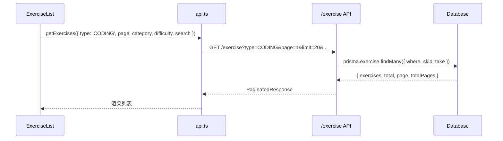

#### 3.2 做题与提交流程

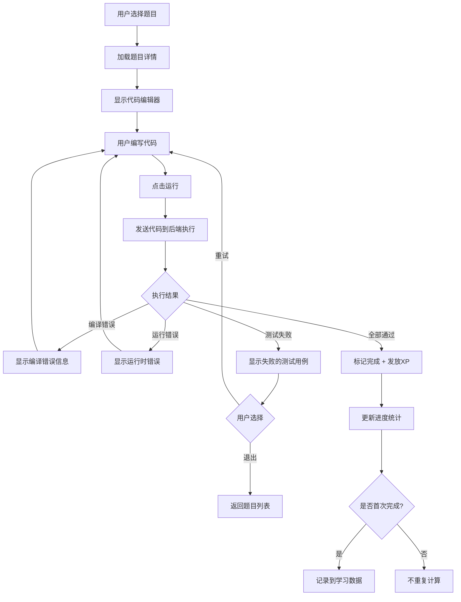

**关键点：做错后可以重试，不扣心**

#### 3.3 错题记录流程

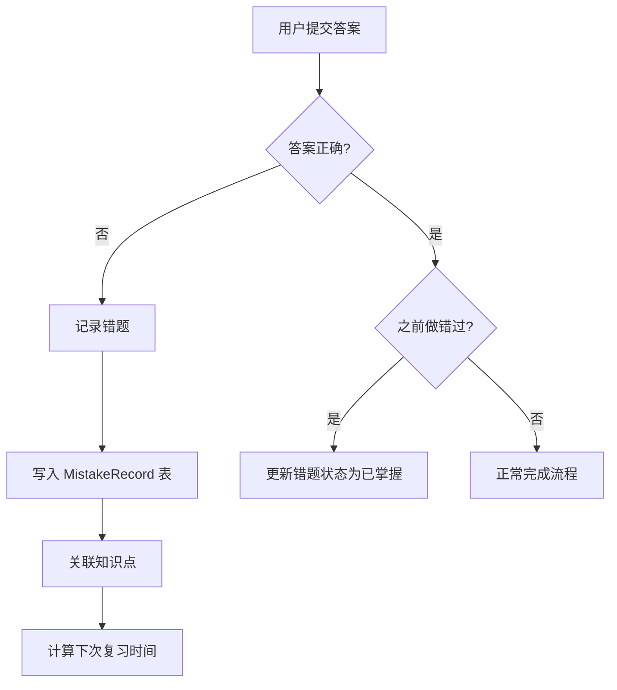

### 4. API 设计

#### 4.1 获取练习题列表

```
GET /exercise
```

**请求参数:**
| 参数 | 类型 | 必填 | 说明 |
|------|------|------|------|
| type | string | 否 | 题型，练习题库固定传 `CODING` |
| category | string | 否 | 分类筛选 |
| difficulty | string | 否 | 难度筛选 |
| search | string | 否 | 关键词搜索（搜索标题和描述） |
| status | string | 否 | 完成状态：`all`/`completed`/`incomplete` |
| page | number | 否 | 页码，默认1 |
| limit | number | 否 | 每页数量，默认20 |

**响应:**
```json
{
  "exercises": [
    {
      "id": "xxx",
      "title": "Hello World",
      "description": "...",
      "difficulty": "easy",
      "category": "基础入门",
      "xp": 10,
      "completed": false
    }
  ],
  "pagination": {
    "page": 1,
    "limit": 20,
    "total": 100,
    "totalPages": 5
  }
}
```

#### 4.2 获取推荐题目

```
GET /exercise/recommendations
```

**响应:**
```json
{
  "recommendations": [
    {
      "exercise": { ... },
      "reason": "根据你的学习进度推荐",
      "priority": 1
    },
    {
      "exercise": { ... },
      "reason": "巩固薄弱知识点：循环语句",
      "priority": 2
    }
  ]
}
```

**推荐算法逻辑:**
1. 优先推荐：错题本中未复习的相关题目
2. 其次推荐：薄弱知识点的题目（正确率低的分类）
3. 再次推荐：下一个难度梯度的题目
4. 最后推荐：随机未完成的题目

#### 4.3 执行代码

```
POST /exercise/{id}/run
```

**请求:**
```json
{
  "code": "#include <iostream>...",
  "language": "cpp"
}
```

**响应:**
```json
{
  "success": true,
  "results": [
    { "testCase": 1, "passed": true, "output": "5", "expected": "5", "time": 12 },
    { "testCase": 2, "passed": false, "output": "10", "expected": "15", "time": 8 }
  ],
  "allPassed": false,
  "totalTime": 20,
  "error": null
}
```

#### 4.4 提交答案（完成题目）

```
POST /exercise/{id}/submit
```

**请求:**
```json
{
  "code": "#include <iostream>..."
}
```

**响应:**
```json
{
  "correct": true,
  "xpEarned": 10,
  "isFirstCompletion": true,
  "levelUp": false,
  "newLevel": 5,
  "message": "恭喜完成！获得 10 XP"
}
```

**后端逻辑:**
1. 执行代码，验证所有测试用例
2. 如果全部通过：
   - 记录完成状态
   - 首次完成发放XP
   - 更新知识点掌握度
3. 如果未通过：
   - 记录错题
   - 关联知识点
   - 设置复习计划

### 5. 与复习系统的集成

#### 5.1 数据关联

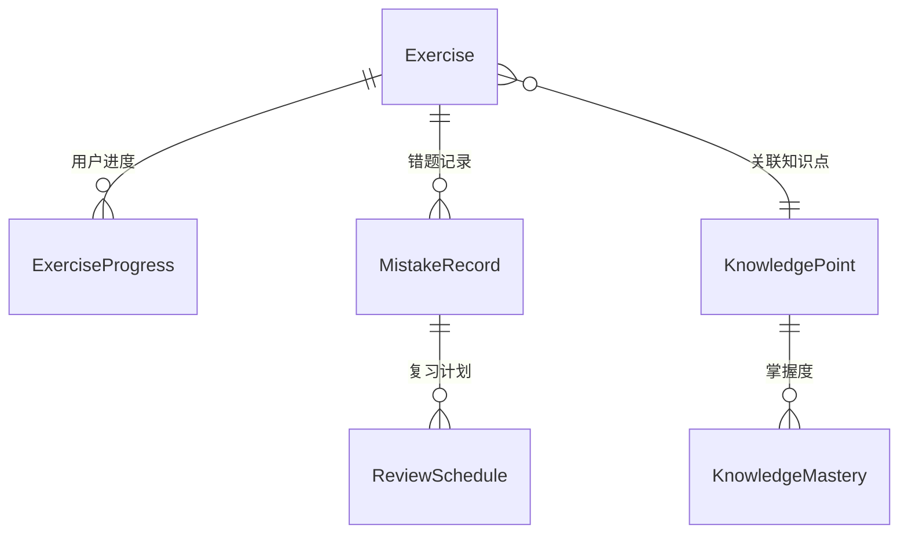

#### 5.2 错题进入复习系统

当用户在练习题库做错题目时：

```typescript
// 后端逻辑
async function recordMistake(userId: string, exerciseId: string, userAnswer: any) {
  // 1. 创建错题记录
  const mistake = await prisma.mistakeRecord.create({
    data: {
      userId,
      exerciseId,
      userAnswer: JSON.stringify(userAnswer),
      source: 'EXERCISE_LIBRARY',  // 标记来源
      reviewCount: 0,
      nextReviewAt: calculateNextReview(0),  // 间隔重复算法
    }
  });

  // 2. 更新知识点掌握度
  const exercise = await prisma.exercise.findUnique({
    where: { id: exerciseId },
    include: { knowledgePoints: true }
  });

  for (const kp of exercise.knowledgePoints) {
    await updateKnowledgeMastery(userId, kp.id, false);
  }

  return mistake;
}
```

#### 5.3 复习系统调用练习题库题目

复习系统在生成复习任务时，可以包含练习题库的题目：

```typescript
async function generateReviewSession(userId: string) {
  // 1. 获取待复习的错题
  const mistakes = await prisma.mistakeRecord.findMany({
    where: {
      userId,
      nextReviewAt: { lte: new Date() },
      mastered: false,
    },
    include: { exercise: true },
    take: 10,
  });

  // 2. 包含练习题库来源的题目
  const exerciseLibraryMistakes = mistakes.filter(
    m => m.source === 'EXERCISE_LIBRARY'
  );

  return {
    exercises: mistakes.map(m => m.exercise),
    sources: mistakes.map(m => m.source),
  };
}
```

### 6. 智能推荐算法

```typescript
async function getRecommendations(userId: string): Promise<Recommendation[]> {
  const recommendations: Recommendation[] = [];

  // 1. 错题相关推荐（最高优先级）
  const recentMistakes = await prisma.mistakeRecord.findMany({
    where: { userId, mastered: false },
    include: { exercise: { include: { knowledgePoints: true } } },
    orderBy: { createdAt: 'desc' },
    take: 5,
  });

  for (const mistake of recentMistakes) {
    // 找同知识点的其他题目
    const relatedExercises = await findRelatedExercises(
      mistake.exercise.knowledgePoints,
      userId
    );
    if (relatedExercises.length > 0) {
      recommendations.push({
        exercise: relatedExercises[0],
        reason: `巩固知识点：${mistake.exercise.category}`,
        priority: 1,
      });
    }
  }

  // 2. 薄弱知识点推荐
  const weakPoints = await getWeakKnowledgePoints(userId);
  for (const point of weakPoints.slice(0, 3)) {
    const exercises = await findExercisesByKnowledgePoint(point.id, userId);
    if (exercises.length > 0) {
      recommendations.push({
        exercise: exercises[0],
        reason: `提升薄弱项：${point.name}`,
        priority: 2,
      });
    }
  }

  // 3. 进阶推荐（已完成简单，推荐中等）
  const progress = await getUserProgress(userId);
  if (progress.easyCompletionRate > 0.8) {
    const mediumExercises = await findIncompleteByDifficulty(userId, 'medium');
    if (mediumExercises.length > 0) {
      recommendations.push({
        exercise: mediumExercises[0],
        reason: '挑战更高难度',
        priority: 3,
      });
    }
  }

  // 4. 随机推荐未完成题目
  const randomIncomplete = await findRandomIncomplete(userId);
  if (randomIncomplete) {
    recommendations.push({
      exercise: randomIncomplete,
      reason: '继续学习',
      priority: 4,
    });
  }

  // 去重并按优先级排序
  return deduplicateAndSort(recommendations);
}
```

### 7. 前端组件修改清单

| 组件 | 修改内容 |
|------|----------|
| `ExerciseList.tsx` | 1. 改用API获取数据<br>2. 添加搜索框<br>3. 添加分页组件<br>4. 添加状态筛选<br>5. 添加推荐区域<br>6. 添加loading/error状态 |
| `ExerciseDetail.tsx` | 1. 集成代码编辑器<br>2. 添加运行按钮<br>3. 显示测试用例结果<br>4. 移除"标记为完成"按钮<br>5. 添加提交按钮（运行通过后可提交） |
| `api.ts` | 1. 添加 `getExercises` 方法<br>2. 添加 `getRecommendations` 方法<br>3. 添加 `runCode` 方法<br>4. 添加 `submitExercise` 方法 |
| 新增 `SearchBar.tsx` | 搜索框组件 |
| 新增 `Pagination.tsx` | 分页组件 |
| 新增 `RecommendationCard.tsx` | 推荐题目卡片 |
| 新增 `TestResultPanel.tsx` | 测试结果展示面板 |

### 8. 后端修改清单

| 文件 | 修改内容 |
|------|----------|
| `routes/exercise.ts` | 1. 添加搜索参数支持<br>2. 添加分页逻辑<br>3. 添加状态筛选<br>4. 返回用户完成状态 |
| 新增 `routes/exercise-recommendations.ts` | 推荐算法API |
| `routes/progress.ts` | 修改完成逻辑，必须验证代码执行结果 |
| 新增 `services/codeRunner.ts` | 代码执行服务（沙箱环境） |
| `routes/review.ts` | 支持练习题库来源的错题 |

---

## 提测前检查清单（更新）

### 实现层面

- [ ] 问题1: 前后端数据同步（使用API获取题目）
- [ ] 问题2: 完成状态持久化（调用后端API）
- [ ] 问题3: 难度值统一处理
- [ ] 问题4: 加载/错误/空状态
- [ ] 新增: 搜索功能
- [ ] 新增: 分页功能
- [ ] 新增: 智能推荐
- [ ] 新增: 代码执行验证
- [ ] 新增: 错题记录到复习系统

### 功能测试

- [ ] 题目列表正确加载
- [ ] 分类筛选正常工作
- [ ] 难度筛选正常工作
- [ ] 状态筛选正常工作
- [ ] 关键词搜索正常工作
- [ ] 分页正常工作
- [ ] 推荐题目正确显示
- [ ] 代码运行返回正确结果
- [ ] 测试用例全部通过后才能完成
- [ ] 完成后XP正确发放
- [ ] 做错题目进入错题本
- [ ] 复习系统能获取练习题库的错题

### 边界测试

- [ ] 无题目时显示空状态
- [ ] 搜索无结果时显示提示
- [ ] 网络错误时显示错误提示
- [ ] 代码编译错误时显示错误信息
- [ ] 代码运行超时时显示提示
- [ ] 重复完成同一题目不重复发放XP

## 相关文件

| 文件 | 说明 |
|------|------|
| `backend/src/routes/questions.ts` | 答案验证逻辑 |
| `backend/src/routes/exercise.ts` | 练习题CRUD API |
| `backend/prisma/seed.ts` | 题目数据示例 |
| `frontend/src/components/Questions/QuestionRenderer.tsx` | 题目渲染器 |
| `frontend/src/components/Questions/FillBlankQuestion.tsx` | 填空题组件 |
| `frontend/src/components/Questions/CodeOrderQuestion.tsx` | 排序题组件 |
| `frontend/src/components/Questions/MultipleChoiceQuestion.tsx` | 选择题组件 |
| `frontend/src/components/Questions/MatchingQuestion.tsx` | 配对题组件 |
| `frontend/src/components/Questions/BugFixQuestion.tsx` | 改错题组件 |
| `frontend/src/components/Learning/ExerciseList.tsx` | 练习题库列表 |
| `frontend/src/components/Learning/ExerciseDetail.tsx` | 练习题详情 |
| `frontend/src/data/exercises.ts` | 本地练习题数据 |

---

## 文档审查：已确认决策

| 问题 | 决策 | 说明 |
|------|------|------|
| 练习题库是否扣心？ | **不扣心** | 学习导向，鼓励自由练习 |
| XP奖励规则 | 首次满XP，重做20% | 与技能树保持一致 |
| 做错后能否重试？ | **可以重试** | 允许反复练习直到答对 |
| 题目数据是否共享？ | **不共享** | 用 source 字段区分，练习题库题目独立 |
| 进度是否分开记录？ | **分开** | 技能树和练习题库独立进度 |
| 代码执行服务 | 详见 [code-runner.md](../architecture/code-runner.md) | 单独文档设计 |
