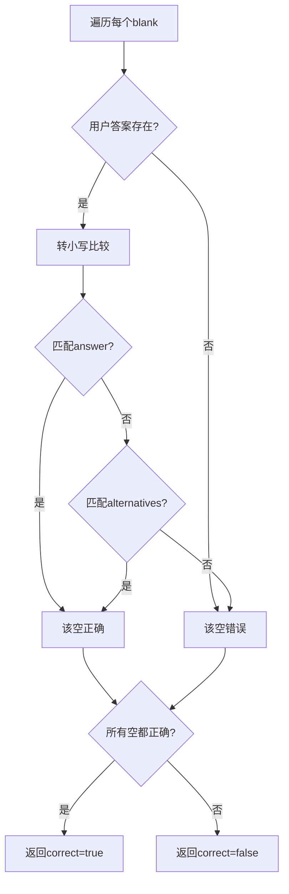
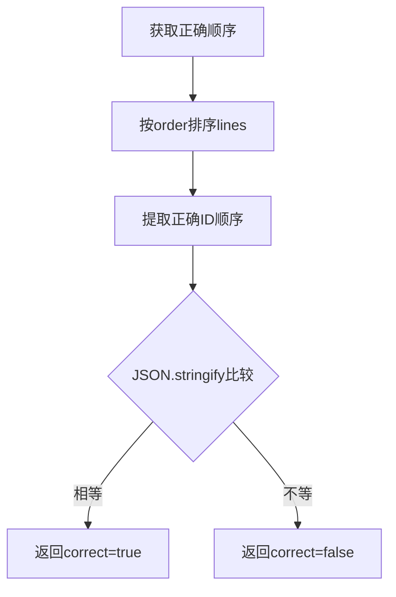
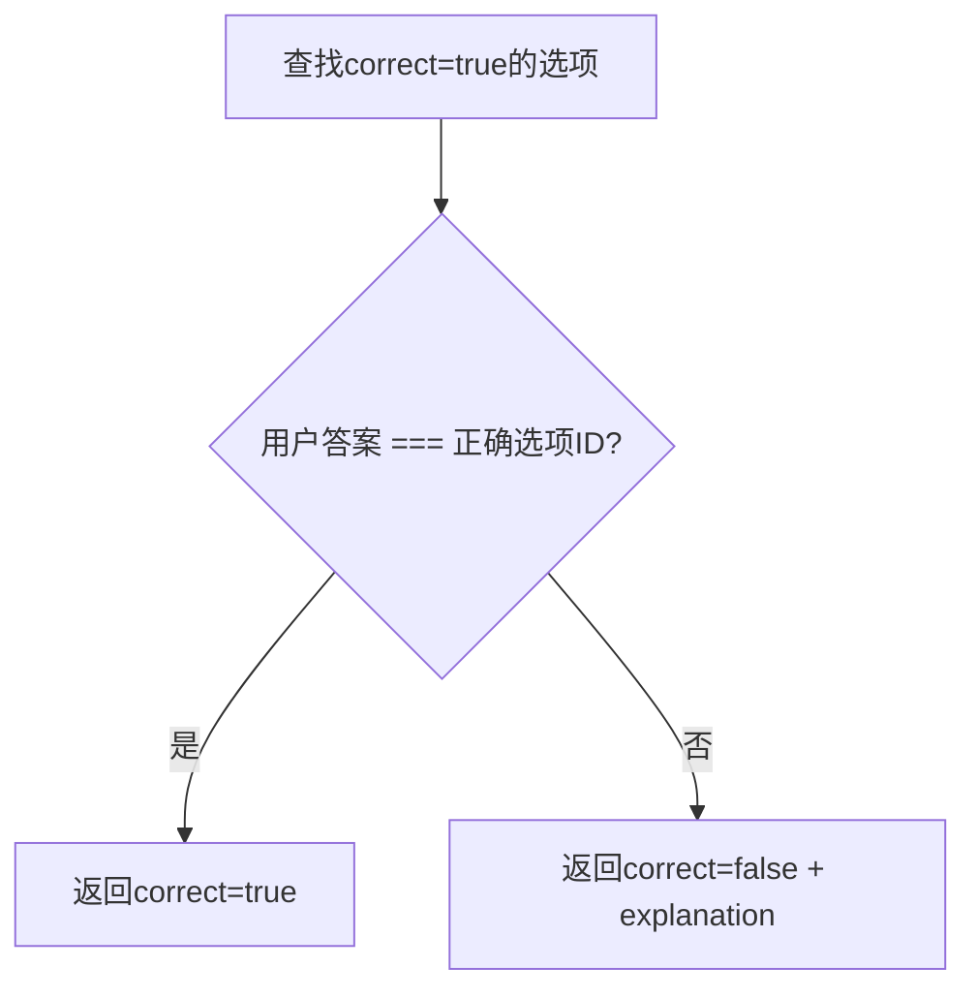
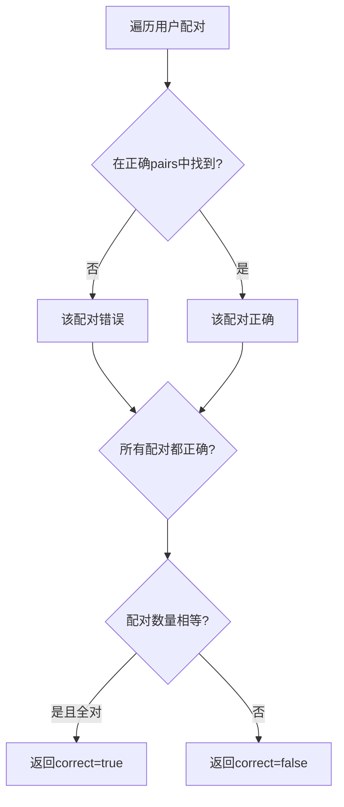
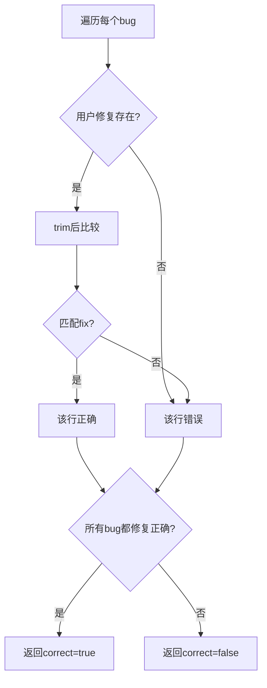
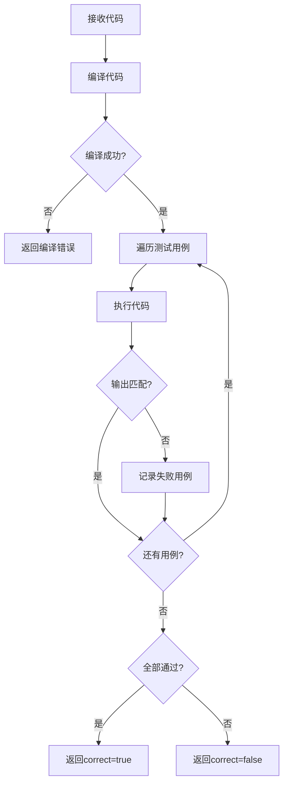

# 题目系统

## 概述

题目系统支持6种题型，每种题型有不同的数据结构和判断逻辑。

## 题目类型

### 1. 填空题 (FILL_BLANK)

**数据结构:**
```json
{
  "type": "FILL_BLANK",
  "questionData": {
    "code": "int x = ___BLANK_1___;\ncout << x ___BLANK_2___ 5;",
    "blanks": [
      {
        "id": "BLANK_1",
        "answer": "10",
        "hint": "整数值",
        "alternatives": ["10"]
      },
      {
        "id": "BLANK_2",
        "answer": "+",
        "hint": "运算符",
        "alternatives": ["+"]
      }
    ]
  }
}
```

**用户答案格式:**
```json
{
  "BLANK_1": "10",
  "BLANK_2": "+"
}
```

**判断逻辑:**


### 2. 代码排序题 (CODE_ORDER)

**数据结构:**
```json
{
  "type": "CODE_ORDER",
  "questionData": {
    "description": "排列代码实现输出 1-5",
    "lines": [
      { "id": "1", "code": "for (int i = 1; i <= 5; i++) {", "order": 1 },
      { "id": "2", "code": "    cout << i << endl;", "order": 2 },
      { "id": "3", "code": "}", "order": 3 }
    ]
  }
}
```

**用户答案格式:**
```json
["1", "2", "3"]  // 用户排列的行ID顺序
```

**判断逻辑:**


### 3. 选择题 (MULTIPLE_CHOICE)

**数据结构:**
```json
{
  "type": "MULTIPLE_CHOICE",
  "questionData": {
    "question": "int x = 5; cout << x++;  输出什么？",
    "options": [
      { "id": "A", "text": "5", "correct": true },
      { "id": "B", "text": "6", "correct": false },
      { "id": "C", "text": "4", "correct": false },
      { "id": "D", "text": "编译错误", "correct": false }
    ],
    "explanation": "后置递增 x++ 先返回当前值 5，然后 x 变成 6"
  }
}
```

**用户答案格式:**
```json
"A"  // 选项ID
```

**判断逻辑:**


### 4. 配对题 (MATCHING)

**数据结构:**
```json
{
  "type": "MATCHING",
  "questionData": {
    "left": [
      { "id": "L1", "text": "声明变量" },
      { "id": "L2", "text": "输出" },
      { "id": "L3", "text": "输入" }
    ],
    "right": [
      { "id": "R1", "text": "int x = 10;" },
      { "id": "R2", "text": "cout << x;" },
      { "id": "R3", "text": "cin >> x;" }
    ],
    "pairs": [["L1", "R1"], ["L2", "R2"], ["L3", "R3"]]
  }
}
```

**用户答案格式:**
```json
[
  ["L1", "R1"],
  ["L2", "R2"],
  ["L3", "R3"]
]
```

**判断逻辑:**


### 5. 改错题 (BUG_FIX)

**数据结构:**
```json
{
  "type": "BUG_FIX",
  "questionData": {
    "buggyCode": "int sum = 0\nfor (i = 0; i < 5; i++)\n    sum += i;",
    "bugs": [
      { "line": 1, "fix": "int sum = 0;", "hint": "缺少分号" },
      { "line": 2, "fix": "for (int i = 0; i < 5; i++) {", "hint": "缺少类型声明和大括号" }
    ],
    "correctCode": "int sum = 0;\nfor (int i = 0; i < 5; i++) {\n    sum += i;\n}"
  }
}
```

**用户答案格式:**
```json
{
  "1": "int sum = 0;",
  "2": "for (int i = 0; i < 5; i++) {"
}
```

**判断逻辑:**


### 6. 编程题 (CODING)

**数据结构:**
```json
{
  "type": "CODING",
  "questionData": {
    "testCases": [
      { "input": "5", "output": "120" },
      { "input": "0", "output": "1" }
    ]
  },
  "starterCode": "#include <iostream>\nusing namespace std;\n\nint main() {\n    // 你的代码\n    return 0;\n}"
}
```

**用户答案格式:**
```json
{
  "code": "#include <iostream>\n..."
}
```

**判断逻辑:** (当前为占位符，需要代码执行环境)


## 前端渲染组件

### QuestionRenderer

根据题目类型渲染不同的答题组件:

```typescript
switch (exercise.type) {
  case 'FILL_BLANK':
    return <FillBlankQuestion ... />;
  case 'CODE_ORDER':
    return <CodeOrderQuestion ... />;
  case 'MULTIPLE_CHOICE':
    return <MultipleChoiceQuestion ... />;
  case 'MATCHING':
    return <MatchingQuestion ... />;
  case 'BUG_FIX':
    return <BugFixQuestion ... />;
  case 'CODING':
    return <CodingQuestion ... />;
}
```

## 相关文件

| 文件 | 说明 |
|------|------|
| `backend/src/routes/questions.ts` | 答案验证逻辑 |
| `backend/prisma/seed.ts` | 题目数据示例 |
| `frontend/src/components/Questions/QuestionRenderer.tsx` | 题目渲染器 |
| `frontend/src/components/Questions/FillBlankQuestion.tsx` | 填空题组件 |
| `frontend/src/components/Questions/CodeOrderQuestion.tsx` | 排序题组件 |
| `frontend/src/components/Questions/MultipleChoiceQuestion.tsx` | 选择题组件 |
| `frontend/src/components/Questions/MatchingQuestion.tsx` | 配对题组件 |
| `frontend/src/components/Questions/BugFixQuestion.tsx` | 改错题组件 |
