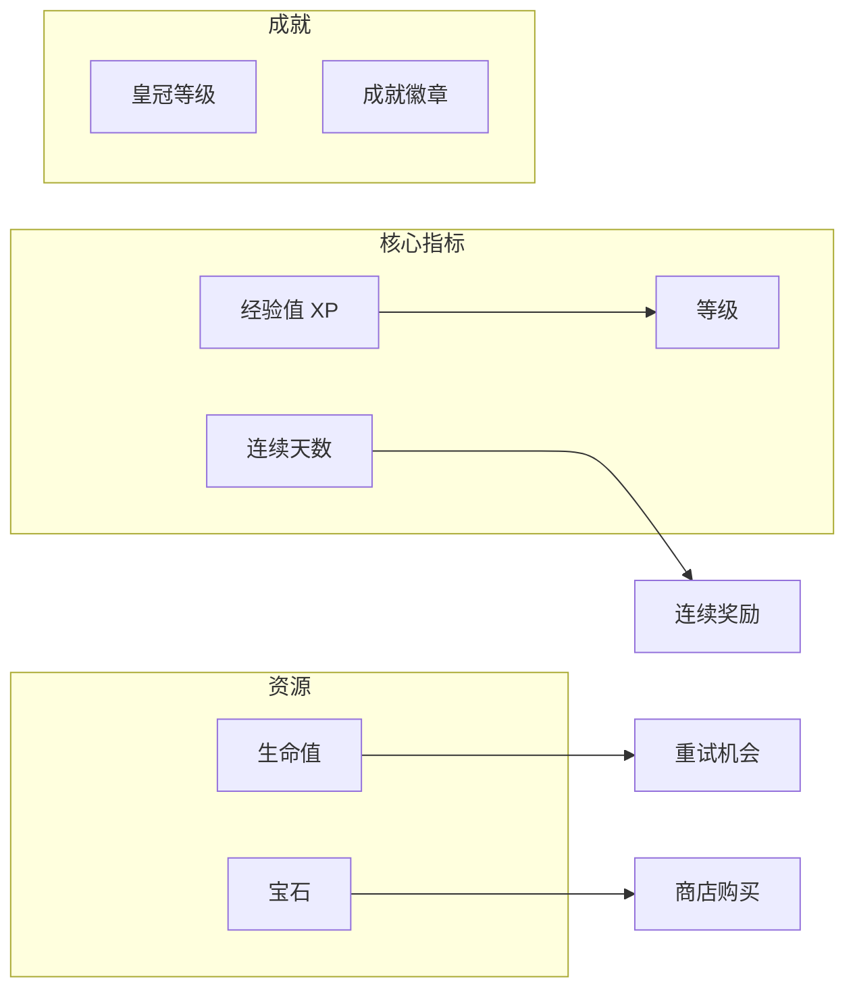
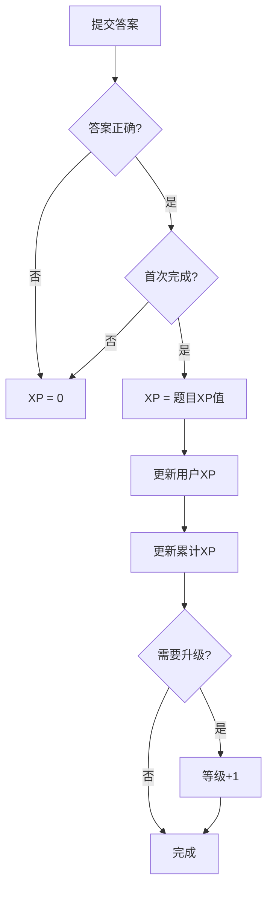
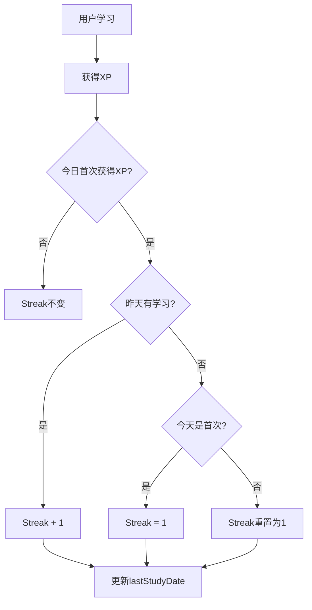
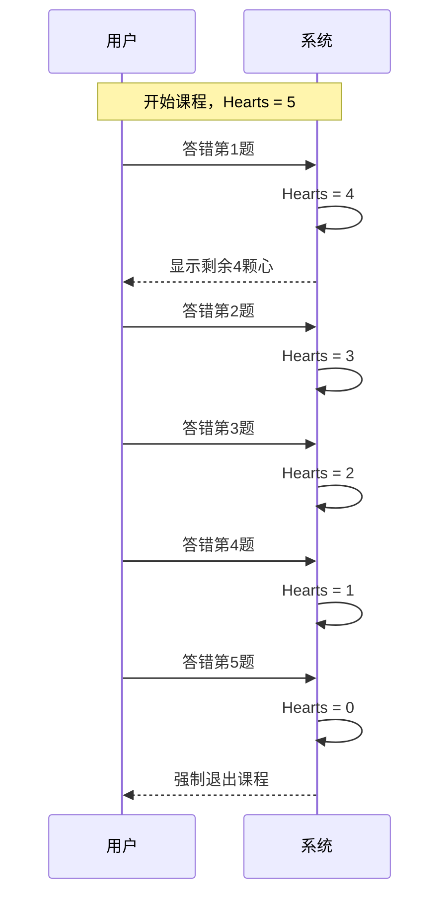
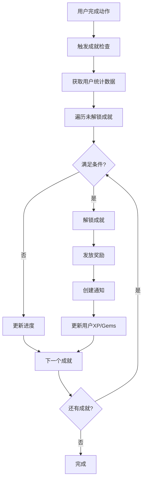
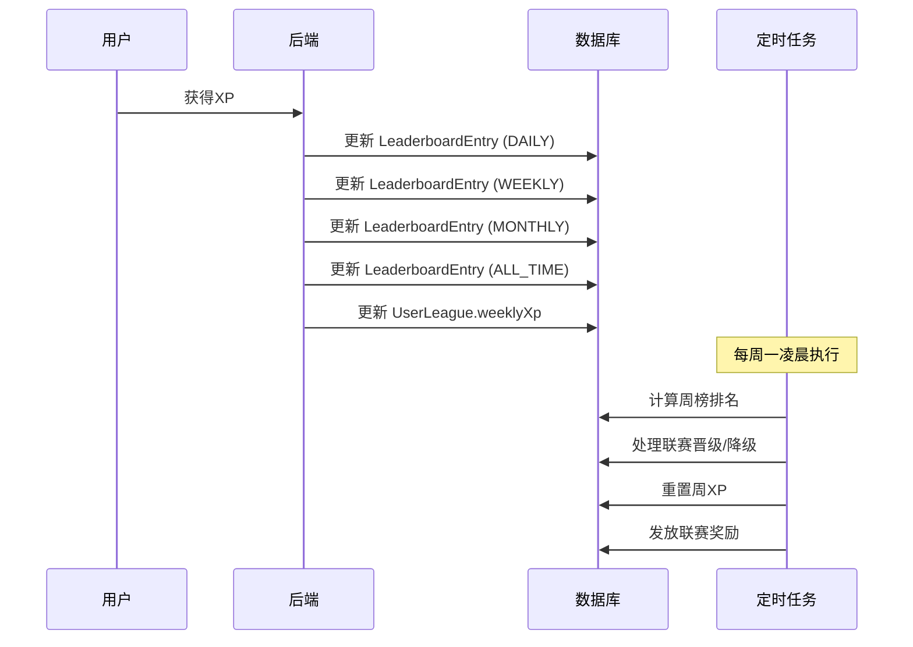

# 游戏化系统

## 概述

游戏化系统是 NOI Quest 的核心特色，通过 XP、等级、连续学习、生命值、宝石等机制激励学生持续学习。

## 游戏化元素



## 经验值 (XP) 系统

### XP 获取规则

| 场景 | XP | 条件 |
|------|-----|------|
| 答对题目 | 题目设定值(10-30) | 首次答对 |
| 重复答对 | 0 | 已完成的题目 |
| 答错题目 | 0 | - |
| 完美通关 | +20% 奖励 | 课程0错误 |
| 复习正确 | 5 | 错题/知识点复习 |

### XP 计算流程



### 等级计算

```typescript
// 等级所需XP公式
function xpForLevel(level: number): number {
  return level * 100; // 每级需要 level * 100 XP
}

// 示例
// Level 1 -> 2: 需要 100 XP
// Level 2 -> 3: 需要 200 XP
// Level 5 -> 6: 需要 500 XP
```

## 连续学习 (Streak)

### Streak 规则



### Streak 奖励

| 连续天数 | 奖励 |
|----------|------|
| 7天 | 额外 50 XP |
| 30天 | 额外 200 XP + 徽章 |
| 100天 | 额外 500 XP + 特殊徽章 |

## 生命值 (Hearts)

### Hearts 机制

- **初始值**: 5
- **消耗**: 答错题目 -1
- **恢复**: 每日自动恢复到满值
- **归零**: 强制退出当前课程



## 宝石 (Gems)

### Gems 获取

| 来源 | 数量 |
|------|------|
| 完美通关课程 | 5 |
| 完成每日任务 | 10 |
| 连续7天学习 | 20 |
| 成就解锁 | 10-50 |

### Gems 用途 (规划中)

- 购买额外生命值
- 解锁特殊主题
- 跳过等待时间

## 皇冠等级 (Crown Level)

每个技能单元有独立的皇冠等级:

| 等级 | 条件 | 显示 |
|------|------|------|
| 0 | 未完成 | 灰色 |
| 1 | 完成所有课程 | 铜色 |
| 2 | 完美通关1次 | 银色 |
| 3 | 完美通关3次 | 金色 |

## 每日目标

### 目标等级

| 等级 | 名称 | 目标XP |
|------|------|--------|
| CASUAL | 休闲 | 10 XP |
| REGULAR | 常规 | 20 XP |
| SERIOUS | 认真 | 30 XP |
| INTENSE | 强化 | 50 XP |

### 每日任务

```json
{
  "quests": [
    {
      "type": "earn_xp",
      "target": 20,
      "current": 15,
      "reward": { "xp": 10, "gems": 5 }
    },
    {
      "type": "complete_exercises",
      "target": 5,
      "current": 3,
      "reward": { "xp": 15, "gems": 10 }
    },
    {
      "type": "perfect_lesson",
      "target": 1,
      "current": 0,
      "reward": { "xp": 20, "gems": 15 }
    }
  ]
}
```

## 数据模型

### User 游戏化字段

```prisma
model User {
  level         Int      @default(1)
  xp            Int      @default(0)      // 当前等级XP
  totalXp       Int      @default(0)      // 累计XP
  streak        Int      @default(0)      // 连续天数
  lastStudyDate DateTime?                 // 最后学习日期
  hearts        Int      @default(5)      // 生命值
  gems          Int      @default(0)      // 宝石
}
```

### DailyXpRecord

```prisma
model DailyXpRecord {
  id        String   @id @default(uuid())
  userId    String
  date      DateTime @db.Date
  xpEarned  Int      @default(0)
  goalMet   Boolean  @default(false)
}
```

### UserUnitProgress

```prisma
model UserUnitProgress {
  id              String  @id @default(uuid())
  userId          String
  unitId          String
  unlocked        Boolean @default(false)
  completed       Boolean @default(false)
  lessonsCompleted Int    @default(0)
  crownLevel      Int     @default(0)
}
```

## 成就/徽章系统

### 成就类型

| 类型 | 说明 | 示例 |
|------|------|------|
| MILESTONE | 里程碑成就 | 完成100道题目 |
| STREAK | 连续学习成就 | 连续学习30天 |
| MASTERY | 掌握度成就 | 某知识点掌握度达到100% |
| PERFECT | 完美表现成就 | 完美通关10个课程 |
| SPEED | 速度成就 | 5分钟内完成一个课程 |
| COLLECTION | 收集成就 | 解锁所有技能单元 |

### 成就列表

| ID | 名称 | 描述 | 条件 | 奖励 |
|----|------|------|------|------|
| first_lesson | 初学者 | 完成第一个课程 | lessonsCompleted >= 1 | 10 XP, 5 Gems |
| ten_lessons | 学习达人 | 完成10个课程 | lessonsCompleted >= 10 | 50 XP, 20 Gems |
| hundred_exercises | 刷题狂人 | 完成100道题目 | exercisesCompleted >= 100 | 100 XP, 50 Gems |
| streak_7 | 坚持一周 | 连续学习7天 | streak >= 7 | 50 XP, 20 Gems |
| streak_30 | 月度学霸 | 连续学习30天 | streak >= 30 | 200 XP, 100 Gems |
| streak_100 | 百日坚持 | 连续学习100天 | streak >= 100 | 500 XP, 300 Gems |
| perfect_run | 完美通关 | 0错误完成一个课程 | perfectLessons >= 1 | 30 XP, 15 Gems |
| perfect_10 | 完美大师 | 完美通关10个课程 | perfectLessons >= 10 | 150 XP, 80 Gems |
| first_crown | 初获皇冠 | 获得第一个金色皇冠 | goldCrowns >= 1 | 100 XP, 50 Gems |
| all_units | 全面发展 | 解锁所有技能单元 | unitsUnlocked == totalUnits | 300 XP, 150 Gems |
| review_master | 复习达人 | 完成50次复习 | reviewCount >= 50 | 80 XP, 40 Gems |
| no_mistakes | 零失误 | 连续答对50道题 | correctStreak >= 50 | 100 XP, 50 Gems |

### 数据模型

```prisma
model Achievement {
  id          String   @id @default(uuid())
  key         String   @unique        // 成就标识符
  name        String                  // 成就名称
  description String                  // 成就描述
  icon        String                  // 图标
  category    String                  // MILESTONE/STREAK/MASTERY/PERFECT/SPEED/COLLECTION
  condition   Json                    // 解锁条件 { "type": "lessonsCompleted", "value": 10 }
  reward      Json                    // 奖励 { "xp": 50, "gems": 20 }
  rarity      String   @default("COMMON")  // COMMON/RARE/EPIC/LEGENDARY
  orderIndex  Int      @default(0)

  userAchievements UserAchievement[]

  createdAt   DateTime @default(now())
  updatedAt   DateTime @updatedAt
}

model UserAchievement {
  id            String   @id @default(uuid())
  userId        String
  achievementId String
  unlockedAt    DateTime @default(now())
  progress      Int      @default(0)    // 当前进度（用于显示进度条）
  notified      Boolean  @default(false) // 是否已通知用户

  user        User        @relation(fields: [userId], references: [id], onDelete: Cascade)
  achievement Achievement @relation(fields: [achievementId], references: [id], onDelete: Cascade)

  @@unique([userId, achievementId])
}
```

### 成就检查流程



### API 接口

```
GET    /api/achievements              # 获取所有成就列表
GET    /api/achievements/user         # 获取用户成就（已解锁+进度）
POST   /api/achievements/check        # 手动触发成就检查
```

**获取用户成就响应:**
```json
{
  "unlocked": [
    {
      "id": "achievement-uuid",
      "key": "first_lesson",
      "name": "初学者",
      "icon": "🎯",
      "rarity": "COMMON",
      "unlockedAt": "2024-01-20T00:00:00Z"
    }
  ],
  "inProgress": [
    {
      "id": "achievement-uuid",
      "key": "ten_lessons",
      "name": "学习达人",
      "icon": "📚",
      "rarity": "RARE",
      "progress": 5,
      "target": 10,
      "percentage": 50
    }
  ],
  "locked": [...]
}
```

## 排行榜系统

### 排行榜类型

| 类型 | 周期 | 说明 |
|------|------|------|
| DAILY | 每日 | 当日XP排名 |
| WEEKLY | 每周 | 本周XP排名（周一重置） |
| MONTHLY | 每月 | 本月XP排名 |
| ALL_TIME | 总榜 | 累计XP排名 |

### 联赛系统

借鉴多邻国的联赛机制，增加竞争性：

| 联赛 | 晋级条件 | 降级条件 | 奖励倍数 |
|------|----------|----------|----------|
| 青铜 | - | 周榜后10% | 1x |
| 白银 | 周榜前30% | 周榜后10% | 1.1x |
| 黄金 | 周榜前20% | 周榜后15% | 1.2x |
| 钻石 | 周榜前10% | 周榜后20% | 1.3x |
| 大师 | 周榜前5% | 周榜后25% | 1.5x |

### 数据模型

```prisma
model LeaderboardEntry {
  id        String   @id @default(uuid())
  userId    String
  period    String   // DAILY/WEEKLY/MONTHLY/ALL_TIME
  periodKey String   // 2024-01-20 / 2024-W03 / 2024-01 / all
  xp        Int      @default(0)
  rank      Int?

  user      User     @relation(fields: [userId], references: [id], onDelete: Cascade)

  createdAt DateTime @default(now())
  updatedAt DateTime @updatedAt

  @@unique([userId, period, periodKey])
  @@index([period, periodKey, xp(sort: Desc)])
}

model UserLeague {
  id          String   @id @default(uuid())
  userId      String   @unique
  league      String   @default("BRONZE")  // BRONZE/SILVER/GOLD/DIAMOND/MASTER
  weeklyXp    Int      @default(0)
  weeklyRank  Int?
  promotedAt  DateTime?
  demotedAt   DateTime?

  user        User     @relation(fields: [userId], references: [id], onDelete: Cascade)

  updatedAt   DateTime @updatedAt
}
```

### 排行榜更新流程



### API 接口

```
GET /api/leaderboard?period=WEEKLY&limit=50    # 获取排行榜
GET /api/leaderboard/me                         # 获取我的排名
GET /api/league                                 # 获取联赛信息
```

**排行榜响应:**
```json
{
  "period": "WEEKLY",
  "periodKey": "2024-W03",
  "entries": [
    {
      "rank": 1,
      "userId": "user-uuid",
      "username": "张三",
      "avatar": "🧑‍💻",
      "xp": 1500,
      "league": "DIAMOND"
    }
  ],
  "myRank": {
    "rank": 15,
    "xp": 450,
    "percentile": 85
  },
  "totalParticipants": 100
}
```

**联赛信息响应:**
```json
{
  "currentLeague": "GOLD",
  "weeklyXp": 350,
  "weeklyRank": 12,
  "totalInLeague": 50,
  "promotionZone": {
    "threshold": 10,
    "currentRank": 12,
    "xpNeeded": 80
  },
  "demotionZone": {
    "threshold": 43,
    "safe": true
  },
  "rewards": {
    "xpMultiplier": 1.2,
    "weeklyBonus": 50
  },
  "endsIn": "3d 5h 20m"
}
```

## 相关文件

| 文件 | 说明 |
|------|------|
| `backend/src/routes/skillTree.ts` | XP奖励逻辑 |
| `backend/src/routes/daily.ts` | 每日目标API |
| `backend/src/routes/achievements.ts` | 成就系统API |
| `backend/src/routes/leaderboard.ts` | 排行榜API |
| `frontend/src/utils/storage.ts` | 本地游戏化计算 |
| `frontend/src/components/SkillTree/LessonSession.tsx` | Hearts显示 |
| `frontend/src/components/Achievements/AchievementList.tsx` | 成就列表 |
| `frontend/src/components/Leaderboard/LeaderboardView.tsx` | 排行榜视图 |
