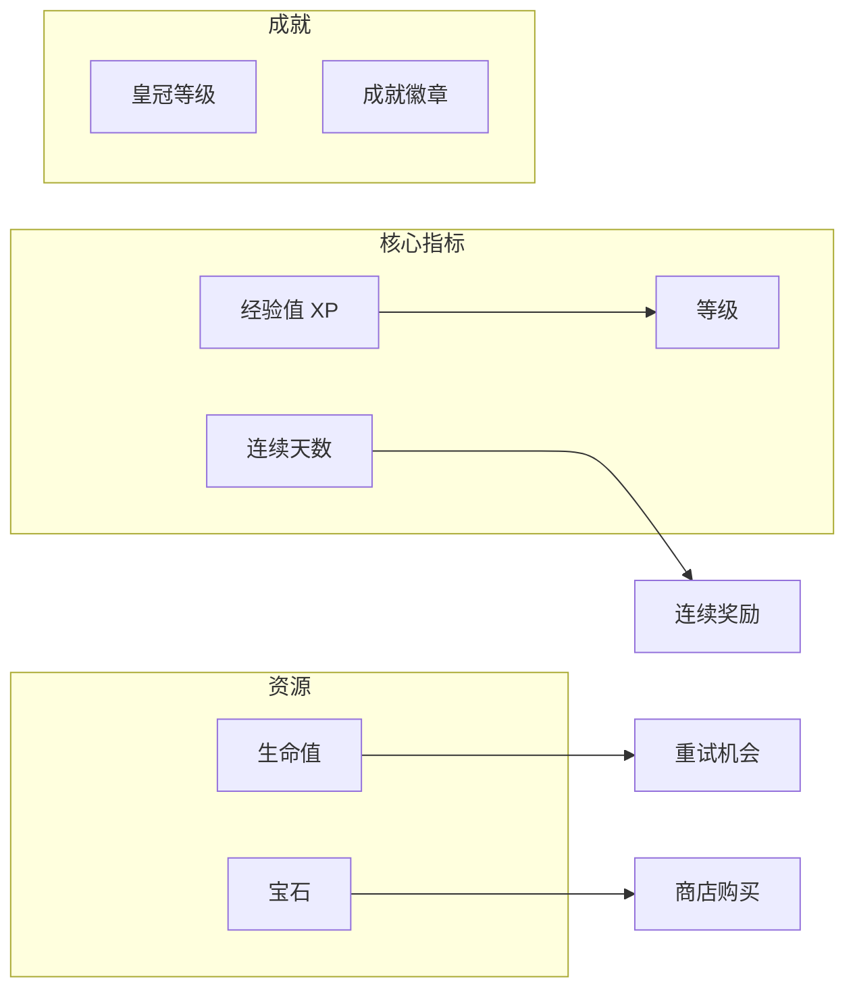
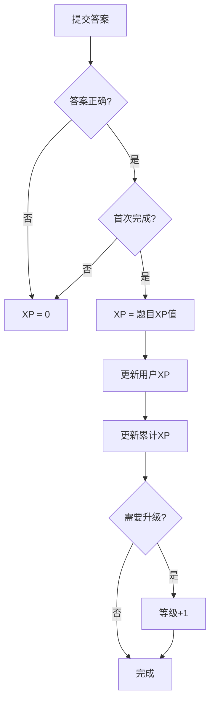
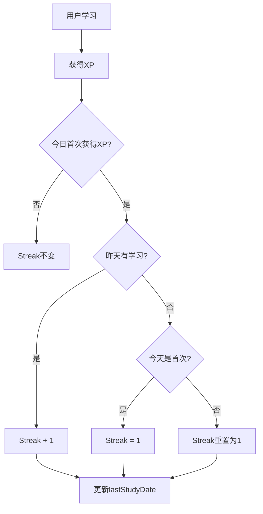
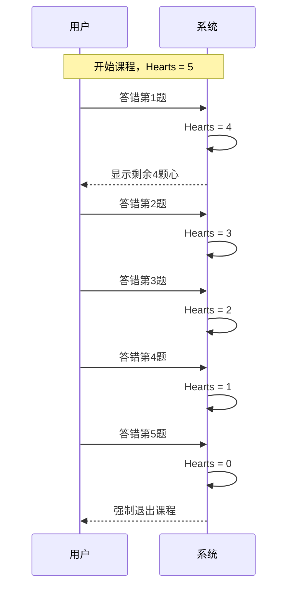

# 游戏化系统

## 概述

游戏化系统是 NOI Quest 的核心特色，通过 XP、等级、连续学习、生命值、宝石等机制激励学生持续学习。

## 游戏化元素



## 经验值 (XP) 系统

### XP 获取规则

| 场景 | XP | 条件 |
|------|-----|------|
| 答对题目 | 题目设定值(10-30) | 首次答对 |
| 重复答对 | 0 | 已完成的题目 |
| 答错题目 | 0 | - |
| 完美通关 | +20% 奖励 | 课程0错误 |
| 复习正确 | 5 | 错题/知识点复习 |

### XP 计算流程



### 等级计算

```typescript
// 等级所需XP公式
function xpForLevel(level: number): number {
  return level * 100; // 每级需要 level * 100 XP
}

// 示例
// Level 1 -> 2: 需要 100 XP
// Level 2 -> 3: 需要 200 XP
// Level 5 -> 6: 需要 500 XP
```

## 连续学习 (Streak)

### Streak 规则



### Streak 奖励

| 连续天数 | 奖励 |
|----------|------|
| 7天 | 额外 50 XP |
| 30天 | 额外 200 XP + 徽章 |
| 100天 | 额外 500 XP + 特殊徽章 |

## 生命值 (Hearts)

### Hearts 机制

- **初始值**: 5
- **消耗**: 答错题目 -1
- **恢复**: 每日自动恢复到满值
- **归零**: 强制退出当前课程



## 宝石 (Gems)

### Gems 获取

| 来源 | 数量 |
|------|------|
| 完美通关课程 | 5 |
| 完成每日任务 | 10 |
| 连续7天学习 | 20 |
| 成就解锁 | 10-50 |

### Gems 用途 (规划中)

- 购买额外生命值
- 解锁特殊主题
- 跳过等待时间

## 皇冠等级 (Crown Level)

每个技能单元有独立的皇冠等级:

| 等级 | 条件 | 显示 |
|------|------|------|
| 0 | 未完成 | 灰色 |
| 1 | 完成所有课程 | 铜色 |
| 2 | 完美通关1次 | 银色 |
| 3 | 完美通关3次 | 金色 |

## 每日目标

### 目标等级

| 等级 | 名称 | 目标XP |
|------|------|--------|
| CASUAL | 休闲 | 10 XP |
| REGULAR | 常规 | 20 XP |
| SERIOUS | 认真 | 30 XP |
| INTENSE | 强化 | 50 XP |

### 每日任务

```json
{
  "quests": [
    {
      "type": "earn_xp",
      "target": 20,
      "current": 15,
      "reward": { "xp": 10, "gems": 5 }
    },
    {
      "type": "complete_exercises",
      "target": 5,
      "current": 3,
      "reward": { "xp": 15, "gems": 10 }
    },
    {
      "type": "perfect_lesson",
      "target": 1,
      "current": 0,
      "reward": { "xp": 20, "gems": 15 }
    }
  ]
}
```

## 数据模型

### User 游戏化字段

```prisma
model User {
  level         Int      @default(1)
  xp            Int      @default(0)      // 当前等级XP
  totalXp       Int      @default(0)      // 累计XP
  streak        Int      @default(0)      // 连续天数
  lastStudyDate DateTime?                 // 最后学习日期
  hearts        Int      @default(5)      // 生命值
  gems          Int      @default(0)      // 宝石
}
```

### DailyXpRecord

```prisma
model DailyXpRecord {
  id        String   @id @default(uuid())
  userId    String
  date      DateTime @db.Date
  xpEarned  Int      @default(0)
  goalMet   Boolean  @default(false)
}
```

### UserUnitProgress

```prisma
model UserUnitProgress {
  id              String  @id @default(uuid())
  userId          String
  unitId          String
  unlocked        Boolean @default(false)
  completed       Boolean @default(false)
  lessonsCompleted Int    @default(0)
  crownLevel      Int     @default(0)
}
```

## 相关文件

| 文件 | 说明 |
|------|------|
| `backend/src/routes/skillTree.ts` | XP奖励逻辑 |
| `backend/src/routes/daily.ts` | 每日目标API |
| `frontend/src/utils/storage.ts` | 本地游戏化计算 |
| `frontend/src/components/SkillTree/LessonSession.tsx` | Hearts显示 |
