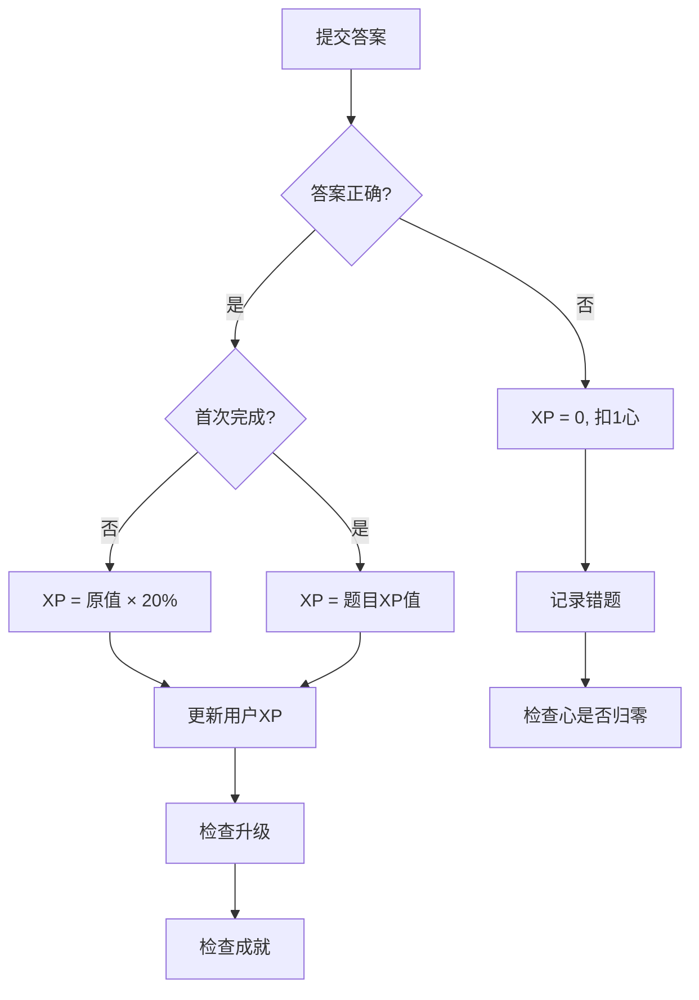
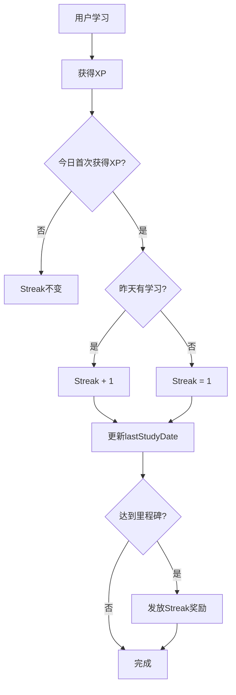
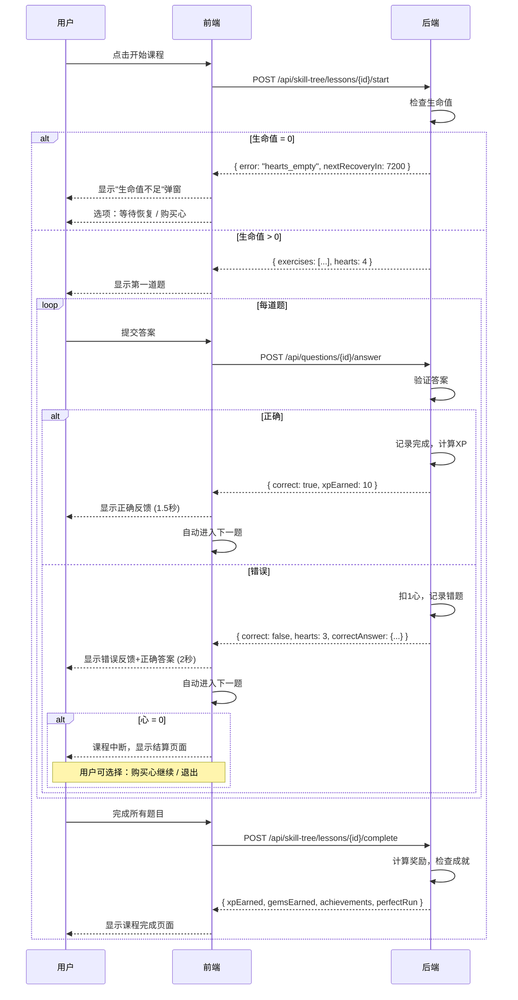
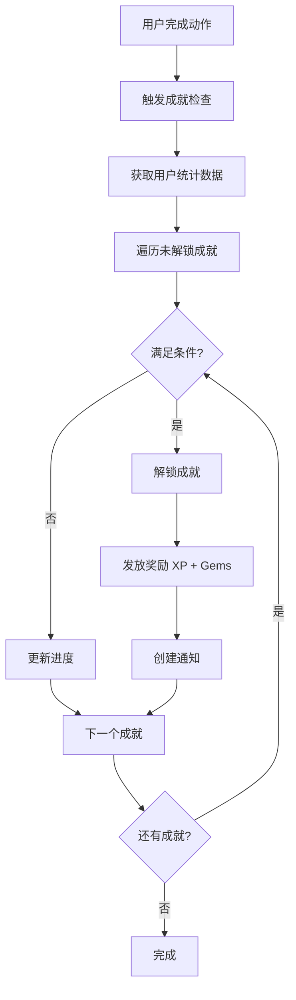

# 游戏化系统

## 概述

游戏化系统是 NOI Quest 的核心特色，通过 XP、等级、连续学习、生命值、宝石等机制激励学生持续学习。

## 核心设计原则

**答错不重试，直接下一题** —— 这是整个系统的基石。

```
答对 → 获得XP → 自动进入下一题
答错 → 扣1心 → 记录错题 → 自动进入下一题
```

这样设计的原因：
1. 让生命值有真正的意义（答错有代价）
2. 让宝石有消费场景（购买心）
3. 形成正向循环（努力学习 → 少犯错 → 心够用 → 继续学习）

## 元素关系图

```
┌─────────────────────────────────────────────────────────────┐
│                        答题循环                              │
│  ┌─────┐    答对     ┌─────┐    升级     ┌─────┐           │
│  │题目 │ ─────────→ │ XP  │ ─────────→ │等级 │           │
│  └─────┘            └─────┘            └─────┘           │
│     │                  │                                   │
│     │答错              │触发                                │
│     ▼                  ▼                                   │
│  ┌─────┐           ┌─────┐                                │
│  │扣心 │           │成就 │──→ 奖励宝石                     │
│  └─────┘           └─────┘                                │
│     │                                                      │
│     │心=0                                                  │
│     ▼                                                      │
│  ┌─────────┐   等待恢复   ┌─────┐                         │
│  │无法继续 │ ←─────────── │时间 │                         │
│  │学习新课 │              └─────┘                         │
│  └─────────┘                 ↑                            │
│     │                        │                            │
│     │花费宝石                 │免费但慢                     │
│     ▼                        │                            │
│  ┌─────┐    购买心      ┌─────┐                          │
│  │宝石 │ ─────────────→│恢复 │                          │
│  └─────┘               └─────┘                          │
└─────────────────────────────────────────────────────────────┘
```

## 生命值 (Hearts)

生命值是学习的"门票"，答错会消耗，用完需要等待或购买。

### 基本规则

| 属性 | 值 | 说明 |
|------|-----|------|
| 最大值 | 5 | 满心状态 |
| 消耗 | -1 | 新课程中每答错1题扣1心 |
| 恢复速度 | 1小时/心 | 时间自动恢复 |
| 归零后果 | 不能开始新课程 | 但可以复习错题、重做已完成课程（不扣心） |

### 扣心规则

| 场景 | 是否扣心 | 说明 |
|------|----------|------|
| 新课程答错 | **扣心** | 核心机制 |
| 重做已完成课程答错 | **不扣心** | 鼓励复习 |
| 复习错题答错 | **不扣心** | 鼓励复习 |

### 恢复机制

生命值有两种恢复方式，用户可以自由选择：

**方式一：时间自动恢复（免费但慢）**

```
心 < 5 时，系统自动倒计时恢复
每 1 小时恢复 1 心
最多恢复到 5 心（满）
```

**方式二：宝石购买（付费但快）**

| 操作 | 花费 | 说明 |
|------|------|------|
| 购买 1 心 | 50 宝石 | 立即恢复1心 |
| 补满全部 | 200 宝石 | 一次性补满到5心（有折扣） |

### UI 显示示例

```
❤️ ❤️ 🤍 🤍 🤍
下一颗心恢复: 2:15:00

[等待恢复]  [💎50 买1心]  [💎200 补满]
```

### 心不足时的选择

```
┌─────────────────────────────────────────┐
│            心不足时的选择                 │
├─────────────────────────────────────────┤
│                                         │
│   选项A: 等待（免费）                     │
│   └─→ 去做其他事，1小时后回来             │
│   └─→ 可以复习错题（不扣心）              │
│   └─→ 可以重做已完成课程（不扣心）         │
│                                         │
│   选项B: 花宝石（立即）                   │
│   └─→ 想继续学习，花50宝石买1心           │
│   └─→ 或花200宝石一次补满                │
│                                         │
└─────────────────────────────────────────┘
```

### 数据模型

```prisma
model User {
  hearts           Int       @default(5)      // 当前生命值
  maxHearts        Int       @default(5)      // 最大生命值
  heartsUpdatedAt  DateTime  @default(now())  // 上次更新时间（用于计算恢复）
}
```

### 心的计算逻辑

```typescript
const HEART_RECOVERY_MINUTES = 60; // 1小时恢复1心

function calculateCurrentHearts(user: User): {
  hearts: number;
  nextRecoveryIn: number | null; // 秒
  fullRecoveryIn: number | null; // 秒
} {
  const now = new Date();
  const lastUpdate = new Date(user.heartsUpdatedAt);
  const minutesPassed = (now.getTime() - lastUpdate.getTime()) / 1000 / 60;

  // 计算恢复了多少心
  const recoveredHearts = Math.floor(minutesPassed / HEART_RECOVERY_MINUTES);
  const currentHearts = Math.min(user.hearts + recoveredHearts, user.maxHearts);

  if (currentHearts >= user.maxHearts) {
    return { hearts: currentHearts, nextRecoveryIn: null, fullRecoveryIn: null };
  }

  // 计算下一颗心恢复时间
  const minutesSinceLastRecovery = minutesPassed % HEART_RECOVERY_MINUTES;
  const minutesToNextHeart = HEART_RECOVERY_MINUTES - minutesSinceLastRecovery;

  // 计算全部恢复时间
  const heartsNeeded = user.maxHearts - currentHearts;
  const minutesToFull = minutesToNextHeart + (heartsNeeded - 1) * HEART_RECOVERY_MINUTES;

  return {
    hearts: currentHearts,
    nextRecoveryIn: Math.ceil(minutesToNextHeart * 60),
    fullRecoveryIn: Math.ceil(minutesToFull * 60),
  };
}
```

## 宝石 (Gems)

宝石是游戏内的通用货币，连接各个系统。

### 获取方式

| 来源 | 数量 | 说明 |
|------|------|------|
| 完成课程 | 5 | 基础奖励 |
| 完美通关 | +10 | 0错误额外奖励 |
| 每日首次学习 | 5 | 鼓励每日登录 |
| 连续7天学习 | 20 | Streak 奖励 |
| 连续30天学习 | 50 | Streak 奖励 |
| 解锁成就 | 10-50 | 根据成就稀有度 |

### 消费方式

| 用途 | 花费 | 说明 |
|------|------|------|
| 购买 1 心 | 50 | 立即恢复1心 |
| 补满生命 | 200 | 一次性补满5心 |
| 错题提示 | 10 | 复习时显示详细解析 |

### 经济平衡

设计目标：认真学习的用户，宝石收入 >= 支出

```
假设用户每天：
- 完成 2 个课程：10 宝石
- 其中 1 个完美通关：10 宝石
- 每日首次学习：5 宝石
- 总收入：25 宝石/天

假设用户每天答错 3 题：
- 需要购买心的概率较低（5心够用）
- 偶尔需要购买：50 宝石

结论：正常学习的用户宝石会逐渐积累
```

## 经验值 (XP) 系统

XP 是衡量学习量的核心指标。

### XP 获取规则

| 场景 | XP | 条件 |
|------|-----|------|
| 答对题目 | 题目设定值(10-30) | 首次答对 |
| 重做答对 | 原XP的20% | 重做已完成课程 |
| 答错题目 | 0 | - |
| 完美通关 | +20% 奖励 | 课程0错误 |
| 复习错题答对 | 5 | 错题本复习 |

### XP 计算流程



### 等级计算

```typescript
// 等级所需XP公式
function xpForLevel(level: number): number {
  return level * 100; // 每级需要 level * 100 XP
}

// 示例
// Level 1 -> 2: 需要 100 XP
// Level 2 -> 3: 需要 200 XP
// Level 5 -> 6: 需要 500 XP
```

## 连续学习 (Streak)

### Streak 规则



### Streak 奖励

| 连续天数 | XP奖励 | 宝石奖励 | 额外奖励 |
|----------|--------|----------|----------|
| 7天 | 50 | 20 | - |
| 30天 | 200 | 50 | 徽章 |
| 100天 | 500 | 150 | 特殊徽章 |
| 365天 | 1000 | 500 | 传奇徽章 |

### Streak 中断与保护

**中断判定**：如果昨天没有获得任何 XP，Streak 重置为 0

**Streak 保护机制**：
- 价格：50 宝石
- 限制：中断后 24 小时内可使用
- 效果：恢复中断前的 Streak 天数

**中断提醒**：
- 当天 23:00 还没学习时，推送提醒
- 第二天登录时，显示中断弹窗，可选择购买保护或从头开始

```
┌─────────────────────────────────────────┐
│                                         │
│        😢 连续学习中断了                  │
│                                         │
│      你的 15 天记录已重置为 0            │
│                                         │
│  ┌─────────────────────────────────┐   │
│  │   💎50 恢复 Streak（限时24小时） │   │
│  └─────────────────────────────────┘   │
│                                         │
│  ┌─────────────────────────────────┐   │
│  │         从头开始                 │   │
│  └─────────────────────────────────┘   │
│                                         │
└─────────────────────────────────────────┘
```

## 答题流程（完整版）



## 皇冠等级 (Crown Level)

皇冠等级是**单元级别**的，代表对整个单元的掌握程度。

### 计算方式

皇冠等级由单元内所有课程的**完美通关总次数**决定：

| 等级 | 条件 | 显示 | 说明 |
|------|------|------|------|
| 0 | 未完成单元 | 灰色 | 还没完成所有课程 |
| 1 | 完成单元所有课程 | 铜色 | 基础完成 |
| 2 | 单元内完美通关累计 ≥1 次 | 银色 | 开始掌握 |
| 3 | 单元内完美通关累计 ≥3 次 | 金色 | 真正掌握 |

### 示例

```
单元有 3 个课程：
- 课程A：完美通关 2 次
- 课程B：完美通关 1 次
- 课程C：完美通关 0 次（但已完成）

单元 perfectCount = 2 + 1 + 0 = 3 → 金色皇冠 🏆
```

## 每日目标

### 目标等级

| 等级 | 名称 | 目标XP | 适合人群 |
|------|------|--------|----------|
| CASUAL | 休闲 | 10 XP | 偶尔学习 |
| REGULAR | 常规 | 20 XP | 日常学习 |
| SERIOUS | 认真 | 30 XP | 备赛学习 |
| INTENSE | 强化 | 50 XP | 冲刺学习 |

### 每日任务

```json
{
  "quests": [
    {
      "type": "earn_xp",
      "target": 20,
      "current": 15,
      "reward": { "xp": 10, "gems": 5 }
    },
    {
      "type": "complete_lesson",
      "target": 1,
      "current": 0,
      "reward": { "xp": 15, "gems": 10 }
    },
    {
      "type": "perfect_lesson",
      "target": 1,
      "current": 0,
      "reward": { "xp": 20, "gems": 15 }
    }
  ]
}
```

## 成就系统

### 成就类型

| 类型 | 说明 | 示例 |
|------|------|------|
| MILESTONE | 里程碑成就 | 完成100道题目 |
| STREAK | 连续学习成就 | 连续学习30天 |
| MASTERY | 掌握度成就 | 某知识点掌握度达到100% |
| PERFECT | 完美表现成就 | 完美通关10个课程 |
| SPEED | 速度成就 | 5分钟内完成一个课程 |
| COLLECTION | 收集成就 | 解锁所有技能单元 |

### 成就列表

| ID | 名称 | 描述 | 条件 | 奖励 |
|----|------|------|------|------|
| first_lesson | 初学者 | 完成第一个课程 | lessonsCompleted >= 1 | 10 XP, 5 Gems |
| ten_lessons | 学习达人 | 完成10个课程 | lessonsCompleted >= 10 | 50 XP, 20 Gems |
| hundred_exercises | 刷题狂人 | 完成100道题目 | exercisesCompleted >= 100 | 100 XP, 50 Gems |
| streak_7 | 坚持一周 | 连续学习7天 | streak >= 7 | 50 XP, 20 Gems |
| streak_30 | 月度学霸 | 连续学习30天 | streak >= 30 | 200 XP, 100 Gems |
| streak_100 | 百日坚持 | 连续学习100天 | streak >= 100 | 500 XP, 300 Gems |
| perfect_run | 完美通关 | 0错误完成一个课程 | perfectLessons >= 1 | 30 XP, 15 Gems |
| perfect_10 | 完美大师 | 完美通关10个课程 | perfectLessons >= 10 | 150 XP, 80 Gems |
| first_crown | 初获皇冠 | 获得第一个金色皇冠 | goldCrowns >= 1 | 100 XP, 50 Gems |
| all_units | 全面发展 | 解锁所有技能单元 | unitsUnlocked == totalUnits | 300 XP, 150 Gems |
| review_master | 复习达人 | 完成50次复习 | reviewCount >= 50 | 80 XP, 40 Gems |
| no_mistakes | 零失误 | 连续答对50道题 | correctStreak >= 50 | 100 XP, 50 Gems |

### 成就检查流程



## 排行榜系统

### 排行榜类型

| 类型 | 周期 | 说明 |
|------|------|------|
| DAILY | 每日 | 当日XP排名 |
| WEEKLY | 每周 | 本周XP排名（周一重置） |
| MONTHLY | 每月 | 本月XP排名 |
| ALL_TIME | 总榜 | 累计XP排名 |

### 联赛系统

借鉴多邻国的联赛机制，增加竞争性：

| 联赛 | 晋级条件 | 降级条件 | 奖励倍数 |
|------|----------|----------|----------|
| 青铜 | - | 周榜后10% | 1x |
| 白银 | 周榜前30% | 周榜后10% | 1.1x |
| 黄金 | 周榜前20% | 周榜后15% | 1.2x |
| 钻石 | 周榜前10% | 周榜后20% | 1.3x |
| 大师 | 周榜前5% | 周榜后25% | 1.5x |

## 数据模型

### User 游戏化字段

```prisma
model User {
  // 等级与经验
  level            Int       @default(1)
  xp               Int       @default(0)      // 当前等级XP
  totalXp          Int       @default(0)      // 累计XP

  // 连续学习
  streak           Int       @default(0)      // 连续天数
  lastStudyDate    DateTime?                  // 最后学习日期

  // 生命值
  hearts           Int       @default(5)      // 当前生命值
  maxHearts        Int       @default(5)      // 最大生命值
  heartsUpdatedAt  DateTime  @default(now())  // 上次更新时间

  // 宝石
  gems             Int       @default(0)      // 宝石数量
}
```

### 其他模型

```prisma
model DailyXpRecord {
  id        String   @id @default(uuid())
  userId    String
  date      DateTime @db.Date
  xpEarned  Int      @default(0)
  goalMet   Boolean  @default(false)

  @@unique([userId, date])
}

model UserUnitProgress {
  id               String  @id @default(uuid())
  userId           String
  unitId           String
  unlocked         Boolean @default(false)
  completed        Boolean @default(false)
  lessonsCompleted Int     @default(0)
  crownLevel       Int     @default(0)
  perfectCount     Int     @default(0)  // 完美通关次数

  @@unique([userId, unitId])
}

model Achievement {
  id          String   @id @default(uuid())
  key         String   @unique
  name        String
  description String
  icon        String
  category    String   // MILESTONE/STREAK/MASTERY/PERFECT/SPEED/COLLECTION
  condition   Json     // { "type": "lessonsCompleted", "value": 10 }
  reward      Json     // { "xp": 50, "gems": 20 }
  rarity      String   @default("COMMON")  // COMMON/RARE/EPIC/LEGENDARY
  orderIndex  Int      @default(0)

  userAchievements UserAchievement[]
}

model UserAchievement {
  id            String   @id @default(uuid())
  userId        String
  achievementId String
  unlockedAt    DateTime @default(now())
  progress      Int      @default(0)
  notified      Boolean  @default(false)

  @@unique([userId, achievementId])
}

model LeaderboardEntry {
  id        String   @id @default(uuid())
  userId    String
  period    String   // DAILY/WEEKLY/MONTHLY/ALL_TIME
  periodKey String   // 2024-01-20 / 2024-W03 / 2024-01 / all
  xp        Int      @default(0)
  rank      Int?

  @@unique([userId, period, periodKey])
  @@index([period, periodKey, xp(sort: Desc)])
}

model UserLeague {
  id          String    @id @default(uuid())
  userId      String    @unique
  league      String    @default("BRONZE")
  weeklyXp    Int       @default(0)
  weeklyRank  Int?
  promotedAt  DateTime?
  demotedAt   DateTime?
}
```

## API 接口

### 生命值相关

```
GET  /api/hearts              # 获取当前生命值状态
POST /api/hearts/purchase     # 购买生命值
```

**获取生命值响应:**
```json
{
  "hearts": 3,
  "maxHearts": 5,
  "nextRecoveryIn": 7200,
  "fullRecoveryIn": 21600,
  "canStartLesson": true
}
```

**购买生命值请求:**
```json
{
  "type": "single" | "full"
}
```

### 宝石相关

```
GET  /api/gems                # 获取当前宝石数量
POST /api/gems/redeem         # 兑换码兑换宝石
```

**兑换码请求:**
```json
{
  "code": "WELCOME2024"
}
```

**兑换码响应（成功）:**
```json
{
  "success": true,
  "type": "GEMS",
  "value": 100,
  "message": "成功获得 100 宝石！"
}
```

**兑换码响应（失败）:**
```json
{
  "success": false,
  "error": "code_invalid" | "code_expired" | "code_used" | "already_redeemed",
  "message": "兑换码无效"
}
```

### 宝石不足弹窗

```
┌─────────────────────────────────────────┐
│                                         │
│           💎 宝石不足                    │
│                                         │
│      当前: 30 宝石，需要: 50 宝石        │
│                                         │
│  ┌─────────────────────────────────┐   │
│  │      💎 获取更多宝石             │   │
│  └─────────────────────────────────┘   │
│                                         │
│  ┌─────────────────────────────────┐   │
│  │         稍后再来                 │   │
│  └─────────────────────────────────┘   │
│                                         │
└─────────────────────────────────────────┘
```

### 获取宝石页面

| 方式 | 说明 |
|------|------|
| 兑换码 | 输入兑换码获取宝石 |
| 购买 | 花钱购买宝石包 |
| 任务 | 完成每日任务获取 |

### 宝石购买套餐

| 套餐 | 价格 | 宝石 | 赠送 |
|------|------|------|------|
| 小包 | ¥6 | 100 | - |
| 中包 | ¥18 | 350 | +50 |
| 大包 | ¥30 | 650 | +150 |

### 成就相关

```
GET  /api/achievements              # 获取所有成就列表
GET  /api/achievements/user         # 获取用户成就（已解锁+进度）
POST /api/achievements/check        # 手动触发成就检查
```

### 成就触发时机

| 时机 | 检查的成就类型 |
|------|---------------|
| 答对题目后 | correctStreak（连续答对） |
| 课程完成后 | lessonsCompleted、perfectLessons |
| 单元完成后 | unitsCompleted、goldCrowns |
| 每日首次获得XP | streak 相关成就 |
| 复习完成后 | reviewCount |

### 成就通知显示

课程完成页面底部显示解锁的成就：

```
┌─────────────────────────────────────────┐
│      🏆 解锁成就                         │
│                                         │
│  ┌─────────┐  ┌─────────┐              │
│  │ 🎯      │  │ 📚      │              │
│  │ 初学者  │  │ 学习达人 │              │
│  │ +5💎    │  │ +20💎   │              │
│  └─────────┘  └─────────┘              │
│                                         │
└─────────────────────────────────────────┘
```

### 排行榜相关

```
GET /api/leaderboard?period=WEEKLY&limit=50    # 获取排行榜
GET /api/leaderboard/me                         # 获取我的排名
GET /api/league                                 # 获取联赛信息
```

### Streak 相关

```
GET  /api/streak                  # 获取当前 Streak 状态
POST /api/streak/protect          # 购买 Streak 保护
```

**Streak 状态响应:**
```json
{
  "streak": 15,
  "lastStudyDate": "2024-01-20",
  "isAtRisk": false,
  "canProtect": false,
  "protectCost": 50
}
```

**Streak 中断时的响应:**
```json
{
  "streak": 0,
  "previousStreak": 15,
  "isAtRisk": false,
  "canProtect": true,
  "protectDeadline": "2024-01-21T23:59:59Z",
  "protectCost": 50
}
```

## 关键设计决策总结

| 问题 | 决策 | 理由 |
|------|------|------|
| 答错能否重试？ | **不能** | 让生命值有意义 |
| 心用完能否继续？ | **不能开新课** | 创造稀缺性 |
| 心如何恢复？ | **时间(1小时/心) + 宝石** | 给宝石消费场景 |
| 错题怎么办？ | **进错题本复习** | 不阻塞当前进度 |
| 重做课程给XP吗？ | **给20%** | 鼓励复习但不刷分 |
| 重做课程扣心吗？ | **不扣** | 心=0时仍可学习 |
| 复习错题扣心吗？ | **不扣** | 鼓励用户复习 |
| 课程中途心归零？ | **XP保留，进度不保存** | 简单且让用户珍惜心 |
| 心不足时能做什么？ | **复习错题、重做已完成课程** | 不完全阻断学习 |
| 每日首次学习判定？ | **首次获得XP** | 答对题目即算 |
| 每日首次学习奖励？ | **5宝石** | 鼓励每日登录 |
| Streak 断了怎么办？ | **从1重新开始** | 可用50宝石保护（24小时内） |
| 皇冠等级怎么算？ | **单元级别** | 单元内完美通关总次数 |
| 错题已掌握后？ | **保留但标记** | 默认隐藏，可切换显示 |
| 宝石不足怎么办？ | **兑换码或购买** | 提供多种获取方式 |

## 相关文件

| 文件 | 说明 |
|------|------|
| `backend/src/routes/skillTree.ts` | XP奖励逻辑 |
| `backend/src/routes/hearts.ts` | 生命值API |
| `backend/src/routes/gems.ts` | 宝石API |
| `backend/src/routes/redeem.ts` | 兑换码API |
| `backend/src/routes/streak.ts` | Streak API |
| `backend/src/routes/daily.ts` | 每日目标API |
| `backend/src/routes/achievements.ts` | 成就系统API |
| `backend/src/routes/leaderboard.ts` | 排行榜API |
| `frontend/src/components/SkillTree/LessonSession.tsx` | 课程学习会话 |
| `frontend/src/components/Hearts/HeartsDisplay.tsx` | 生命值显示 |
| `frontend/src/components/Gems/GemsDisplay.tsx` | 宝石显示 |
| `frontend/src/components/Gems/RedeemModal.tsx` | 兑换码弹窗 |
| `frontend/src/components/Achievements/AchievementList.tsx` | 成就列表 |
| `frontend/src/components/Leaderboard/LeaderboardView.tsx` | 排行榜视图 |
