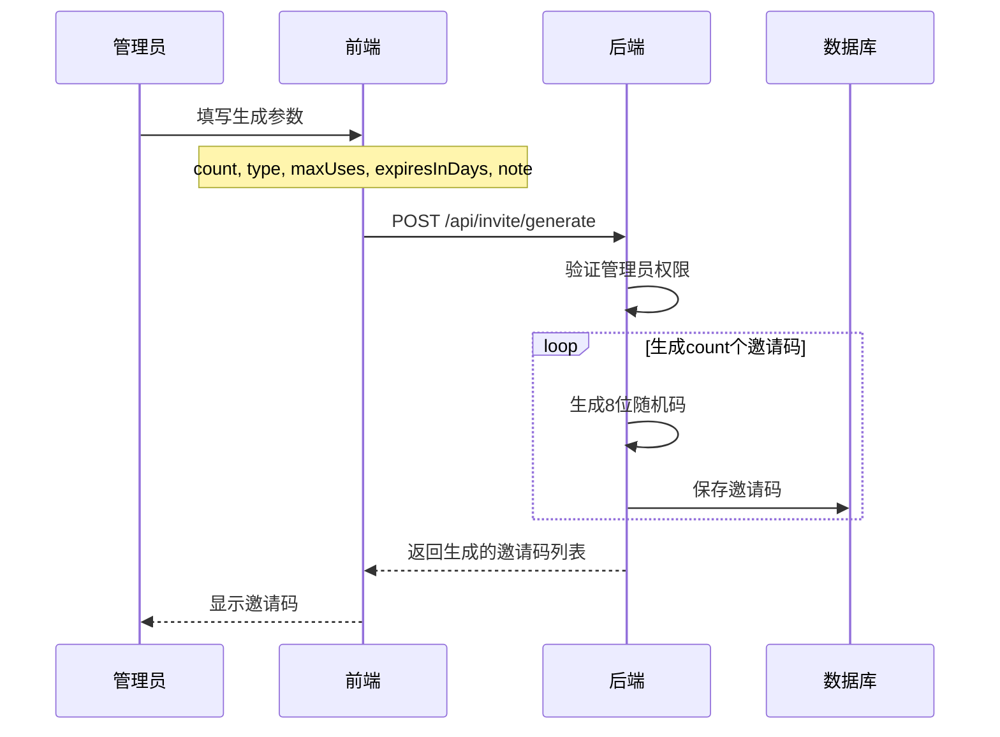
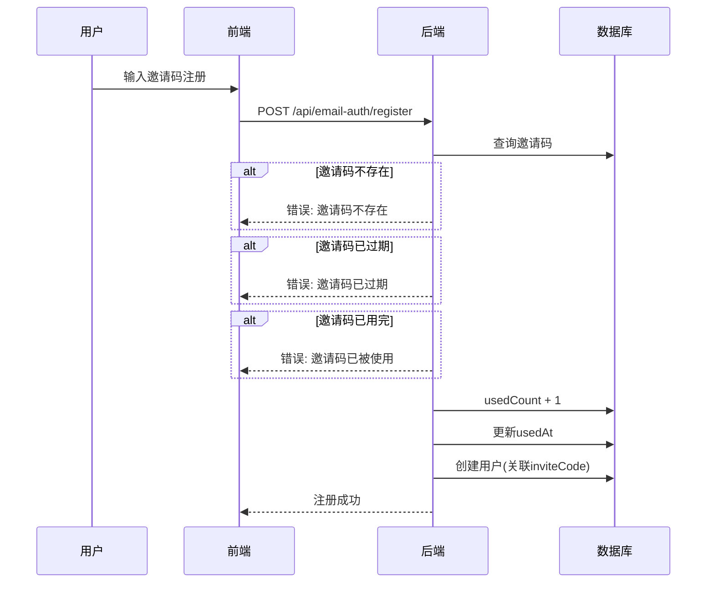
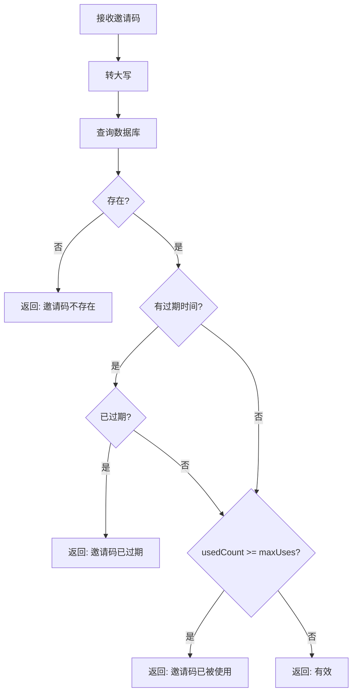

# 邀请码系统

## 概述

邀请码系统用于控制用户注册，支持生成不同类型、不同有效期的邀请码。

## 数据模型

```prisma
model InviteCode {
  id          String    @id @default(uuid())
  code        String    @unique        // 8位大写字母数字
  createdBy   String?                  // 创建者ID
  type        String    @default("STUDENT")  // STUDENT/TEACHER/ADMIN
  maxUses     Int       @default(1)    // 最大使用次数
  usedCount   Int       @default(0)    // 已使用次数
  expiresAt   DateTime?                // 过期时间
  usedAt      DateTime?                // 最后使用时间
  note        String?                  // 备注
  createdAt   DateTime  @default(now())
}
```

## 流程图

### 邀请码生成流程



### 邀请码使用流程



### 邀请码验证流程



## API 接口

### 生成邀请码

```
POST /api/invite/generate
Authorization: Bearer <token>  (需要ADMIN角色)
```

**请求体:**
```json
{
  "count": 10,           // 生成数量 (1-100)
  "type": "STUDENT",     // 用户类型
  "maxUses": 1,          // 每码可用次数
  "expiresInDays": 30,   // 有效天数 (0为永久)
  "note": "2024春季招生"  // 备注
}
```

**响应:**
```json
{
  "message": "成功生成 10 个邀请码",
  "codes": ["ABC12345", "DEF67890", ...],
  "type": "STUDENT",
  "maxUses": 1,
  "expiresAt": "2024-02-20T00:00:00Z"
}
```

### 验证邀请码

```
POST /api/invite/verify
```

**请求体:**
```json
{
  "code": "ABC12345"
}
```

**响应 (有效):**
```json
{
  "valid": true,
  "type": "STUDENT"
}
```

**响应 (无效):**
```json
{
  "error": "邀请码已过期"
}
```

### 获取邀请码列表

```
GET /api/invite?type=STUDENT&used=false&page=1&limit=20
Authorization: Bearer <token>  (需要ADMIN角色)
```

**响应:**
```json
{
  "codes": [
    {
      "id": "uuid",
      "code": "ABC12345",
      "type": "STUDENT",
      "maxUses": 1,
      "usedCount": 0,
      "expiresAt": "2024-02-20T00:00:00Z",
      "note": "2024春季招生",
      "createdAt": "2024-01-20T00:00:00Z"
    }
  ],
  "pagination": {
    "page": 1,
    "limit": 20,
    "total": 100,
    "totalPages": 5
  }
}
```

### 删除邀请码

```
DELETE /api/invite/{id}
Authorization: Bearer <token>  (需要ADMIN角色)
```

### 批量删除过期邀请码

```
DELETE /api/invite/expired/batch
Authorization: Bearer <token>  (需要ADMIN角色)
```

**响应:**
```json
{
  "message": "已删除 15 个过期或已用完的邀请码"
}
```

## 配置

| 配置项 | 环境变量 | 默认值 | 说明 |
|--------|----------|--------|------|
| 是否需要邀请码 | INVITE_REQUIRED | true | 注册是否需要邀请码 |

## 邀请码格式

- 长度: 8位
- 字符: 大写字母和数字
- 生成方式: UUID去除连字符后取前8位

```typescript
const code = uuidv4().replace(/-/g, '').substring(0, 8).toUpperCase();
// 示例: "A1B2C3D4"
```

## 状态说明

| 状态 | 条件 | 显示 |
|------|------|------|
| 可用 | usedCount < maxUses && 未过期 | 绿色 |
| 已用完 | usedCount >= maxUses | 灰色 |
| 已过期 | expiresAt < now | 红色 |

## 相关文件

| 文件 | 说明 |
|------|------|
| `backend/src/routes/invite.ts` | 邀请码API |
| `backend/src/routes/email-auth.ts` | 注册时验证邀请码 |
| `frontend/src/components/Admin/InviteCodeManagement.tsx` | 邀请码管理界面 |
| `frontend/src/components/Auth/EmailRegister.tsx` | 注册时输入邀请码 |
