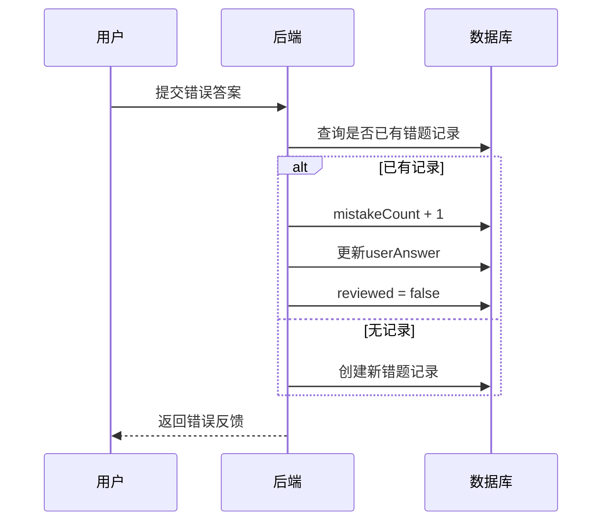
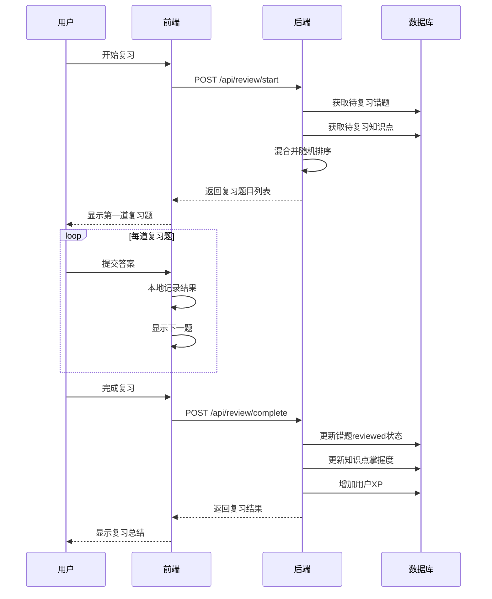
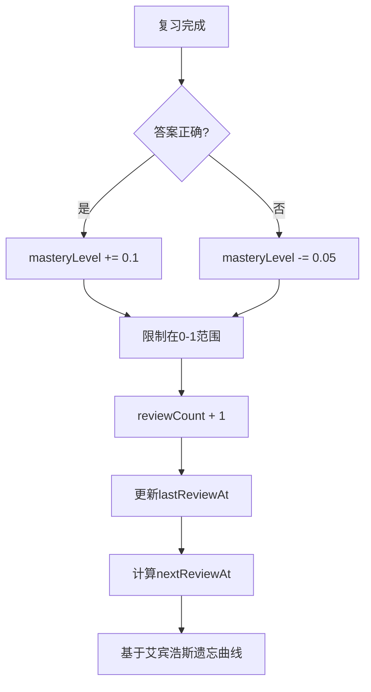

# 复习系统

## 概述

复习系统帮助学生巩固知识，包括错题复习和知识点复习两种模式。

## 数据模型

### MistakeRecord (错题记录)

```prisma
model MistakeRecord {
  id            String   @id @default(uuid())
  userId        String
  exerciseId    String
  userAnswer    Json     // 用户的错误答案
  correctAnswer Json     // 正确答案
  mistakeCount  Int      @default(1)  // 错误次数
  reviewed      Boolean  @default(false)
  reviewedAt    DateTime?
  createdAt     DateTime @default(now())
  updatedAt     DateTime @updatedAt
}
```

### KnowledgeMastery (知识点掌握度)

```prisma
model KnowledgeMastery {
  id            String   @id @default(uuid())
  userId        String
  knowledgeKey  String   // 知识点标识
  knowledgeType String   // category/type/difficulty
  masteryLevel  Float    @default(0)  // 0-1
  reviewCount   Int      @default(0)
  lastReviewAt  DateTime?
  nextReviewAt  DateTime?
}
```

## 流程图

### 错题记录流程



### 复习会话流程



### 知识点掌握度更新



## API 接口

### 获取复习状态

```
GET /api/review/status
Authorization: Bearer <token>
```

**响应:**
```json
{
  "mistakesToReview": 15,
  "knowledgeToReview": 8,
  "totalReviewed": 50,
  "lastReviewDate": "2024-01-20T00:00:00Z",
  "streakDays": 3
}
```

### 获取待复习内容

```
GET /api/review/due?limit=10
Authorization: Bearer <token>
```

**响应:**
```json
{
  "knowledgeReview": [
    {
      "knowledge": {
        "key": "loops",
        "type": "category",
        "masteryLevel": 0.6
      },
      "exercises": [...]
    }
  ],
  "mistakeReview": [
    {
      "id": "mistake-uuid",
      "exercise": {...},
      "mistakeCount": 3,
      "userAnswer": {...}
    }
  ]
}
```

### 开始复习会话

```
POST /api/review/start
Authorization: Bearer <token>
```

**请求体:**
```json
{
  "type": "mixed",  // mistakes | knowledge | mixed
  "limit": 10
}
```

**响应:**
```json
{
  "sessionId": "session-uuid",
  "exercises": [
    {
      "id": "exercise-uuid",
      "type": "FILL_BLANK",
      "reviewType": "mistake",
      "mistakeRecordId": "mistake-uuid",
      ...
    }
  ],
  "totalCount": 10
}
```

### 完成复习

```
POST /api/review/complete
Authorization: Bearer <token>
```

**请求体:**
```json
{
  "results": [
    {
      "exerciseId": "exercise-uuid",
      "correct": true,
      "reviewType": "mistake",
      "mistakeRecordId": "mistake-uuid"
    },
    {
      "exerciseId": "exercise-uuid",
      "correct": false,
      "reviewType": "knowledge",
      "knowledgeKey": "loops"
    }
  ]
}
```

**响应:**
```json
{
  "message": "复习完成",
  "totalReviewed": 10,
  "correctCount": 8,
  "accuracy": 80,
  "xpEarned": 40,
  "mistakesCleared": 5,
  "masteryUpdates": [
    { "key": "loops", "oldLevel": 0.6, "newLevel": 0.7 }
  ]
}
```

### 获取错题列表

```
GET /api/review/mistakes?category=循环&reviewed=false&page=1&limit=20
Authorization: Bearer <token>
```

**响应:**
```json
{
  "mistakes": [
    {
      "id": "mistake-uuid",
      "exercise": {
        "id": "exercise-uuid",
        "title": "for循环填空",
        "type": "FILL_BLANK",
        "category": "循环"
      },
      "userAnswer": { "BLANK_1": "0" },
      "correctAnswer": { "BLANK_1": "1" },
      "mistakeCount": 2,
      "reviewed": false,
      "createdAt": "2024-01-20T00:00:00Z"
    }
  ],
  "pagination": {...}
}
```

### 标记错题已复习

```
POST /api/review/mistakes/{mistakeId}/review
Authorization: Bearer <token>
```

### 获取知识点掌握度

```
GET /api/review/mastery?type=category
Authorization: Bearer <token>
```

**响应:**
```json
[
  {
    "knowledgeKey": "基础入门",
    "knowledgeType": "category",
    "masteryLevel": 0.85,
    "reviewCount": 20,
    "lastReviewAt": "2024-01-20T00:00:00Z"
  }
]
```

## 复习算法

### 艾宾浩斯遗忘曲线

```typescript
function calculateNextReview(masteryLevel: number, reviewCount: number): Date {
  // 基础间隔（天）
  const baseIntervals = [1, 2, 4, 7, 15, 30];

  // 根据复习次数选择间隔
  const intervalIndex = Math.min(reviewCount, baseIntervals.length - 1);
  let interval = baseIntervals[intervalIndex];

  // 根据掌握度调整
  if (masteryLevel > 0.8) {
    interval *= 1.5;  // 掌握好，延长间隔
  } else if (masteryLevel < 0.5) {
    interval *= 0.5;  // 掌握差，缩短间隔
  }

  const nextDate = new Date();
  nextDate.setDate(nextDate.getDate() + Math.round(interval));
  return nextDate;
}
```

### 复习优先级

1. 错误次数多的错题
2. 掌握度低的知识点
3. 长时间未复习的内容
4. 即将到期的复习任务

## 相关文件

| 文件 | 说明 |
|------|------|
| `backend/src/routes/review.ts` | 复习API |
| `backend/src/routes/questions.ts` | 错题记录逻辑 |
| `frontend/src/components/Review/ReviewDashboard.tsx` | 复习仪表盘 |
| `frontend/src/components/Review/ReviewSession.tsx` | 复习会话 |
