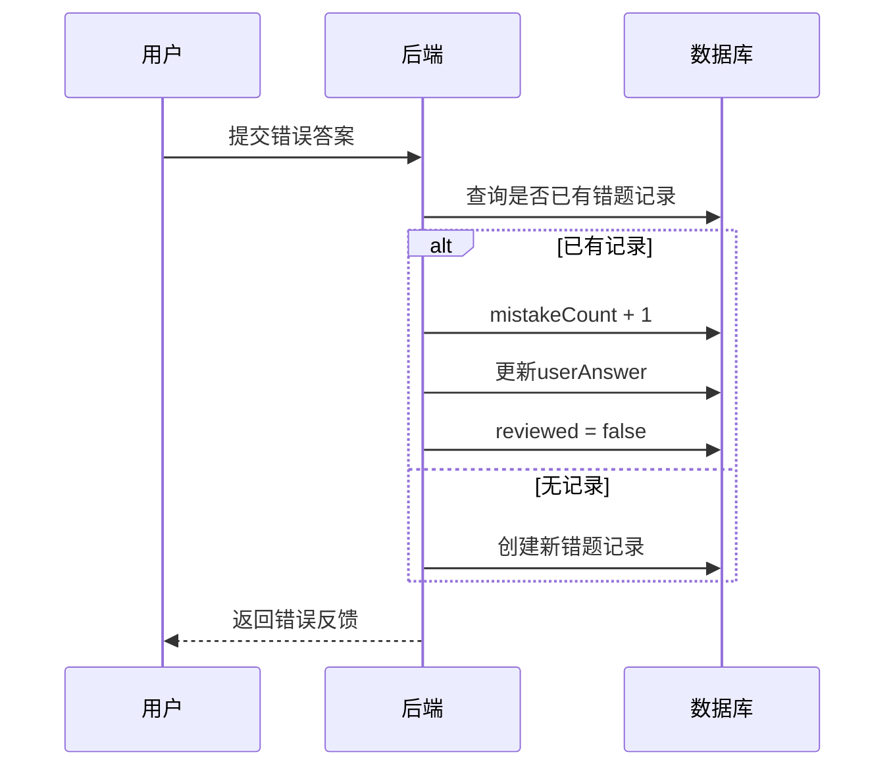
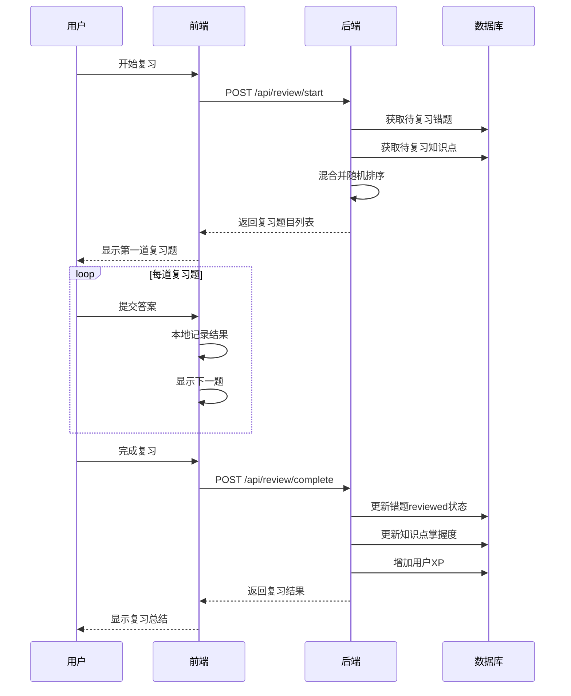
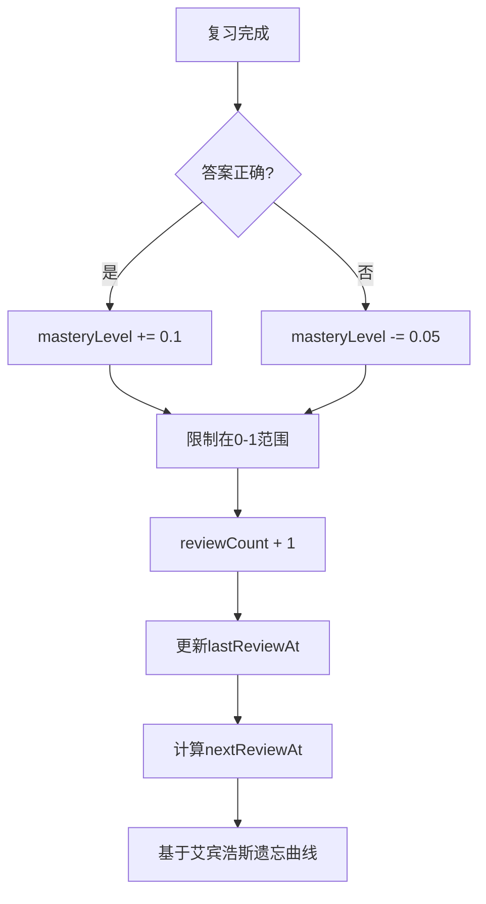

# 复习系统

## 概述

复习系统帮助学生巩固知识，包括错题复习和知识点复习两种模式。

## 数据模型

### MistakeRecord (错题记录)

```prisma
model MistakeRecord {
  id            String   @id @default(uuid())
  userId        String
  exerciseId    String
  userAnswer    Json     // 用户的错误答案
  correctAnswer Json     // 正确答案
  mistakeCount  Int      @default(1)  // 错误次数
  reviewed      Boolean  @default(false)
  reviewedAt    DateTime?
  source        String   @default("SKILL_TREE")  // SKILL_TREE | EXERCISE_LIBRARY | REVIEW
  createdAt     DateTime @default(now())
  updatedAt     DateTime @updatedAt
}
```

**source 字段说明：**
| 值 | 说明 |
|-----|------|
| SKILL_TREE | 技能树课程中做错 |
| EXERCISE_LIBRARY | 练习题库中做错 |
| REVIEW | 复习时做错（再次错误） |

### KnowledgeMastery (知识点掌握度)

```prisma
model KnowledgeMastery {
  id            String   @id @default(uuid())
  userId        String
  knowledgeKey  String   // 知识点标识
  knowledgeType String   // category/type/difficulty
  masteryLevel  Float    @default(0)  // 0-1
  reviewCount   Int      @default(0)
  lastReviewAt  DateTime?
  nextReviewAt  DateTime?
}
```

## 流程图

### 错题记录流程



### 复习会话流程



### 知识点掌握度更新



## API 接口

### 获取复习状态

```
GET /api/review/status
Authorization: Bearer <token>
```

**响应:**
```json
{
  "mistakesToReview": 15,
  "knowledgeToReview": 8,
  "totalReviewed": 50,
  "lastReviewDate": "2024-01-20T00:00:00Z",
  "streakDays": 3
}
```

### 获取待复习内容

```
GET /api/review/due?limit=10
Authorization: Bearer <token>
```

**响应:**
```json
{
  "knowledgeReview": [
    {
      "knowledge": {
        "key": "loops",
        "type": "category",
        "masteryLevel": 0.6
      },
      "exercises": [...]
    }
  ],
  "mistakeReview": [
    {
      "id": "mistake-uuid",
      "exercise": {...},
      "mistakeCount": 3,
      "userAnswer": {...}
    }
  ]
}
```

### 开始复习会话

```
POST /api/review/start
Authorization: Bearer <token>
```

**请求体:**
```json
{
  "type": "mixed",  // mistakes | knowledge | mixed
  "limit": 10
}
```

**响应:**
```json
{
  "sessionId": "session-uuid",
  "exercises": [
    {
      "id": "exercise-uuid",
      "type": "FILL_BLANK",
      "reviewType": "mistake",
      "mistakeRecordId": "mistake-uuid",
      ...
    }
  ],
  "totalCount": 10
}
```

### 完成复习

```
POST /api/review/complete
Authorization: Bearer <token>
```

**请求体:**
```json
{
  "results": [
    {
      "exerciseId": "exercise-uuid",
      "correct": true,
      "reviewType": "mistake",
      "mistakeRecordId": "mistake-uuid"
    },
    {
      "exerciseId": "exercise-uuid",
      "correct": false,
      "reviewType": "knowledge",
      "knowledgeKey": "loops"
    }
  ]
}
```

**响应:**
```json
{
  "message": "复习完成",
  "totalReviewed": 10,
  "correctCount": 8,
  "accuracy": 80,
  "xpEarned": 40,
  "mistakesCleared": 5,
  "masteryUpdates": [
    { "key": "loops", "oldLevel": 0.6, "newLevel": 0.7 }
  ]
}
```

### 获取错题列表

```
GET /api/review/mistakes?category=循环&reviewed=false&page=1&limit=20
Authorization: Bearer <token>
```

**响应:**
```json
{
  "mistakes": [
    {
      "id": "mistake-uuid",
      "exercise": {
        "id": "exercise-uuid",
        "title": "for循环填空",
        "type": "FILL_BLANK",
        "category": "循环"
      },
      "userAnswer": { "BLANK_1": "0" },
      "correctAnswer": { "BLANK_1": "1" },
      "mistakeCount": 2,
      "reviewed": false,
      "createdAt": "2024-01-20T00:00:00Z"
    }
  ],
  "pagination": {...}
}
```

### 标记错题已复习

```
POST /api/review/mistakes/{mistakeId}/review
Authorization: Bearer <token>
```

### 获取知识点掌握度

```
GET /api/review/mastery?type=category
Authorization: Bearer <token>
```

**响应:**
```json
[
  {
    "knowledgeKey": "基础入门",
    "knowledgeType": "category",
    "masteryLevel": 0.85,
    "reviewCount": 20,
    "lastReviewAt": "2024-01-20T00:00:00Z"
  }
]
```

## 复习算法

### 艾宾浩斯遗忘曲线

```typescript
function calculateNextReview(masteryLevel: number, reviewCount: number): Date {
  // 基础间隔（天）
  const baseIntervals = [1, 2, 4, 7, 15, 30];

  // 根据复习次数选择间隔
  const intervalIndex = Math.min(reviewCount, baseIntervals.length - 1);
  let interval = baseIntervals[intervalIndex];

  // 根据掌握度调整
  if (masteryLevel > 0.8) {
    interval *= 1.5;  // 掌握好，延长间隔
  } else if (masteryLevel < 0.5) {
    interval *= 0.5;  // 掌握差，缩短间隔
  }

  const nextDate = new Date();
  nextDate.setDate(nextDate.getDate() + Math.round(interval));
  return nextDate;
}
```

### 复习优先级

1. 错误次数多的错题
2. 掌握度低的知识点
3. 长时间未复习的内容
4. 即将到期的复习任务

## 相关文件

| 文件 | 说明 |
|------|------|
| `backend/src/routes/review.ts` | 复习API |
| `backend/src/routes/questions.ts` | 错题记录逻辑 |
| `frontend/src/components/Review/ReviewDashboard.tsx` | 复习仪表盘 |
| `frontend/src/components/Review/ReviewSession.tsx` | 复习会话 |

## 智能复习推荐

### 推荐算法

基于多维度因素计算复习优先级分数：

```typescript
interface ReviewPriority {
  exerciseId: string;
  score: number;        // 0-100，越高越需要复习
  factors: {
    forgettingCurve: number;   // 遗忘曲线因子 (0-40)
    mistakeFrequency: number;  // 错误频率因子 (0-30)
    timeSinceReview: number;   // 距上次复习时间因子 (0-20)
    knowledgeWeakness: number; // 知识点薄弱因子 (0-10)
  };
}

function calculateReviewPriority(
  exercise: Exercise,
  userProgress: ExerciseProgress,
  mastery: KnowledgeMastery
): ReviewPriority {
  const now = new Date();

  // 1. 遗忘曲线因子：基于艾宾浩斯曲线计算遗忘程度
  const daysSinceComplete = daysBetween(userProgress.completedAt, now);
  const retentionRate = Math.exp(-daysSinceComplete / (mastery.masteryLevel * 30 + 5));
  const forgettingCurve = (1 - retentionRate) * 40;

  // 2. 错误频率因子：错误次数越多，优先级越高
  const mistakeFrequency = Math.min(userProgress.mistakeCount * 5, 30);

  // 3. 距上次复习时间因子
  const daysSinceReview = mastery.lastReviewAt
    ? daysBetween(mastery.lastReviewAt, now)
    : 30;
  const timeSinceReview = Math.min(daysSinceReview * 2, 20);

  // 4. 知识点薄弱因子
  const knowledgeWeakness = (1 - mastery.masteryLevel) * 10;

  const score = forgettingCurve + mistakeFrequency + timeSinceReview + knowledgeWeakness;

  return {
    exerciseId: exercise.id,
    score: Math.min(score, 100),
    factors: { forgettingCurve, mistakeFrequency, timeSinceReview, knowledgeWeakness }
  };
}
```

### 复习模式

| 模式 | 说明 | 适用场景 |
|------|------|----------|
| 智能复习 | 系统自动选择最需要复习的内容 | 日常复习 |
| 错题专练 | 只复习做错过的题目 | 针对性提高 |
| 知识点复习 | 选择特定知识点复习 | 考前突击 |
| 薄弱环节 | 复习掌握度最低的知识点 | 补齐短板 |
| 限时挑战 | 限时完成一定数量的复习题 | 提高速度 |

### 复习推荐 API

```
GET /api/review/recommendations?limit=10&mode=smart
```

**响应:**
```json
{
  "mode": "smart",
  "recommendations": [
    {
      "exercise": {
        "id": "exercise-uuid",
        "title": "for循环填空",
        "type": "FILL_BLANK"
      },
      "priority": {
        "score": 85,
        "factors": {
          "forgettingCurve": 35,
          "mistakeFrequency": 25,
          "timeSinceReview": 15,
          "knowledgeWeakness": 10
        }
      },
      "reason": "该题目错误次数较多，且已有7天未复习"
    }
  ],
  "summary": {
    "totalDue": 25,
    "highPriority": 8,
    "mediumPriority": 12,
    "lowPriority": 5
  }
}
```

## 学习分析报告

### 分析维度

| 维度 | 指标 | 说明 |
|------|------|------|
| 学习时间 | 每日/每周学习时长 | 学习投入度 |
| 学习效率 | 正确率、平均用时 | 学习质量 |
| 知识掌握 | 各知识点掌握度 | 知识图谱 |
| 学习习惯 | 学习时段分布 | 最佳学习时间 |
| 进步趋势 | 正确率变化曲线 | 成长轨迹 |

### 数据模型

```prisma
model LearningSession {
  id            String   @id @default(uuid())
  userId        String
  sessionType   String   // LESSON / REVIEW / PRACTICE
  startedAt     DateTime
  endedAt       DateTime?
  duration      Int?     // 秒
  exerciseCount Int      @default(0)
  correctCount  Int      @default(0)
  xpEarned      Int      @default(0)

  user          User     @relation(fields: [userId], references: [id], onDelete: Cascade)

  @@index([userId, startedAt])
}

model DailyLearningStats {
  id              String   @id @default(uuid())
  userId          String
  date            DateTime @db.Date
  totalDuration   Int      @default(0)    // 总学习时长（秒）
  sessionsCount   Int      @default(0)    // 学习次数
  exercisesCount  Int      @default(0)    // 完成题目数
  correctCount    Int      @default(0)    // 正确数
  xpEarned        Int      @default(0)    // 获得XP
  lessonsCompleted Int     @default(0)    // 完成课程数
  reviewsCompleted Int     @default(0)    // 完成复习数

  user            User     @relation(fields: [userId], references: [id], onDelete: Cascade)

  @@unique([userId, date])
  @@index([date])
}
```

### 学习报告 API

```
GET /api/analytics/daily?date=2024-01-20
GET /api/analytics/weekly?week=2024-W03
GET /api/analytics/monthly?month=2024-01
GET /api/analytics/knowledge-map
GET /api/analytics/progress-trend?days=30
```

**周报响应:**
```json
{
  "period": "2024-W03",
  "summary": {
    "totalDuration": 7200,
    "totalExercises": 150,
    "correctRate": 0.82,
    "xpEarned": 450,
    "lessonsCompleted": 8,
    "reviewsCompleted": 5,
    "streakDays": 7
  },
  "dailyBreakdown": [
    { "date": "2024-01-15", "duration": 1200, "exercises": 25, "correctRate": 0.84 }
  ],
  "peakHours": [
    { "hour": 20, "sessions": 5, "avgDuration": 900 },
    { "hour": 21, "sessions": 4, "avgDuration": 850 }
  ],
  "knowledgeProgress": [
    { "knowledge": "循环", "startLevel": 0.6, "endLevel": 0.75, "change": 0.15 }
  ],
  "achievements": [
    { "key": "streak_7", "name": "坚持一周", "unlockedAt": "2024-01-20" }
  ],
  "comparison": {
    "vsLastWeek": {
      "duration": "+20%",
      "exercises": "+15%",
      "correctRate": "+5%"
    }
  }
}
```

### 知识图谱响应

```json
{
  "categories": [
    {
      "name": "基础语法",
      "masteryLevel": 0.85,
      "exerciseCount": 50,
      "completedCount": 45,
      "knowledgePoints": [
        { "name": "变量声明", "masteryLevel": 0.9, "reviewDue": false },
        { "name": "数据类型", "masteryLevel": 0.85, "reviewDue": false },
        { "name": "运算符", "masteryLevel": 0.75, "reviewDue": true }
      ]
    },
    {
      "name": "控制结构",
      "masteryLevel": 0.65,
      "exerciseCount": 40,
      "completedCount": 30,
      "knowledgePoints": [
        { "name": "if语句", "masteryLevel": 0.8, "reviewDue": false },
        { "name": "for循环", "masteryLevel": 0.6, "reviewDue": true },
        { "name": "while循环", "masteryLevel": 0.55, "reviewDue": true }
      ]
    }
  ],
  "overallMastery": 0.72,
  "weakestPoints": ["while循环", "for循环", "运算符"],
  "strongestPoints": ["变量声明", "数据类型", "if语句"]
}
```

## 复习提醒系统

### 提醒规则

| 触发条件 | 提醒内容 | 渠道 |
|----------|----------|------|
| 有到期复习内容 | "你有X道题目需要复习" | 应用内通知 |
| 连续3天未学习 | "别忘了保持学习习惯" | 推送通知 |
| 知识点掌握度下降 | "XX知识点需要巩固" | 应用内通知 |
| 错题累积超过阈值 | "错题本已有X道题目" | 应用内通知 |

### 提醒数据模型

```prisma
model ReviewReminder {
  id          String   @id @default(uuid())
  userId      String
  type        String   // DUE_REVIEW / INACTIVE / MASTERY_DROP / MISTAKES_PILE
  title       String
  message     String
  data        Json?    // 附加数据
  read        Boolean  @default(false)
  dismissed   Boolean  @default(false)

  createdAt   DateTime @default(now())

  user        User     @relation(fields: [userId], references: [id], onDelete: Cascade)

  @@index([userId, read])
}
```

### 提醒 API

```
GET  /api/reminders?unread=true           # 获取提醒列表
POST /api/reminders/:id/read              # 标记已读
POST /api/reminders/:id/dismiss           # 忽略提醒
PUT  /api/reminders/settings              # 更新提醒设置
```
