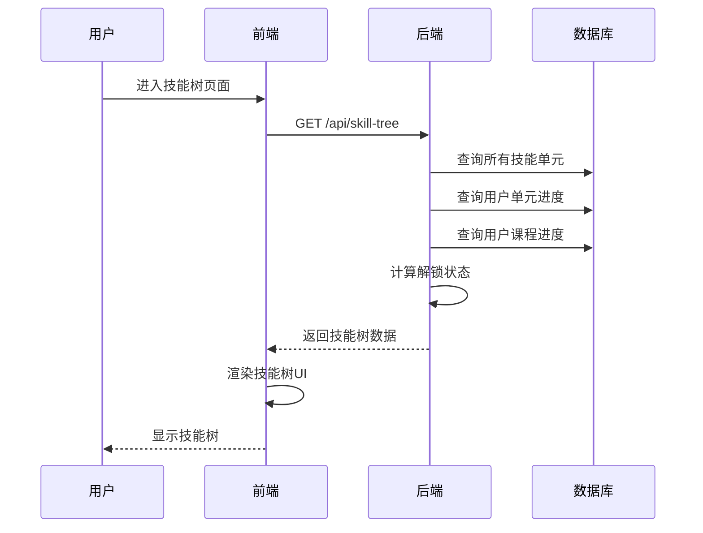
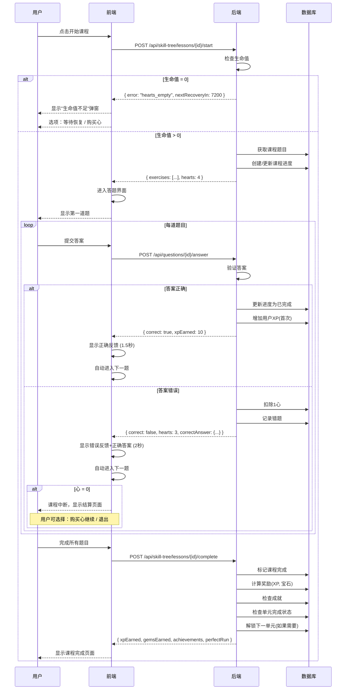
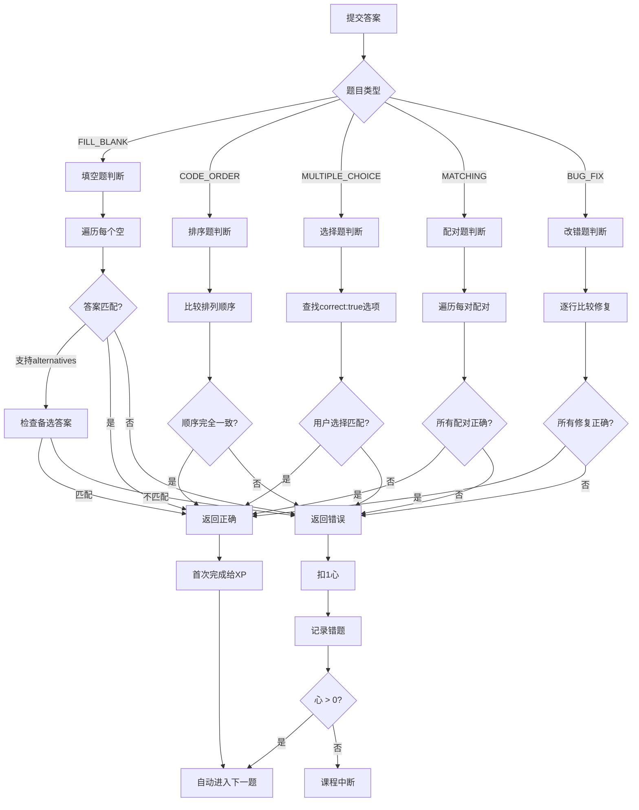
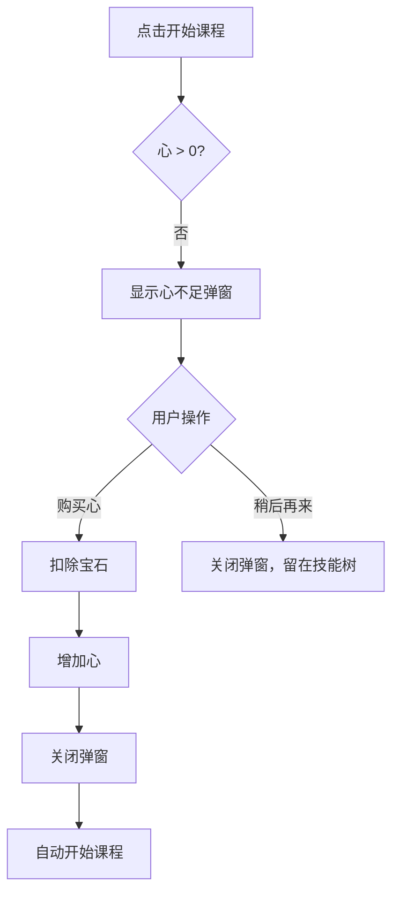
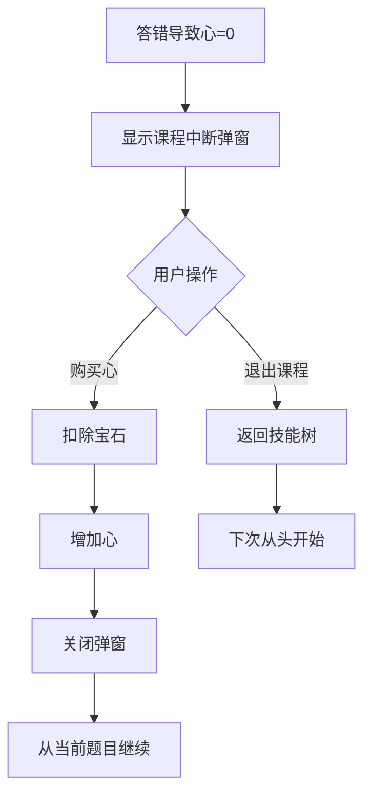
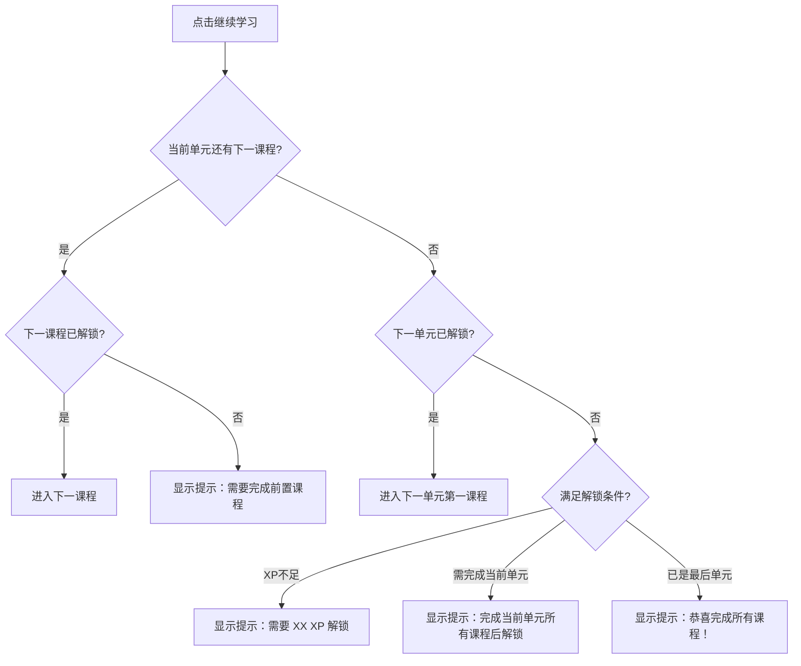
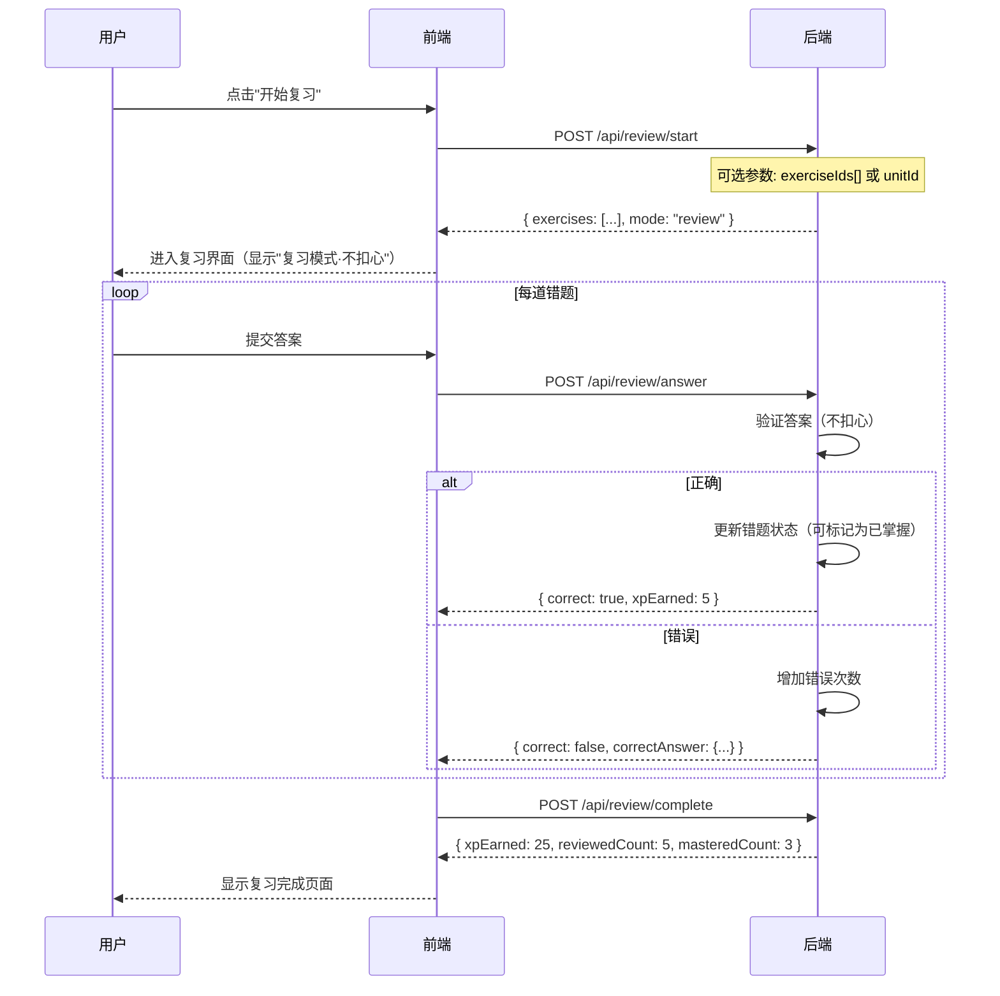
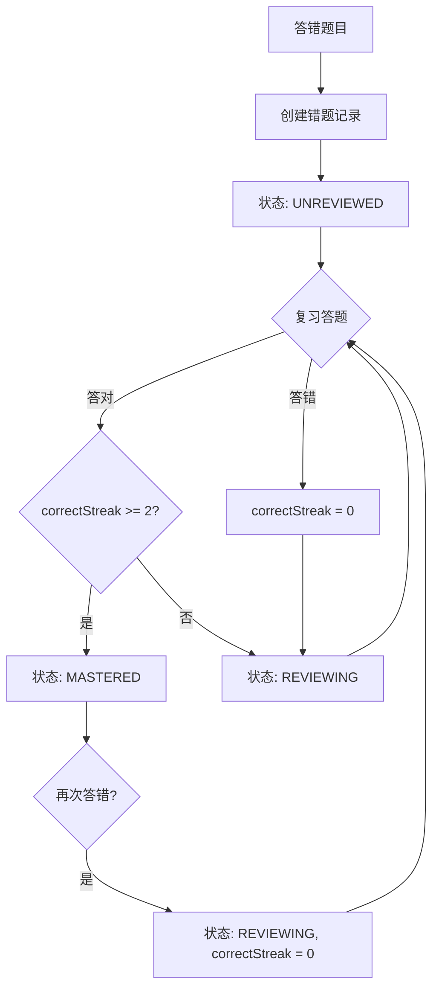

# 技能树/学习之旅模块

## 概述

技能树是学生学习的主要入口，采用多邻国风格的闯关设计。包含多个技能单元，每个单元包含多个课程，每个课程包含多道题目。

## 数据结构

### 技能树层级

```
SkillUnit (技能单元)
├── Lesson (课程)
│   ├── Exercise (题目)
│   ├── Exercise
│   └── ...
├── Lesson
│   └── ...
└── ...
```

### 进度追踪

- `UserUnitProgress`: 用户对单元的进度
- `UserLessonProgress`: 用户对课程的进度
- `ExerciseProgress`: 用户对题目的进度

## 核心设计原则

**答错不重试，直接下一题** —— 与游戏化系统保持一致。

```
答对 → 获得XP → 自动进入下一题
答错 → 扣1心 → 记录错题 → 自动进入下一题
```

详见 [游戏化系统文档](./gamification.md)

## 通关定义

**通关 = 完成课程中的所有题目**（不管对错）

```
课程有 8 道题：

题1 ✓ → 题2 ✗ → 题3 ✓ → 题4 ✗ → 题5 ✓ → 题6 ✓ → 题7 ✓ → 题8 ✓
                                                              ↓
                                                          课程通关
```

### 通关条件

| 条件 | 说明 |
|------|------|
| 通关 | 完成所有题目（答完最后一题） |
| 完美通关 | 完成所有题目 + 0错误 |
| 课程中断 | 答题过程中心归零，未完成所有题目 |

### 通关结果

| 情况 | 星级 | 奖励 |
|------|------|------|
| 全对(0错误) | ⭐⭐⭐ | 基础XP + 20%奖励 + 15宝石 |
| 1-2错误 | ⭐⭐ | 基础XP + 5宝石 |
| 3+错误 | ⭐ | 基础XP + 5宝石 |
| 心归零中断 | 无 | 已获得XP保留，进度不保存 |

### 未通关（中断）的处理

- 已获得的 XP **保留**
- 课程进度 **不保存**，下次从头开始
- 错题已记录到错题本
- 可购买心后从当前题目继续

## 课程模式

系统有三种学习模式，扣心规则不同：

| 模式 | 入口 | 扣心 | XP | 说明 |
|------|------|------|-----|------|
| 新课程 | 技能树点击未完成课程 | **扣心** | 100% | 首次学习 |
| 重做课程 | 技能树点击已完成课程 | **不扣心** | 20% | 巩固练习 |
| 复习错题 | 错题本入口 | **不扣心** | 5 XP/题 | 针对性复习 |

### API 区分方式

**开始课程 API：**
```
POST /api/skill-tree/lessons/{lessonId}/start
```

**请求体：**
```json
{
  "mode": "new" | "redo"
}
```

- `new`：新课程模式（默认），扣心
- `redo`：重做模式，不扣心

**后端判断逻辑：**
```typescript
// 如果课程已完成，自动切换为 redo 模式
if (lessonProgress?.completed && mode === 'new') {
  mode = 'redo';
}
```

**响应中返回当前模式：**
```json
{
  "mode": "new" | "redo",
  "deductHearts": true | false,
  "exercises": [...]
}
```

### 前端显示区分

| 模式 | 课程入口按钮 | 顶部栏显示 |
|------|-------------|-----------|
| 新课程 | "开始学习" | 显示心 ❤️❤️❤️❤️❤️ |
| 重做课程 | "再练一次" | 显示 "练习模式 · 不扣心" |
| 复习错题 | "开始复习" | 显示 "复习模式 · 不扣心" |

## 流程图

### 技能树加载流程



### 课程学习流程



### 答题判断流程



## API 接口

### 获取技能树

```
GET /api/skill-tree
Authorization: Bearer <token>
```

**响应:**
```json
{
  "units": [
    {
      "id": "unit-basics",
      "title": "C++ 基础入门",
      "description": "学习 C++ 的基本语法",
      "icon": "🚀",
      "color": "from-green-400 to-green-600",
      "orderIndex": 1,
      "requiredXp": 0,
      "lessons": [
        {
          "id": "lesson-1",
          "title": "Hello World",
          "orderIndex": 1,
          "exerciseCount": 5
        }
      ],
      "progress": {
        "unlocked": true,
        "completed": false,
        "lessonsCompleted": 1,
        "crownLevel": 0
      }
    }
  ],
  "userStats": {
    "totalXp": 150,
    "level": 2,
    "streak": 5,
    "hearts": 4,
    "maxHearts": 5,
    "nextHeartIn": 7200
  }
}
```

### 开始课程

```
POST /api/skill-tree/lessons/{lessonId}/start
Authorization: Bearer <token>
```

**响应 (成功):**
```json
{
  "message": "课程开始",
  "hearts": 4,
  "exercises": [
    {
      "id": "exercise-1",
      "title": "变量声明",
      "type": "FILL_BLANK",
      "description": "填写正确的代码",
      "questionData": {
        "code": "int x = ___BLANK_1___;",
        "blanks": [
          { "id": "BLANK_1", "hint": "整数值" }
        ]
      },
      "xp": 10
    }
  ]
}
```

**响应 (生命值不足):**
```json
{
  "error": "hearts_empty",
  "message": "生命值不足，无法开始新课程",
  "hearts": 0,
  "maxHearts": 5,
  "nextRecoveryIn": 7200,
  "fullRecoveryIn": 21600,
  "purchaseOptions": {
    "single": { "cost": 50, "label": "购买1心" },
    "full": { "cost": 200, "label": "补满生命" }
  }
}
```

### 提交答案

```
POST /api/questions/{exerciseId}/answer
Authorization: Bearer <token>
```

**请求体:**
```json
{
  "answer": {
    "BLANK_1": "10"
  },
  "lessonId": "lesson-1"
}
```

**响应 (正确):**
```json
{
  "correct": true,
  "feedback": "回答正确！",
  "xpEarned": 10,
  "isFirstTime": true,
  "correctAnswer": null
}
```

**响应 (错误):**
```json
{
  "correct": false,
  "feedback": "答案不正确",
  "xpEarned": 0,
  "hearts": 3,
  "correctAnswer": {
    "blanks": [
      { "id": "BLANK_1", "correct": false, "expected": "10" }
    ]
  }
}
```

**响应 (错误且心归零):**
```json
{
  "correct": false,
  "feedback": "答案不正确",
  "xpEarned": 0,
  "hearts": 0,
  "heartsEmpty": true,
  "correctAnswer": {
    "blanks": [
      { "id": "BLANK_1", "correct": false, "expected": "10" }
    ]
  },
  "sessionInterrupted": true,
  "partialResult": {
    "completed": 3,
    "total": 5,
    "xpEarned": 30,
    "mistakes": 5
  }
}
```

### 完成课程

```
POST /api/skill-tree/lessons/{lessonId}/complete
Authorization: Bearer <token>
```

**请求体:**
```json
{
  "mistakes": 2
}
```

**响应:**
```json
{
  "message": "课程完成",
  "xpEarned": 50,
  "bonusXp": 10,
  "gemsEarned": 5,
  "perfectRun": false,
  "unitCompleted": false,
  "lessonsCompleted": 2,
  "totalLessons": 5,
  "crownLevel": 0,
  "achievements": [
    {
      "id": "first_lesson",
      "name": "初学者",
      "icon": "🎯",
      "reward": { "xp": 10, "gems": 5 }
    }
  ]
}
```

## 游戏化机制

### XP 奖励规则

| 场景 | XP | 条件 |
|------|-----|------|
| 答对题目(首次) | 题目设定的XP值 | 首次答对 |
| 答对题目(重做) | 原XP的20% | 重做已完成课程（不扣心） |
| 复习错题答对 | 5 | 错题本复习（不扣心） |
| 答错题目 | 0 | - |
| 完美通关(0错误) | 额外20%奖励 | 课程0错误 |

### 生命值机制

| 属性 | 值 | 说明 |
|------|-----|------|
| 最大值 | 5 | 满心状态 |
| 消耗 | -1 | 新课程中每答错1题扣1心 |
| 恢复速度 | 1小时/心 | 时间自动恢复 |
| 归零后果 | 不能开始新课程 | 但可以复习错题、重做已完成课程（不扣心） |

### 扣心规则

| 场景 | 是否扣心 | 说明 |
|------|----------|------|
| 新课程答错 | **扣心** | 核心机制 |
| 重做已完成课程答错 | **不扣心** | 鼓励复习 |
| 复习错题答错 | **不扣心** | 鼓励复习 |

### 课程中途心归零

- 已获得的 XP **保留**
- 课程进度 **不保存**，下次需重新开始
- 用户可选择：购买心继续 / 退出

### 宝石奖励

| 场景 | 宝石 |
|------|------|
| 完成课程 | 5 |
| 完美通关 | +10 |
| 每日首次学习 | 5 |

### 解锁机制

- 第一个单元默认解锁
- 完成前置单元后解锁下一单元
- 需要达到指定XP才能解锁

## 题目顺序规则

| 场景 | 顺序 | 说明 |
|------|------|------|
| 新课程 | **固定顺序** | 按 orderIndex 排序，保证学习递进性 |
| 重做课程 | **随机顺序** | 打乱顺序，避免记忆答案位置 |
| 复习错题 | **随机顺序** | 打乱顺序 |

## 购买心后的流程

### 场景1：心不足弹窗中购买



**购买成功后**：自动开始课程，无需用户再次点击

### 场景2：课程中断弹窗中购买



**购买成功后**：从当前题目继续（不是从头开始）

**注意**：已答过的题目状态保留，只是从中断的地方继续

## "继续学习"按钮逻辑

课程完成页的"继续学习"按钮行为：



**按钮文案动态变化：**

| 情况 | 按钮文案 |
|------|----------|
| 有下一课程 | "继续学习" |
| 当前单元完成，下一单元已解锁 | "进入下一单元" |
| 下一单元未解锁 | "返回技能树" |
| 全部完成 | "返回技能树" |

## 界面交互规范

### 答题界面布局

```
┌─────────────────────────────────────────────────────────┐
│  ← 退出    ████████░░░░░░░░ 3/8     ❤️❤️❤️❤️🤍          │  ← 顶部栏
├─────────────────────────────────────────────────────────┤
│                                                         │
│                      题目标题                            │
│                                                         │
│  ┌─────────────────────────────────────────────────┐   │
│  │                                                 │   │
│  │                  题目内容区                      │   │  ← 题目区
│  │              (代码/文字/图片)                    │   │
│  │                                                 │   │
│  └─────────────────────────────────────────────────┘   │
│                                                         │
│  ┌─────────────────────────────────────────────────┐   │
│  │                                                 │   │
│  │                  答案输入区                      │   │  ← 答案区
│  │           (填空/选择/拖拽/配对)                  │   │
│  │                                                 │   │
│  └─────────────────────────────────────────────────┘   │
│                                                         │
│           ┌─────────────────────────┐                  │
│           │       检查答案          │                  │  ← 提交按钮
│           └─────────────────────────┘                  │
│                                                         │
└─────────────────────────────────────────────────────────┘
```

### 顶部栏元素

| 元素 | 说明 |
|------|------|
| 退出按钮 | 点击弹出确认弹窗，确认后退出课程 |
| 进度条 | 显示当前题目/总题目数，如 "3/8" |
| 生命值 | 显示当前心数，满心❤️，空心🤍 |

### 提交按钮状态

| 状态 | 样式 | 说明 |
|------|------|------|
| 未填写 | 灰色禁用 | 用户未输入答案 |
| 已填写 | 绿色可点击 | 用户已输入答案 |
| 检查中 | 灰色 + loading | 正在验证答案 |
| 显示反馈中 | 隐藏 | 反馈弹窗显示期间 |

### 答题反馈弹窗

**正确反馈：**

```
┌─────────────────────────────────────────┐
│                                         │
│              ✓ 回答正确！                │  ← 绿色背景
│                                         │
│              +10 XP                     │  ← XP 动画飞入
│                                         │
│         [ 1.5秒后自动进入下一题 ]         │
│                                         │
└─────────────────────────────────────────┘
```

**错误反馈：**

```
┌─────────────────────────────────────────┐
│                                         │
│              ✗ 回答错误                  │  ← 红色背景
│                                         │
│         正确答案: int x = 10;           │  ← 显示正确答案
│                                         │
│              ❤️ -1                      │  ← 心减少动画
│                                         │
│         [ 2秒后自动进入下一题 ]           │
│                                         │
└─────────────────────────────────────────┘
```

**反馈显示规则：**

| 结果 | 显示时长 | 用户可操作 |
|------|----------|------------|
| 正确 | 1.5秒 | 可点击立即跳过 |
| 错误 | 2秒 | 可点击立即跳过 |

### 心不足弹窗

当用户开始课程但心=0时显示：

```
┌─────────────────────────────────────────┐
│                                         │
│           😢 生命值不足                  │
│                                         │
│         ❤️ 0 / 5                        │
│                                         │
│      下一颗心恢复: 45:30                 │  ← 实时倒计时
│                                         │
│  ┌─────────────┐  ┌─────────────────┐  │
│  │  💎50 买1心  │  │  💎200 补满     │  │
│  └─────────────┘  └─────────────────┘  │
│                                         │
│  ┌─────────────────────────────────┐   │
│  │         稍后再来                 │   │  ← 关闭弹窗
│  └─────────────────────────────────┘   │
│                                         │
│      💡 你可以先复习错题或重做课程        │  ← 提示文字
│                                         │
└─────────────────────────────────────────┘
```

### 课程中断弹窗

当答题过程中心归零时显示：

```
┌─────────────────────────────────────────┐
│                                         │
│           💔 生命值耗尽                  │
│                                         │
│         本次学习已中断                   │
│                                         │
│      已完成: 3/8 题                      │
│      已获得: +30 XP                     │  ← XP 保留
│                                         │
│  ┌─────────────┐  ┌─────────────────┐  │
│  │  💎50 买1心  │  │  💎200 补满     │  │
│  │   继续学习   │  │    继续学习     │  │
│  └─────────────┘  └─────────────────┘  │
│                                         │
│  ┌─────────────────────────────────┐   │
│  │         退出课程                 │   │
│  └─────────────────────────────────┘   │
│                                         │
└─────────────────────────────────────────┘
```

### 课程完成页面

```
┌─────────────────────────────────────────┐
│                                         │
│              🎉 课程完成！               │
│                                         │
│         ┌─────────────────┐            │
│         │   ⭐ ⭐ ⭐       │            │  ← 星级评价
│         │   完美通关！     │            │     0错误=3星
│         └─────────────────┘            │     1-2错误=2星
│                                         │     3+错误=1星
│      ┌─────────┐  ┌─────────┐         │
│      │  +50 XP │  │  +15 💎 │         │  ← 奖励展示
│      └─────────┘  └─────────┘         │
│                                         │
│      ┌─────────────────────────┐       │
│      │  🏆 解锁成就: 初学者     │       │  ← 成就通知(如有)
│      └─────────────────────────┘       │
│                                         │
│  ┌─────────────────────────────────┐   │
│  │           继续学习               │   │
│  └─────────────────────────────────┘   │
│                                         │
│  ┌─────────────────────────────────┐   │
│  │           返回技能树             │   │
│  └─────────────────────────────────┘   │
│                                         │
└─────────────────────────────────────────┘
```

### 星级评价规则

| 错误次数 | 星级 | 说明 |
|----------|------|------|
| 0 | ⭐⭐⭐ | 完美通关 |
| 1-2 | ⭐⭐ | 良好 |
| 3+ | ⭐ | 及格 |

### 动画效果

| 场景 | 动画 | 时长 |
|------|------|------|
| XP 增加 | 数字从小变大 + 飞入效果 | 0.5秒 |
| 心减少 | 心抖动 + 变灰 | 0.3秒 |
| 进度条前进 | 平滑过渡 | 0.3秒 |
| 正确反馈弹出 | 从下往上滑入 | 0.2秒 |
| 错误反馈弹出 | 从下往上滑入 + 轻微抖动 | 0.2秒 |
| 星级展示 | 依次亮起 | 每颗0.3秒 |
| 成就解锁 | 放大 + 光效 | 0.5秒 |

### 退出确认弹窗

用户点击退出按钮时显示：

```
┌─────────────────────────────────────────┐
│                                         │
│           确定要退出吗？                 │
│                                         │
│      当前进度不会保存，                  │
│      已获得的 XP 会保留。                │
│                                         │
│  ┌─────────────┐  ┌─────────────────┐  │
│  │    取消     │  │    确定退出     │  │
│  └─────────────┘  └─────────────────┘  │
│                                         │
└─────────────────────────────────────────┘
```

### 生命值显示组件

**位置**：顶部栏右侧

**样式**：
```
满心状态:  ❤️ ❤️ ❤️ ❤️ ❤️
部分消耗:  ❤️ ❤️ ❤️ 🤍 🤍
即将耗尽:  ❤️ 🤍 🤍 🤍 🤍  ← 最后一颗心闪烁提醒
全部耗尽:  🤍 🤍 🤍 🤍 🤍
```

**点击行为**：点击心显示详情弹窗

```
┌─────────────────────────────────────────┐
│                                         │
│         ❤️ ❤️ ❤️ 🤍 🤍                  │
│           3 / 5                         │
│                                         │
│      下一颗心恢复: 45:30                 │
│      全部恢复: 2:45:30                  │
│                                         │
│  ┌─────────────────────────────────┐   │
│  │      💎50 买1心 | 💎200 补满    │   │
│  └─────────────────────────────────┘   │
│                                         │
└─────────────────────────────────────────┘
```

## 前端状态管理

### 答题会话状态

```typescript
interface LessonSessionState {
  lessonId: string;
  exercises: Exercise[];
  currentIndex: number;
  answers: Record<string, any>;
  results: AnswerResult[];
  mistakes: number;
  xpEarned: number;
  hearts: number;
  sessionStatus: 'active' | 'completed' | 'interrupted';
}

interface AnswerResult {
  exerciseId: string;
  correct: boolean;
  xpEarned: number;
  feedback: string;
}
```

### 答题流程状态机

```
┌─────────┐     开始课程      ┌─────────┐
│  IDLE   │ ───────────────→ │ LOADING │
└─────────┘                   └─────────┘
                                   │
                    ┌──────────────┴──────────────┐
                    │                             │
                    ▼                             ▼
            ┌─────────────┐              ┌─────────────┐
            │ HEARTS_EMPTY│              │  ANSWERING  │◄────┐
            └─────────────┘              └─────────────┘     │
                    │                          │             │
                    │                    提交答案            │
                    │                          ▼             │
                    │                   ┌───────────┐        │
                    │                   │ CHECKING  │        │
                    │                   └───────────┘        │
                    │                          │             │
                    │              ┌───────────┴───────────┐ │
                    │              │                       │ │
                    │              ▼                       ▼ │
                    │       ┌───────────┐          ┌───────────┐
                    │       │  CORRECT  │          │  WRONG    │
                    │       └───────────┘          └───────────┘
                    │              │                       │
                    │              │ 1.5秒后               │ 2秒后
                    │              │                       │
                    │              ▼                       ▼
                    │       ┌─────────────────────────────────┐
                    │       │         还有下一题？             │
                    │       └─────────────────────────────────┘
                    │              │                       │
                    │         有   │                  没有 │
                    │              │                       │
                    │              └───────┬───────────────┘
                    │                      │
                    │         ┌────────────┴────────────┐
                    │         │                         │
                    │         ▼                         ▼
                    │  ┌─────────────┐          ┌─────────────┐
                    │  │ 下一题      │          │  COMPLETED  │
                    │  │ (回到       │          │  显示结算   │
                    │  │  ANSWERING) │          └─────────────┘
                    │  └─────────────┘
                    │         │
                    │         │ 心=0时
                    │         ▼
                    │  ┌─────────────┐
                    └─→│ INTERRUPTED │
                       │ 课程中断    │
                       └─────────────┘
```

```

## 错题本设计

### 入口位置

```
┌─────────────────────────────────────────┐
│  技能树页面顶部                          │
│                                         │
│  [我的错题 (12)]   [学习统计]   [成就]   │
│                                         │
└─────────────────────────────────────────┘
```

或者在个人中心页面：

```
┌─────────────────────────────────────────┐
│  个人中心                                │
│                                         │
│  📚 我的错题 (12)                        │
│  📊 学习统计                             │
│  🏆 我的成就                             │
│                                         │
└─────────────────────────────────────────┘
```

### 错题列表页面

```
┌─────────────────────────────────────────────────────────┐
│  ← 返回          我的错题 (12)                          │
├─────────────────────────────────────────────────────────┤
│                                                         │
│  筛选: [全部 ▼]  [按单元 ▼]  [按时间 ▼]                │
│                                                         │
│  ┌─────────────────────────────────────────────────┐   │
│  │  📝 变量声明                                     │   │
│  │  单元: C++基础  ·  错误次数: 2  ·  3天前         │   │
│  │  [查看详情]  [开始复习]                          │   │
│  └─────────────────────────────────────────────────┘   │
│                                                         │
│  ┌─────────────────────────────────────────────────┐   │
│  │  📝 循环语句                                     │   │
│  │  单元: 控制流程  ·  错误次数: 1  ·  1天前        │   │
│  │  [查看详情]  [开始复习]                          │   │
│  └─────────────────────────────────────────────────┘   │
│                                                         │
│  ┌─────────────────────────────────────────────────┐   │
│  │           [开始复习全部错题]                     │   │
│  └─────────────────────────────────────────────────┘   │
│                                                         │
└─────────────────────────────────────────────────────────┘
```

### 错题详情页面

```
┌─────────────────────────────────────────────────────────┐
│  ← 返回          错题详情                               │
├─────────────────────────────────────────────────────────┤
│                                                         │
│  📝 变量声明                                            │
│  单元: C++基础  ·  课程: Hello World                    │
│                                                         │
│  ┌─────────────────────────────────────────────────┐   │
│  │  题目:                                          │   │
│  │  int x = ____;                                  │   │
│  │                                                 │   │
│  │  你的答案: x                                    │   │
│  │  正确答案: 10                                   │   │
│  └─────────────────────────────────────────────────┘   │
│                                                         │
│  💡 解析:                                               │
│  变量声明时需要赋予初始值，这里应该填写一个整数...       │
│                                                         │
│  错误记录:                                              │
│  · 2024-01-20 10:30 - 答案: x                          │
│  · 2024-01-18 15:20 - 答案: int                        │
│                                                         │
│  ┌─────────────────────────────────────────────────┐   │
│  │              [开始复习这道题]                    │   │
│  └─────────────────────────────────────────────────┘   │
│                                                         │
└─────────────────────────────────────────────────────────┘
```

### 复习错题流程



### 错题状态

| 状态 | 说明 | 显示 | 转换条件 |
|------|------|------|----------|
| UNREVIEWED | 未复习 | 红色标记 | 刚记录的错题 |
| REVIEWING | 复习中 | 黄色标记 | 复习过但还未掌握 |
| MASTERED | 已掌握 | 绿色标记 | 连续答对2次 |

### 错题状态流转



### 错题列表筛选

默认只显示未复习和复习中的错题，已掌握的默认隐藏：

```
筛选: [未复习 (8)] [复习中 (3)] [已掌握 (5)] [全部 (16)]
```

### 错题 API

```
GET  /api/review/mistakes              # 获取错题列表
GET  /api/review/mistakes/{id}         # 获取错题详情
POST /api/review/start                 # 开始复习
POST /api/review/answer                # 提交复习答案
POST /api/review/complete              # 完成复习
DELETE /api/review/mistakes/{id}       # 手动移除已掌握的错题
```

**获取错题列表响应：**
```json
{
  "total": 12,
  "mistakes": [
    {
      "id": "mistake-uuid",
      "lessonId": "exercise-uuid",
      "exerciseId": "exercise-uuid",
      "exerciseTitle": "变量声明",
      "unitTitle": "C++基础",
      "lessonTitle": "Hello World",
      "wrongCount": 2,
      "lastWrongAt": "2024-01-20T10:30:00Z",
      "status": "unreviewed" | "reviewing" | "mastered"
    }
  ]
}
```

## 网络异常处理

### 提交答案失败

```mermaid
flowchart TD
    A[用户提交答案] --> B[发送请求]
    B --> C{请求成功?}
    C -->|是| D[显示反馈，进入下一题]
    C -->|否| E[显示错误提示]
    E --> F{重试次数 < 3?}
    F -->|是| G[显示重试按钮]
    G --> H[用户点击重试]
    H --> B
    F -->|否| I[显示"网络异常"弹窗]
    I --> J{用户选择}
    J -->|重试| B
    J -->|退出| K[保存本地进度，返回技能树]
```

### 网络异常弹窗

```
┌─────────────────────────────────────────┐
│                                         │
│           ⚠️ 网络连接失败                │
│                                         │
│      请检查网络后重试                    │
│                                         │
│  ┌─────────────┐  ┌─────────────────┐  │
│  │    重试     │  │    稍后继续     │  │
│  └─────────────┘  └─────────────────┘  │
│                                         │
│      💡 你的答题进度已自动保存           │
│                                         │
└─────────────────────────────────────────┘
```

### 本地进度缓存

为防止网络异常导致进度丢失，前端需要本地缓存：

```typescript
interface LocalLessonCache {
  lessonId: string;
  mode: 'new' | 'redo' | 'review';
  currentIndex: number;
  answers: Record<string, any>;      // 已提交的答案
  results: AnswerResult[];           // 已获得的结果
  pendingAnswer?: {                  // 待提交的答案（网络失败时）
    exerciseId: string;
    answer: any;
  };
  xpEarned: number;
  mistakes: number;
  savedAt: string;                   // ISO 时间戳
}
```

**缓存策略：**

| 时机 | 操作 |
|------|------|
| 每次答题后 | 保存到 localStorage |
| 课程完成后 | 清除缓存 |
| 用户主动退出 | 保留缓存 |
| 下次进入同一课程 | 检测缓存，提示是否继续 |

**继续上次进度弹窗：**

```
┌─────────────────────────────────────────┐
│                                         │
│           📚 发现未完成的课程            │
│                                         │
│      上次学习: 3/8 题                   │
│      已获得: 30 XP                      │
│                                         │
│  ┌─────────────┐  ┌─────────────────┐  │
│  │  继续学习   │  │    重新开始     │  │
│  └─────────────┘  └─────────────────┘  │
│                                         │
└─────────────────────────────────────────┘
```

## 相关文件

| 文件 | 说明 |
|------|------|
| `backend/src/routes/skillTree.ts` | 技能树API |
| `backend/src/routes/questions.ts` | 题目答案验证 |
| `backend/src/routes/review.ts` | 错题本API |
| `backend/src/routes/hearts.ts` | 生命值API |
| `frontend/src/components/SkillTree/SkillTreeView.tsx` | 技能树视图 |
| `frontend/src/components/SkillTree/LessonSession.tsx` | 课程学习会话 |
| `frontend/src/components/Questions/QuestionRenderer.tsx` | 题目渲染器 |
| `frontend/src/components/Feedback/AnswerFeedback.tsx` | 答题反馈 |
| `frontend/src/components/Hearts/HeartsDisplay.tsx` | 生命值显示 |
| `frontend/src/components/Review/MistakeList.tsx` | 错题列表 |
| `frontend/src/components/Review/MistakeDetail.tsx` | 错题详情 |
| `frontend/src/utils/lessonCache.ts` | 本地进度缓存 |
