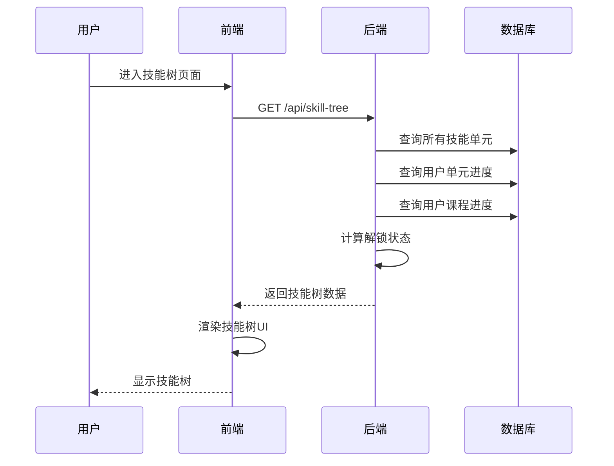
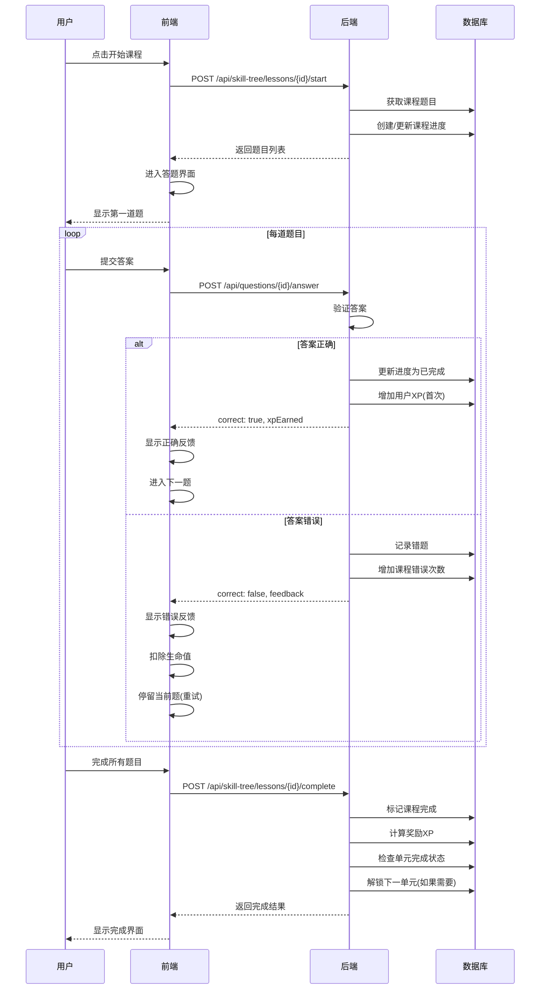
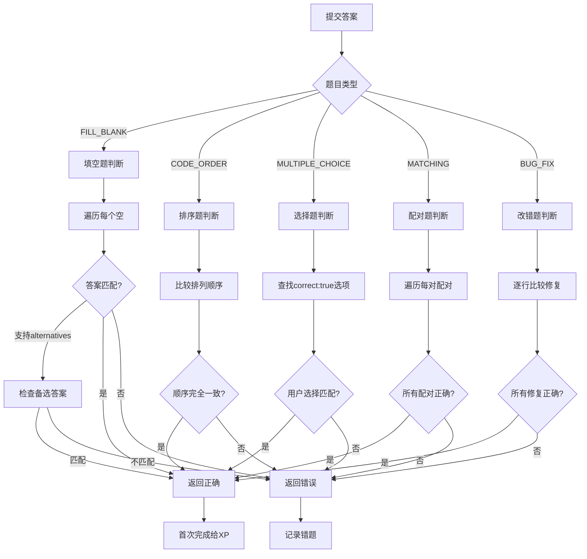

# 技能树/学习之旅模块

## 概述

技能树是学生学习的主要入口，采用多邻国风格的闯关设计。包含多个技能单元，每个单元包含多个课程，每个课程包含多道题目。

## 数据结构

### 技能树层级

```
SkillUnit (技能单元)
├── Lesson (课程)
│   ├── Exercise (题目)
│   ├── Exercise
│   └── ...
├── Lesson
│   └── ...
└── ...
```

### 进度追踪

- `UserUnitProgress`: 用户对单元的进度
- `UserLessonProgress`: 用户对课程的进度
- `ExerciseProgress`: 用户对题目的进度

## 流程图

### 技能树加载流程



### 课程学习流程



### 答题判断流程



## API 接口

### 获取技能树

```
GET /api/skill-tree
Authorization: Bearer <token>
```

**响应:**
```json
{
  "units": [
    {
      "id": "unit-basics",
      "title": "C++ 基础入门",
      "description": "学习 C++ 的基本语法",
      "icon": "🚀",
      "color": "from-green-400 to-green-600",
      "orderIndex": 1,
      "requiredXp": 0,
      "lessons": [
        {
          "id": "lesson-1",
          "title": "Hello World",
          "orderIndex": 1,
          "exerciseCount": 5
        }
      ],
      "progress": {
        "unlocked": true,
        "completed": false,
        "lessonsCompleted": 1,
        "crownLevel": 0
      }
    }
  ],
  "userStats": {
    "totalXp": 150,
    "level": 2,
    "streak": 5
  }
}
```

### 开始课程

```
POST /api/skill-tree/lessons/{lessonId}/start
Authorization: Bearer <token>
```

**响应:**
```json
{
  "message": "课程开始",
  "exercises": [
    {
      "id": "exercise-1",
      "title": "变量声明",
      "type": "FILL_BLANK",
      "description": "填写正确的代码",
      "questionData": {
        "code": "int x = ___BLANK_1___;",
        "blanks": [
          { "id": "BLANK_1", "hint": "整数值" }
        ]
      },
      "xp": 10
    }
  ]
}
```

### 提交答案

```
POST /api/questions/{exerciseId}/answer
Authorization: Bearer <token>
```

**请求体:**
```json
{
  "answer": {
    "BLANK_1": "10"
  },
  "lessonId": "lesson-1"
}
```

**响应 (正确):**
```json
{
  "correct": true,
  "feedback": "回答正确！",
  "xpEarned": 10,
  "correctAnswer": null
}
```

**响应 (错误):**
```json
{
  "correct": false,
  "feedback": "部分填空不正确，请检查。",
  "xpEarned": 0,
  "correctAnswer": {
    "blanks": [
      { "id": "BLANK_1", "correct": false, "expected": "10" }
    ]
  }
}
```

### 完成课程

```
POST /api/skill-tree/lessons/{lessonId}/complete
Authorization: Bearer <token>
```

**请求体:**
```json
{
  "mistakes": 2
}
```

**响应:**
```json
{
  "message": "课程完成",
  "xpEarned": 50,
  "bonusXp": 10,
  "perfectRun": false,
  "unitCompleted": false,
  "lessonsCompleted": 2,
  "totalLessons": 5,
  "crownLevel": 0
}
```

## 游戏化机制

### XP 奖励规则

| 场景 | XP |
|------|-----|
| 答对题目(首次) | 题目设定的XP值 |
| 答对题目(重复) | 0 |
| 答错题目 | 0 |
| 完美通关(0错误) | 额外20%奖励 |

### 生命值机制

- 初始生命值: 5
- 答错扣除: 1
- 生命值归零: 强制退出课程
- 恢复: 每日自动恢复

### 解锁机制

- 第一个单元默认解锁
- 完成前置单元后解锁下一单元
- 需要达到指定XP才能解锁

## 相关文件

| 文件 | 说明 |
|------|------|
| `backend/src/routes/skillTree.ts` | 技能树API |
| `backend/src/routes/questions.ts` | 题目答案验证 |
| `frontend/src/components/SkillTree/SkillTreeView.tsx` | 技能树视图 |
| `frontend/src/components/SkillTree/LessonSession.tsx` | 课程学习会话 |
| `frontend/src/components/Questions/QuestionRenderer.tsx` | 题目渲染器 |
| `frontend/src/components/Feedback/AnswerFeedback.tsx` | 答题反馈 |
