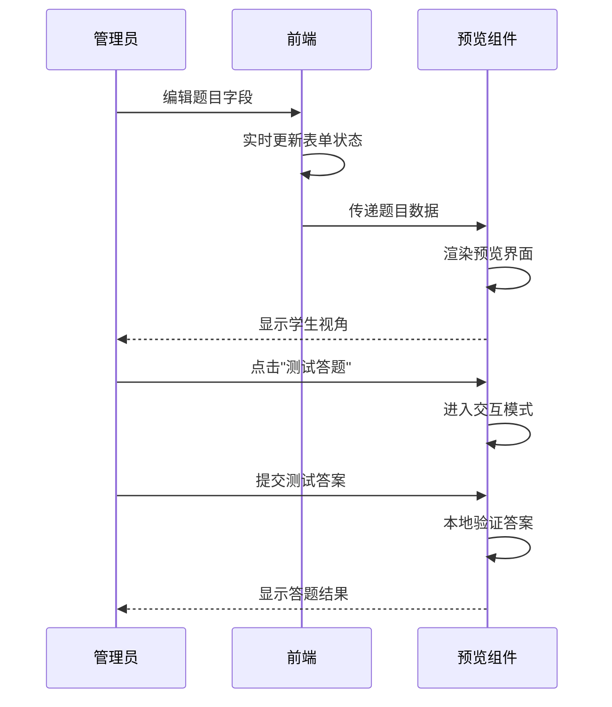
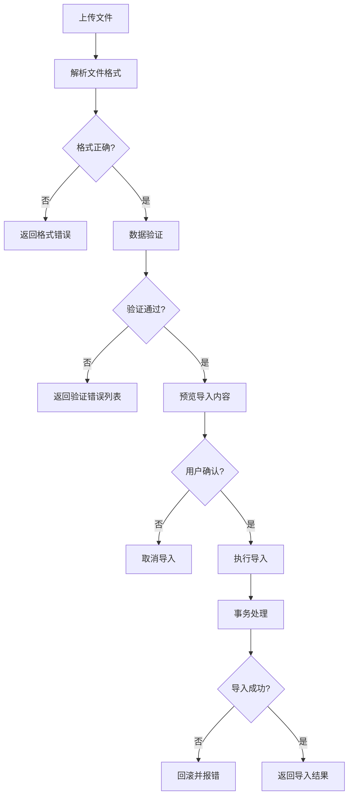

# 技能单元管理系统设计

## 问题分析

当前技能单元、课程、题目数据在 `seed.ts` 中硬编码，更新需要修改代码并重新部署。需要提供管理界面让管理员直接管理内容。

## 数据库设计

### 新增表

#### KnowledgePoint (知识点)

用于标记题目涉及的知识点，便于按知识点组织复习。

```prisma
model KnowledgePoint {
  id          String   @id @default(uuid())
  name        String   @unique        // 如 "变量声明", "for循环"
  category    String                  // 分类: "语法", "算法", "数据结构"
  orderIndex  Int      @default(0)

  exercises   ExerciseKnowledgePoint[]

  createdAt   DateTime @default(now())
  updatedAt   DateTime @updatedAt

  @@index([category])
}
```

#### ExerciseKnowledgePoint (题目-知识点关联)

```prisma
model ExerciseKnowledgePoint {
  id               String         @id @default(uuid())
  exerciseId       String
  knowledgePointId String

  exercise         Exercise       @relation(fields: [exerciseId], references: [id], onDelete: Cascade)
  knowledgePoint   KnowledgePoint @relation(fields: [knowledgePointId], references: [id], onDelete: Cascade)

  @@unique([exerciseId, knowledgePointId])
}
```

### 现有表扩展

#### Exercise 表

```prisma
model Exercise {
  // ... 现有字段 ...

  // 新增
  isPublished     Boolean @default(true)   // 是否发布
  knowledgePoints ExerciseKnowledgePoint[]
}
```

#### SkillUnit 表

```prisma
model SkillUnit {
  // ... 现有字段 ...

  // 新增
  isPublished Boolean @default(true)
}
```

#### Lesson 表

```prisma
model Lesson {
  // ... 现有字段 ...

  // 新增
  isPublished Boolean @default(true)
}
```

## ER 图

```
┌─────────────────┐     ┌─────────────────┐     ┌─────────────────┐
│   SkillUnit     │────<│     Lesson      │────<│    Exercise     │
│─────────────────│     │─────────────────│     │─────────────────│
│ id              │     │ id              │     │ id              │
│ title           │     │ title           │     │ title           │
│ description     │     │ orderIndex      │     │ type            │
│ icon            │     │ unitId          │     │ questionData    │
│ orderIndex      │     │ isPublished     │     │ lessonId        │
│ isPublished     │     └─────────────────┘     │ isPublished     │
└─────────────────┘                             └────────┬────────┘
                                                         │
┌─────────────────┐     ┌─────────────────────────┐      │
│ KnowledgePoint  │<────│ ExerciseKnowledgePoint  │<─────┘
│─────────────────│     │─────────────────────────│
│ id              │     │ exerciseId              │
│ name            │     │ knowledgePointId        │
│ category        │     └─────────────────────────┘
│ orderIndex      │
└─────────────────┘
```

## API 设计

### 技能单元

```
GET    /api/admin/skill-units              # 列表
POST   /api/admin/skill-units              # 创建
PUT    /api/admin/skill-units/:id          # 更新
DELETE /api/admin/skill-units/:id          # 删除
PUT    /api/admin/skill-units/reorder      # 排序
```

### 课程

```
GET    /api/admin/lessons                  # 列表
POST   /api/admin/lessons                  # 创建
PUT    /api/admin/lessons/:id              # 更新
DELETE /api/admin/lessons/:id              # 删除
PUT    /api/admin/lessons/reorder          # 排序
```

### 题目

```
GET    /api/admin/exercises                # 列表（支持筛选）
POST   /api/admin/exercises                # 创建
PUT    /api/admin/exercises/:id            # 更新
DELETE /api/admin/exercises/:id            # 删除
```

### 知识点

```
GET    /api/admin/knowledge-points         # 列表
POST   /api/admin/knowledge-points         # 创建
PUT    /api/admin/knowledge-points/:id     # 更新
DELETE /api/admin/knowledge-points/:id     # 删除
```

## 管理后台页面

```
/admin
├── /content                  # 内容管理
│   ├── /skill-units          # 技能单元列表 + 编辑
│   ├── /lessons              # 课程列表 + 编辑
│   ├── /exercises            # 题目列表 + 编辑
│   └── /knowledge-points     # 知识点管理
```

## 题目编辑器

针对不同题型提供表单：

| 题型 | 编辑内容 |
|------|----------|
| FILL_BLANK | 代码文本 + 空位答案列表 |
| CODE_ORDER | 代码行列表 + 正确顺序 |
| MULTIPLE_CHOICE | 题目 + 选项列表 + 正确答案 |
| MATCHING | 左列 + 右列 + 配对关系 |
| BUG_FIX | 错误代码 + 修复列表 |
| CODING | 题目描述 + 初始代码 + 测试用例 |

## 实现步骤

1. 数据库迁移：添加新表和字段
2. 实现管理 API
3. 开发管理后台 UI

## 题目预览功能

管理员在编辑题目时，可以实时预览学生看到的效果。

### 预览模式

| 模式 | 说明 |
|------|------|
| 编辑视图 | 左侧编辑表单，右侧实时预览 |
| 全屏预览 | 模拟学生答题界面 |
| 移动端预览 | 模拟手机端显示效果 |

### 预览组件

```typescript
interface ExercisePreviewProps {
  exercise: {
    type: ExerciseType;
    title: string;
    description?: string;
    questionData: any;
  };
  mode: 'split' | 'fullscreen' | 'mobile';
  onAnswer?: (answer: any) => void;  // 可选：测试答题
}
```

### 预览流程



## 题目统计功能

### 统计指标

| 指标 | 说明 | 计算方式 |
|------|------|----------|
| 正确率 | 首次答对的比例 | correctFirst / totalAttempts |
| 平均尝试次数 | 答对前的平均尝试 | totalAttempts / uniqueUsers |
| 平均用时 | 答题平均耗时 | totalTime / totalAttempts |
| 放弃率 | 跳过或退出的比例 | skipped / totalStarted |
| 错误分布 | 常见错误答案统计 | 按错误答案分组计数 |

### 数据模型

```prisma
model ExerciseStatistics {
  id                String   @id @default(uuid())
  exerciseId        String   @unique
  totalAttempts     Int      @default(0)    // 总尝试次数
  correctFirst      Int      @default(0)    // 首次正确次数
  totalCorrect      Int      @default(0)    // 总正确次数
  uniqueUsers       Int      @default(0)    // 独立用户数
  totalTimeSeconds  Int      @default(0)    // 总用时（秒）
  skippedCount      Int      @default(0)    // 跳过次数
  commonMistakes    Json?                   // 常见错误 [{ answer: "...", count: 10 }]

  exercise          Exercise @relation(fields: [exerciseId], references: [id], onDelete: Cascade)

  updatedAt         DateTime @updatedAt
}
```

### 统计 API

```
GET /api/admin/exercises/:id/statistics    # 单题统计
GET /api/admin/statistics/overview         # 总览统计
GET /api/admin/statistics/difficult        # 难题排行（正确率最低）
GET /api/admin/statistics/popular          # 热门题目（尝试最多）
```

**单题统计响应:**
```json
{
  "exerciseId": "exercise-uuid",
  "title": "for循环填空",
  "statistics": {
    "correctRate": 0.72,
    "avgAttempts": 1.4,
    "avgTimeSeconds": 45,
    "abandonRate": 0.05,
    "totalAttempts": 1500,
    "uniqueUsers": 1071
  },
  "commonMistakes": [
    { "answer": "i++", "count": 150, "percentage": 35 },
    { "answer": "i--", "count": 80, "percentage": 19 }
  ],
  "trend": {
    "last7Days": [
      { "date": "2024-01-20", "attempts": 50, "correctRate": 0.74 }
    ]
  }
}
```

### 统计仪表盘

```
/admin/statistics
├── 总览卡片（总题目数、总答题次数、平均正确率）
├── 难题排行榜（正确率最低的10题）
├── 热门题目（答题次数最多的10题）
├── 趋势图表（每日答题量、正确率变化）
└── 知识点分析（各知识点的掌握情况）
```

## 批量导入/导出功能

### 支持格式

| 格式 | 导入 | 导出 | 说明 |
|------|------|------|------|
| JSON | ✅ | ✅ | 完整数据，支持所有字段 |
| Excel | ✅ | ✅ | 简化格式，适合批量编辑 |
| CSV | ✅ | ✅ | 简单格式，适合简单题型 |

### JSON 格式规范

```json
{
  "version": "1.0",
  "exportedAt": "2024-01-20T00:00:00Z",
  "skillUnits": [
    {
      "title": "C++ 基础入门",
      "description": "学习 C++ 的基本语法",
      "icon": "🚀",
      "orderIndex": 1,
      "lessons": [
        {
          "title": "Hello World",
          "orderIndex": 1,
          "exercises": [
            {
              "title": "输出语句",
              "type": "FILL_BLANK",
              "description": "填写正确的输出语句",
              "xp": 10,
              "questionData": {
                "code": "cout << ___BLANK_1___;",
                "blanks": [
                  { "id": "BLANK_1", "answer": "\"Hello\"", "alternatives": ["'Hello'"] }
                ]
              },
              "knowledgePoints": ["输出语句", "字符串"]
            }
          ]
        }
      ]
    }
  ]
}
```

### Excel 格式规范

| 列名 | 说明 | 示例 |
|------|------|------|
| unit_title | 技能单元标题 | C++ 基础入门 |
| lesson_title | 课程标题 | Hello World |
| exercise_title | 题目标题 | 输出语句 |
| type | 题型 | FILL_BLANK |
| description | 题目描述 | 填写正确的输出语句 |
| xp | 经验值 | 10 |
| question_data | JSON格式的题目数据 | {"code": "...", "blanks": [...]} |
| knowledge_points | 知识点（逗号分隔） | 输出语句,字符串 |

### 导入/导出 API

```
POST /api/admin/import
Content-Type: multipart/form-data
Body: file (JSON/Excel/CSV)

GET /api/admin/export?format=json&unitIds=unit1,unit2
GET /api/admin/export?format=excel&all=true
```

### 导入流程



### 导入验证规则

| 验证项 | 规则 | 错误提示 |
|--------|------|----------|
| 必填字段 | title, type 必填 | "第X行缺少必填字段: title" |
| 题型有效性 | type 必须是有效枚举值 | "第X行题型无效: XXX" |
| 数据格式 | questionData 必须是有效JSON | "第X行题目数据格式错误" |
| 答案完整性 | 填空题必须有答案 | "第X行填空题缺少答案" |
| 重复检测 | 检测重复标题 | "第X行与第Y行标题重复" |

### 导入响应

```json
{
  "success": true,
  "summary": {
    "unitsCreated": 2,
    "unitsUpdated": 1,
    "lessonsCreated": 10,
    "exercisesCreated": 50,
    "knowledgePointsCreated": 15
  },
  "warnings": [
    { "row": 15, "message": "知识点'指针'不存在，已自动创建" }
  ],
  "errors": []
}
```

## 内容版本控制

### 版本记录

```prisma
model ContentVersion {
  id          String   @id @default(uuid())
  entityType  String   // SKILL_UNIT / LESSON / EXERCISE
  entityId    String
  version     Int
  data        Json     // 完整的实体数据快照
  changeType  String   // CREATE / UPDATE / DELETE
  changedBy   String   // 操作者ID
  changeNote  String?  // 修改说明

  createdAt   DateTime @default(now())

  @@index([entityType, entityId])
  @@index([createdAt])
}
```

### 版本管理 API

```
GET  /api/admin/versions/:entityType/:entityId    # 获取版本历史
GET  /api/admin/versions/:versionId               # 获取特定版本详情
POST /api/admin/versions/:versionId/restore       # 恢复到特定版本
GET  /api/admin/versions/:versionId/diff          # 与当前版本对比
```

### 版本对比响应

```json
{
  "currentVersion": 5,
  "compareVersion": 3,
  "changes": [
    {
      "field": "title",
      "old": "for循环基础",
      "new": "for循环入门"
    },
    {
      "field": "questionData.blanks[0].answer",
      "old": "i++",
      "new": "++i"
    }
  ]
}
```
